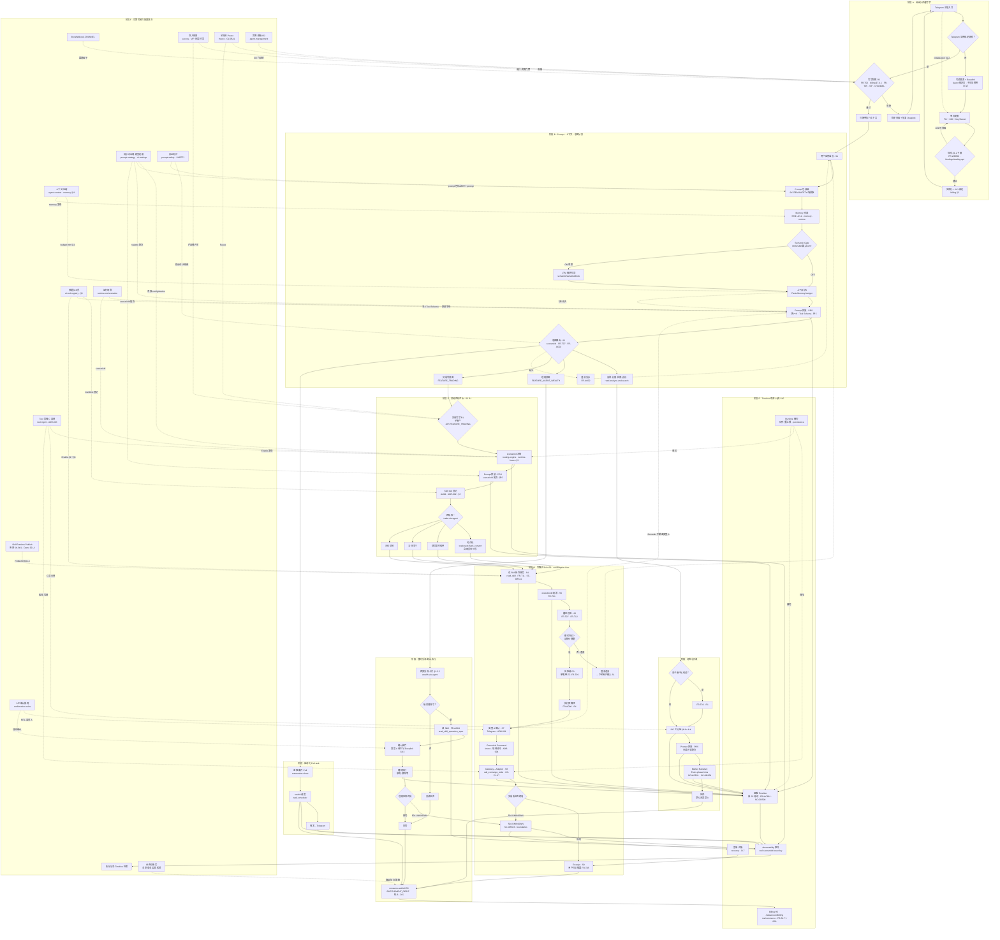
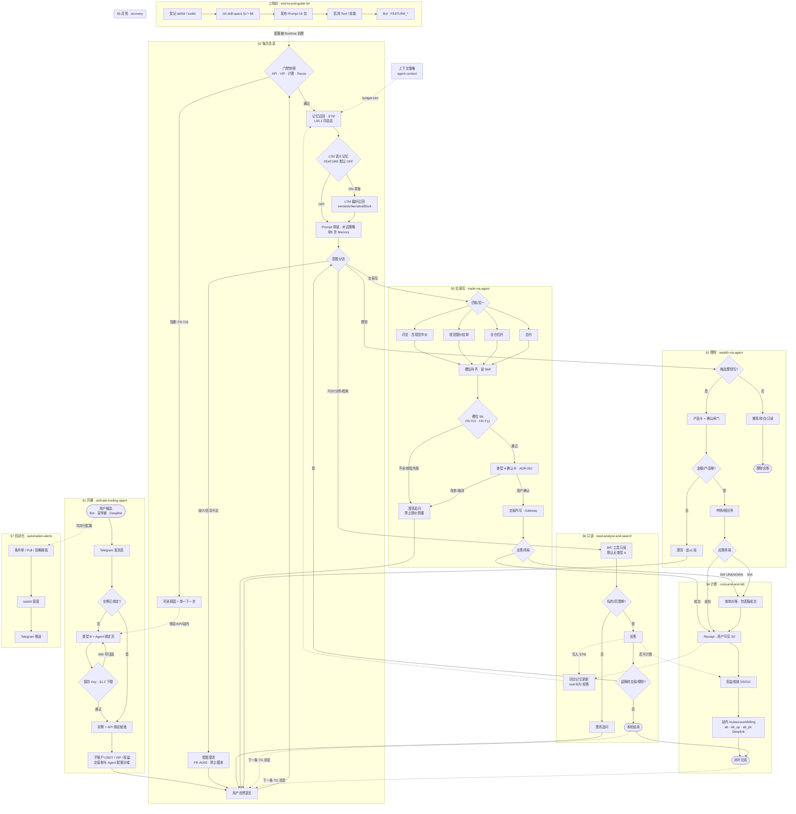
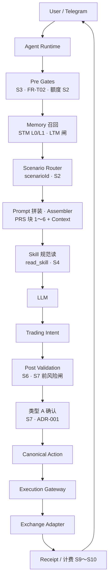
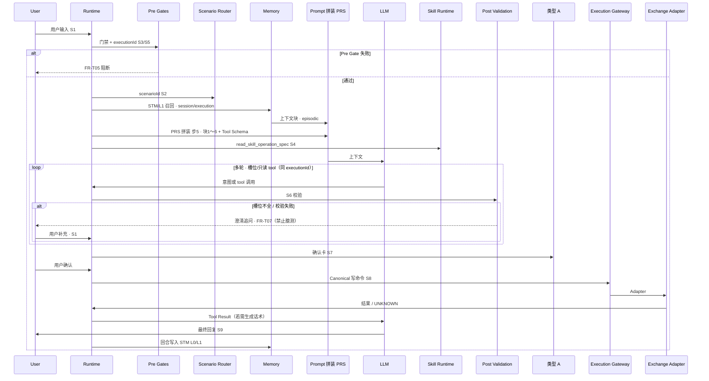

# 端到端闭环总览（Telegram → Runtime → 运营台 → 模型）

## 文首摘要

| 项 | 内容 |
|----|------|
| **流程名** | **用户侧会话起端到闭环**：会话门禁 → **意图分类**（问答 / 理财 / 交易写）→ **交易四轨互斥**（闪兑含市价、限价、杠杆、合约）→ **交易确认（类型 A）** → **交易执行** → 计费与观测 → 运营回流 |
| **主渠道** | **Telegram**（[`telegram/overview.md`](../specs/requirements/domains/agent/telegram/overview.md) **§2.5 · 类型 A；总则 §2～§2.6**）；开通：**Agent 产品线绑定页**；资金 / Billing：**交易所站内** |
| **定位** | **索引与鸟瞰图**（本目录 **`flow/`**）：串联 **[`specs/requirements/flows/`](../specs/requirements/flows/README.md)** 与各域 SSOT；**条文与验收**仍以 **[`domains/`](../specs/requirements/domains/README.md)**、**[`agent-orchestration/`](../specs/requirements/domains/agent/agent-orchestration/overview.md)**、**[`Runtime/`](../specs/requirements/Runtime/overview.md)**、**[`design/api.md`](../specs/design/api.md)** 为准。**Speckit / FEATURE_DIR 入口** → **[`spec.md`](../specs/requirements/spec.md)** **域长段**（**openapi-ai / `integrations`/allowlist 同窗**，与下文 **Prompt·Skill** 段一致）。**逐步可运行抽检** → **[Runtime Walkthrough](#runtime-walkthrough)** |
| **架构语言** | **系统工程叙事（对内对齐）**：[`architecture.md`](../specs/design/architecture.md) **「与通用 Agent 栈之对照」** — **Runtime / Gateway / 意图中心**；**非**「仅 Prompt + Tool Calling → 交易所 HTTP」栈。**与 ADR-004 / Canonical** **同窗**，见下文 **`design/`** 行 |
| **概念管线（十步 · 对签）** | [`Runtime/domain-model.md`](../specs/requirements/Runtime/domain-model.md) **§1～§4** ↔ [`trade-via-agent`](../specs/requirements/flows/trade-via-agent.md) **S1～S10** |
| **业务场景总图（人话 · flows §0～§7）** | 本篇 [**§业务场景总图**](#business-scenarios) · HTML **Tab 1** · [`product/flows.md`](../product/flows.md) |
| **人类一篇读懂（Runtime-first · 时序图）** | [`product/end-to-end-guide.md`](../product/end-to-end-guide.md) **§2**（**叙事**；步骤 SSOT 仍以下列 `flows/` 为准） |
| **`design/`** | **ADR-001**（[`001-telegram-confirm-before-coobit-write.md`](../specs/design/adr/001-telegram-confirm-before-coobit-write.md)）；**开通保存绑定** [**`design/api.md`**](../specs/design/api.md) **「用户侧 Agent 开通 / 绑定」「绑定保存 · 交易所探测矩阵」**；子账户交易矩阵与 **`TBD`** 收口见 [**`contract-closure.md`**](../specs/requirements/contract-closure.md)；**统一交易语义** [`ADR-004`](../specs/design/adr/004-intent-centric-execution-and-canonical-trading-model.md) · [`canonical-trading-model`](../specs/design/canonical-trading-model.md)；**契约** [`CC-P1-07`](../specs/requirements/contract-closure.md#cc-p1-07)；**人类评审** [`§7.5`](../../product/requirements-review.md#cc-adr004-review-checklist) |

---

## 参与角色与系统

| 角色 / 系统 | 职责摘要 |
|-------------|-----------|
| **用户** | Telegram 会话、**Agent 产品线绑定页**（TG + **子账户 UID + Key/Secret** → **保存** **`POST .../bindings/trading-api`** → **§1.2 下限校验** [**FR-WEB06**](../specs/requirements/domains/web/agent-onboarding.md) · **`TradingApiBindRejectCode`**）→ **通过后** **实例 + API 绑定**）、确认卡片 |
| **Agent Runtime** | 门禁快照、`executionId` / 工具链、`scenarioId` 编排、队列与恢复 |
| **Coobit 交易所** | 子账户 scope 读写 API；账务与 Billing |
| **LLM / Prompt** | 意图与槽位、对话策略；配置 SSOT：[**`specs/requirements/prompts/`**](../specs/requirements/prompts/README.md)、[**`prompt-management`**](../specs/requirements/domains/admin/prompt-management/overview.md)、Fallback 见 [**`Runtime/fallback-policy.md`**](../specs/requirements/Runtime/fallback-policy.md) |
| **运营控制台** | Bot/Webhook、**`configKey`**、执行观测；**准入** · **安全防护** · **人工确认规则**（见下行运营侧规则）；**技能与工具** [`ai.tool-registry`](../specs/requirements/admin-console/page-specs.md)（对齐 [**tool-registry-reconciliation §0**](../specs/requirements/domains/admin/tool-management/admin-console-tool-registry-reconciliation.md)）；**计费与账务** 三项 IA（[**billing-reconciliation §0**](../specs/requirements/domains/admin/billing-management/admin-console-billing-pages-reconciliation.md)）；路由 [**`demo-routing.md`**](../specs/requirements/admin-console/demo-routing.md)、[**`runtime-to-ui-mapping.md`**](../specs/requirements/admin-console/runtime-to-ui-mapping.md) |

---

## 主闭环流程图（Mermaid）

**运营侧规则（控制台配置 → 运行时消费）**：**准入**（VIP / 灰度·名单 / 封禁 / I02 · **`access-control`**）；**安全防护**（**SAFETY** · **`ai.prompt-safety`**）；**人工确认规则**（**`ai.confirmation-rules`** · [**`risk/hitl-and-automation-matrix.md`**](../specs/requirements/risk/hitl-and-automation-matrix.md)）；**技能与工具**（**`/ai/tool-registry`** · 登记 + §1～§6 抽屉 + **Enable** · **无** Demo Runtime 发布 UI — [**tool-registry-reconciliation §0**](../specs/requirements/domains/admin/tool-management/admin-console-tool-registry-reconciliation.md)）；**计费商品/扣次/订单**（**`/billing/operations`** 五 Tab + **总览** + **核销** — [**billing-reconciliation §0**](../specs/requirements/domains/admin/billing-management/admin-console-billing-pages-reconciliation.md)）；**Prompt 发布门禁** 在 **提示词治理**（**SC-PM-21**）。路由 [**`admin-console/demo-routing.md`**](../specs/requirements/admin-console/demo-routing.md)。

**Prompt 与 Skill（鸟瞰须可见）**：**Prompt**（[`prompts/`](../specs/requirements/prompts/README.md)、[`prompt-management`](../specs/requirements/domains/admin/prompt-management/overview.md)）决定 **模型与会话策略如何消费用户输入**；**Skill**（[`trade-assistance` §8](../specs/requirements/domains/agent/exchange-agent/trade-assistance.md)、**`skillId`**、[`routing-engine`](../specs/requirements/domains/agent/agent-orchestration/routing-engine.md)）把 **`scenarioId`** **落到可调用的操作规范与工具集合**，写路径上 **须** **`read_skill`** **先于**类型 A（**FR-T11 / FR-AO04**）。图中 **显式节点**与此分工对齐。**对上 Coobit 子账户 HTTP**：出站默认经 **`openapi-ai`**（**须 pin**）；PATH 仍以 **`design/api` 矩阵** 与 [`agent-coobit-api-allowlist`](../specs/requirements/integrations/exchange/agent-coobit-api-allowlist.md) **为界** — [`integrations/exchange/overview.md`](../specs/requirements/integrations/exchange/overview.md)。

下列图为 **逻辑顺序**，**非**部署拓扑；**异常终局·对账·用户 Billing** 与 **自动化** 已收入。**开通链** **同窗** [**`initialization-flow.md`**](../specs/requirements/domains/agent/onboarding/initialization-flow.md) **§1.2～§1.3**、[**`telegram-binding.md`**](../specs/requirements/domains/agent/onboarding/telegram-binding.md) **§2**（**保存** **`POST .../bindings/trading-api`** · **§1.2 下限 · FR-WEB06**）。**OCO/bracket** 等 **矩阵延期** 能力仍以 **`design/api`** **书面延期** 为准。**现货市价写**走 **闪兑轨**（[**`trade-via-agent.md`**](../specs/requirements/flows/trade-via-agent.md)）。

**横切（v1.8.2 · Tab1 图内显式）**：**Prompt 拼装 · PRS**（[`prompt-runtime`](../specs/requirements/prompt-runtime/README.md) **块1～6 · 步5**）、**Memory**（STM/LTM · [`memory-runtime`](../specs/requirements/Runtime/memory-runtime.md)）、**Market Narrative**（Facts/phase · [`market-narrative-runtime`](../specs/requirements/market-narrative-runtime/README.md)）、**写路径十步**（[`domain-model`](../specs/requirements/Runtime/domain-model.md) **S4→S10**）、**Timeline ≠ Receipt**（**FR-MC801** vs **FR-T05**）。**浏览器预览**：[**`e2e-closed-loop.html`**](e2e-closed-loop.html) — **v1.8.2** 四 Tab：**业务场景总图** / **端到端鸟瞰** / **Runtime-first** / **单笔写 Sequence**；改图请 **双文件同步**（`.md` **fenced `mermaid`** **与** **`.html`** **`graphLines*`**）。**人话叙事**：[**`product/flows.md` §0～§7**](../product/flows.md) · [**`end-to-end-guide.md`**](../product/end-to-end-guide.md)；**Runtime 评审**：[**§2**](../product/end-to-end-guide.md#2-runtime-first-架构评审用)。

**仍未逐点画全**：**`SC-RISK*`** 全表、**网格/DCA** 等非目标能力——见 [**`risk/acceptance.md`**](../specs/requirements/risk/acceptance.md)、[**`product.md`**](../specs/requirements/product.md) **非目标**。**图例**：**实线** = 主链因果序；**虚线** = 配置回流 / 横切约束；**S1～S10** = [`domain-model` §1](../specs/requirements/Runtime/domain-model.md)；**R1～R3** = [`domain-model` §2](../specs/requirements/Runtime/domain-model.md)；**Receipt / Timeline / 计费** = [`domain-model` §3](../specs/requirements/Runtime/domain-model.md)。

---

## 业务场景总图（HTML Tab 1 · `product/flows` §0～§7 同窗）

**定位**：**对客/评审用** — 按 **用户情境与时间序** 串起开通、会话、**多轮对话**、**缺参澄清**、分流、写路径、计费、异常与自动化；**步骤编号与 FR/SC** 仍以 **`specs/requirements/flows/`** 为准。**与「端到端鸟瞰」Tab** 分工：技术鸟瞰 = Runtime/运营台/模型；**本篇（HTML 默认 Tab）** = **业务场景** 完整分叉。

**情境索引（对照）** → [`product/flows.md` §0](../product/flows.md#0-按情境找入口索引)

**图例（业务 Tab）**：**§N** = [`product/flows.md`](../product/flows.md) 对应节；**类型 B** = 阻断卡 + Deeplink（[`telegram-and-cards`](../product/telegram-and-cards.md)）；**四轨** = 闪兑（含市价）/ 限价 / 杠杆 / 合约（[`trade-via-agent`](../specs/requirements/flows/trade-via-agent.md)）；**配额用尽** → **`ab_up` / `ab_pk`**（[`commerce-deeplink`](../specs/requirements/domains/web/commerce-deeplink.md) · **JV-15**）。**缺参**：**S6 / FR-T07** — **澄清后回到 `USER_MSG`**，**禁止静默下单**（[`trade-via-agent` S6/S11](specs/requirements/flows/trade-via-agent.md)）。**多轮**：**同 Telegram 会话** 可多次进入 **`USER_MSG`**；**同一写意图** 在 **S5 `executionId` 起票后** 持 **`waiting_confirmation` 等状态** 直至终局（[`end-to-end-guide` §2.7](../product/end-to-end-guide.md) · [`confirmation-flow`](../specs/requirements/domains/agent/agent-orchestration/confirmation-flow.md)）。**记忆**：**STM（L0/L1）** 每轮 **召回** 后进 PRS；**LTM/Semantic** **默认 OFF**；**「重新开始」** 清 **STM**（**≠** **「清空记忆」** LTM）— [`memory-runtime`](../specs/requirements/Runtime/memory-runtime.md) · [`context-management` §2](../specs/requirements/Runtime/context-management.md)。

---

## Runtime-first 补充图（与 HTML Tab 2～3 · `product/end-to-end-guide` §2 同窗）

**定位**：**评审用简化视图**；**步骤 SSOT** 仍以 [`trade-via-agent`](../specs/requirements/flows/trade-via-agent.md) **S1～S10** 为准。

### 逻辑容器（Tab 2）

### 单笔写路径时序（Tab 3）

---

## 按主题的权威流程拆分（深链）

步骤级 SSOT 仍在 **`specs/requirements/flows/`**：

| 主题 | 步骤级流程 / 域 SSOT |
|------|----------------------|
| **Prompt 目录（运行时注入）** | [**`prompts/README.md`**](../specs/requirements/prompts/README.md)；治理 [**`prompt-management/`**](../specs/requirements/domains/admin/prompt-management/overview.md) |
| **Skill / toolId / read_skill** | [**`trade-assistance.md` §8**](../specs/requirements/domains/agent/exchange-agent/trade-assistance.md)；[**ADR-002**](../specs/design/adr/002-tool-skill-registry-ssot.md)；运营台 [**`ai.tool-registry`**](../specs/requirements/admin-console/page-specs.md) · [**tool-registry-reconciliation §0**](../specs/requirements/domains/admin/tool-management/admin-console-tool-registry-reconciliation.md)；**所内 Publish** [**`skill-specs/PUBLISH.md`**](../specs/requirements/skill-specs/PUBLISH.md)（**Demo 无** 发布按钮） |
| **运营台 · 计费与账务** | [**billing-reconciliation §0**](../specs/requirements/domains/admin/billing-management/admin-console-billing-pages-reconciliation.md)（**总览 / 商业运营 / 核销**）；域 [**`billing-management/`**](../specs/requirements/domains/admin/billing-management/overview.md)；用户侧见下行 **Billing·H5** |
| **运营台 · 运行场景** | **`ai.runtime-orchestration`**（**scenarioId** · 技能范围只读）；[**`agent-orchestration/routing-engine.md`**](../specs/requirements/domains/agent/agent-orchestration/routing-engine.md) |
| **Memory 横切** | [**`Runtime/memory-runtime.md`**](../specs/requirements/Runtime/memory-runtime.md)；设计 [**`design/memory-runtime-injection.md`**](../specs/design/memory-runtime-injection.md) |
| **Market Narrative 横切** | [**`market-narrative-runtime/README.md`**](../specs/requirements/market-narrative-runtime/README.md)；设计 [**`design/market-narrative-runtime.md`**](../specs/design/market-narrative-runtime.md) |
| **概念十步 · 写路径** | [**`Runtime/domain-model.md`**](../specs/requirements/Runtime/domain-model.md)；[**`skill-specs/production-runtime.md`**](../specs/requirements/skill-specs/production-runtime.md) |
| 开通（TG 实例门禁→Agent 绑定页 **§1.2 下限** 保存校验→实例/API 绑定→VIP/Telegram） | [**`activate-trading-agent.md`**](../specs/requirements/flows/activate-trading-agent.md)；[**`initialization-flow.md`**](../specs/requirements/domains/agent/onboarding/initialization-flow.md) **§1.2**；[**`onboarding/overview.md`**](../specs/requirements/domains/agent/onboarding/overview.md)；[**`telegram-binding.md`**](../specs/requirements/domains/agent/onboarding/telegram-binding.md)；[**`agent-onboarding.md`**](../specs/requirements/domains/web/agent-onboarding.md) **`FR-WEB01～06`**、**`SC-WEB-12`**（UID）；[`user/onboarding.yaml`](../specs/openapi/user/onboarding.yaml) **`POST .../bindings/trading-api`**、[`TradingApiBindRejectCode`](../specs/openapi/components/onboarding-schemas.yaml)；[**`design/api.md`**](../specs/design/api.md) **`me/agent/*`** **与绑定探测矩阵**；API 吊销/权限分界 [**`permission-authorization.md`**](../specs/requirements/domains/agent/onboarding/permission-authorization.md) |
| 单笔读 / 分析 / 检索 | [**`read-analyze-and-search-via-agent.md`**](../specs/requirements/flows/read-analyze-and-search-via-agent.md) |
| 单笔交易写与卡片确认 | [**`trade-via-agent.md`**](../specs/requirements/flows/trade-via-agent.md) |
| 单次执行计费 **与** 用户账单侧车 | [**`consume-and-bill.md`**](../specs/requirements/flows/consume-and-bill.md) **（S2～S6 · Mermaid）**；[**`billing-management/flow.md`**](../specs/requirements/domains/admin/billing-management/flow.md) |
| 理财 | [**`wealth-via-agent.md`**](../specs/requirements/flows/wealth-via-agent.md) |
| **准入·VIP·灰度·封禁** | [**`access-control/overview.md`**](../specs/requirements/domains/admin/access-control/overview.md)；控制台 **`access.overview`**（[**`demo-routing.md`**](../specs/requirements/admin-console/demo-routing.md)） |
| **安全防护（SAFETY）** | [**`prompt-management/`**](../specs/requirements/domains/admin/prompt-management/overview.md)；**`ai.prompt-safety`**（[**`page-specs.md`**](../specs/requirements/admin-console/page-specs.md)） |
| **人工确认规则（HITL）** | **`ai.confirmation-rules`**；[**`risk/hitl-and-automation-matrix.md`**](../specs/requirements/risk/hitl-and-automation-matrix.md)、[**`risk/user-confirmation.md`**](../specs/requirements/risk/user-confirmation.md) |
| **自动化告警 / Pull** | [**`automation-alerts.md`**](../specs/requirements/flows/automation-alerts.md)；[**`task-scheduler.md`**](../specs/requirements/domains/agent/agent-orchestration/task-scheduler.md) |
| **504·UNKNOWN·对账·观测** | [**`architecture.md`**](../specs/design/architecture.md)；[**`exchange-agent/boundaries.md`**](../specs/requirements/domains/agent/exchange-agent/boundaries.md)；[**`Runtime/recovery.md`**](../specs/requirements/Runtime/recovery.md)；[**`observability/overview.md`**](../specs/requirements/observability/overview.md) **（traceKey·D-5 · SC-OBS03）** |
| **用户 Billing·H5（交易所站内）** | **`src/Web`** **`/subaccount/billing`**（**账单与消耗** · **`me/commerce`**）— [**`web-billing-reconciliation` §0**](../specs/requirements/domains/web/admin-console-web-billing-reconciliation.md)；[**`agent-billing.md`**](../specs/requirements/domains/web/agent-billing.md)；**核销顺序** **见上行「单次执行计费」** |
| **Tool 策略·C 类（生产）** | [**`tool-management/`**](../specs/requirements/domains/admin/tool-management/overview.md)；Demo **B/C 类** 在 [**`ai.tool-registry`**](../specs/requirements/admin-console/page-specs.md) Tab；[**ADR-003**](../specs/design/adr/README.md)（索引） |
| **上下文·降级** | [**`agent-context/overview.md`**](../specs/requirements/domains/agent/agent-context/overview.md)；[**`Runtime/fallback-policy.md`**](../specs/requirements/Runtime/fallback-policy.md) |
| **实例·模板 I02** | [**`agent-management/functions.md`**](../specs/requirements/domains/admin/agent-management/functions.md) **§2.1** |
| **执行预算 FR-AO06** | [**`execution-lifecycle.md`** §4](../specs/requirements/domains/agent/agent-orchestration/execution-lifecycle.md) |
| **风险验收横切** | [**`risk/acceptance.md`**](../specs/requirements/risk/acceptance.md) **`SC-RISK*`** |

### 运营台 Demo IA（鸟瞰锚点 · 与阶段 F 节点同窗）

| 侧栏模块 | 路由 · pageId | 对齐 SSOT |
|----------|---------------|-----------|
| **执行记录** | `/runtime/executions` · `runtime.executions` | [**runtime-executions-reconciliation §0**](../specs/requirements/domains/admin/observability-management/admin-console-runtime-executions-reconciliation.md) |
| **执行链路协查** | `/observability` · `obs.traces-logs` | [**observability-reconciliation §0**](../specs/requirements/domains/admin/observability-management/admin-console-observability-reconciliation.md) |
| **提示词治理** | `/prompts/strategy` · `ai.prompt-strategy` | [**prompt-strategy-reconciliation §0**](../specs/requirements/domains/admin/prompt-management/admin-console-prompt-strategy-reconciliation.md) |
| **实例管理** | `/agents/instances` · `ai.agents-instances` | [**agent-instances-reconciliation §0**](../specs/requirements/domains/admin/agent-management/admin-console-agent-instances-reconciliation.md) |
| **技能与工具** | `/ai/tool-registry` · `ai.tool-registry` | [**tool-registry-reconciliation §0**](../specs/requirements/domains/admin/tool-management/admin-console-tool-registry-reconciliation.md) |
| **计费总览** | `/billing/overview` · `billing.overview` | [**billing-reconciliation §0**](../specs/requirements/domains/admin/billing-management/admin-console-billing-pages-reconciliation.md) |
| **商业运营** | `/billing/operations` · `billing.operations` | 同上 · Tab：套餐 / 资源 / 计费规则 / **订单（详情抽屉 §3.2.1）** / 消耗 |
| **执行核销** | `/billing/ledger` · `billing.ledger` | 同上 |

**图内**：**`UI`** = 执行记录 + 协查；**`PROMPT_CFG`** = 提示词治理（含模型配置节点）；**`INST`** = 实例管理；**`TOOL_REG`** = 技能与工具；**`BILLING_ADM`** = 计费三入口；**`RUNTIME_PUB`** = **所内** Skill Publish（**非** Demo 页按钮）。

---

## Runtime Walkthrough（最小逐步推演 · 可运行性抽检）

**用途**：从 **「文档是否厚」** 切到 **「Runtime 能否活着跑完一条目标链」** — **不替代** 实现联调，但 **强制** 把 **用户输入** 与 **[`Runtime/execution.md`](../specs/requirements/Runtime/execution.md) §1** **逐步对齐**；**条文** **仍以** **`specs/requirements`** **为准**。**Goal/三种路径/§1×flow** → [`goal-and-execution-paths.md`](../specs/requirements/domains/agent/agent-orchestration/goal-and-execution-paths.md)；**Golden Path 八维** → [§6 · `#golden-path-eight-dimensions`](../specs/requirements/domains/agent/agent-orchestration/goal-and-execution-paths.md#golden-path-eight-dimensions)。

**下一小节** 为 **`trade.spot.flash_convert`** **范例**（**标准现货写** **九步 Then**）；[`routing-engine.md`](../specs/requirements/domains/agent/agent-orchestration/routing-engine.md) **§1～§4** **登记的** **每个** **`scenarioId`** **之** **九步** **增量/例外** → **[全 scenarioId 索引](#runtime-walkthrough-scenarios)**。**横切能力**（**Market Narrative · Memory**）**P2 回归束** → **[横切抽检](#runtime-walkthrough-crosscut)**。

**选取的 Goal（黄金路径，交易写）**：用户 **已绑定**、**门禁通过**（含 VIP）；在 Telegram 发起 **现货闪兑/市价换币类写意图**，收敛主 **`scenarioId`=`trade.spot.flash_convert`**（以 [`routing-engine`](../specs/requirements/domains/agent/agent-orchestration/routing-engine.md) **为准**），经 **读技能 → 槽位 → 类型 A → `call_exchange_write`**，到达 **可归因终局**（成功 / 可解释拒答 / UNKNOWN 不伪造成交），**且** **观测链** **可串联** **`executionId`**。

| **execution §1 步** | **本 Goal 下须能回答**（**Then 最小集**） |
|---------------------|---------------------------------------------|
| **1 接入与归因** | **`sessionId`/用户/实例** **稳定**；**同一会话** **连续消息** **不降格** **为** **匿名流**（[`sessions`](../specs/requirements/Runtime/sessions.md)、[`telegram-binding`](../specs/requirements/domains/agent/onboarding/telegram-binding.md)）。 |
| **2 有效配置快照** | **`configVersion`/`FEATURE_*`** **可读**；若 **Kill/Pause 拒新写** → **须在起票前** **可解释阻断**（[`exchange-agent/overview` FR-T04 等](../specs/requirements/domains/agent/exchange-agent/overview.md)）— **见下方故障路径 B**。 |
| **3 起票 `executionId`** | **本条用户回合** **有可计费单元键**；**禁止** **单用** **`message_id`** **顶替** **主锚**（**FR-T01**）。 |
| **4 编排与 Planner** | **主 `scenarioId` ≤1**；**寄存器合法**；**`FR-AO06`** **未突破前** **不** **无限外扩工具**（[`implementation-alignment` §6](../specs/requirements/domains/agent/agent-orchestration/implementation-alignment.md)）。 |
| **5 上下文装配** | **工具回填** **可关联** **本 `executionId`**（[`context-management` §2](../specs/requirements/Runtime/context-management.md)）；Prompt 版本 **不** **静默漂移** **致** **与确认卡片** **矛盾**。 |
| **6 确认门** | **无用户确认** → **无写**（**ADR-001** / **JV-04**）。 |
| **7 工具与外部调用** | **仅 §8 登记 `skillId`/`toolId`**；**504/UNKNOWN** **话术合规**（[`unknown-state`](../specs/requirements/Runtime/unknown-state.md)）。 |
| **8 终局与计费** | **`consume-and-bill`** **S3～S5**（**轨 B 权益核销 · `ENTITLEMENT_DEBIT`**）**与** **`billing` §10.1** **同窗**；**不** **重复核销**（**`SC-B20`**）。 |
| **9 观测与留存** | **`agent.tool.call` / `scenarioId` / `traceKey`（若适用）** **可检索**；**支撑** **运营协查**（[`observability/overview`](../specs/requirements/observability/overview.md)）。 |

### 全 `scenarioId` 九步对齐索引（与 `routing-engine` 同窗）

**写路径** **不得** **违背** [`runtime-freeze.md` §3](../specs/requirements/domains/agent/agent-orchestration/runtime-freeze.md) **对应** **`scenarioId` 小节**（**§3.1～§3.11**）**之** **依赖 / 并行 / 失败边** **产品下限** — **映射** **见** [`routing-engine.md`](../specs/requirements/domains/agent/agent-orchestration/routing-engine.md) **文首** **「写路径 · 编排下限对签」**。

**读法**：**步 1～9** **定义** **只认** [`Runtime/execution.md`](../specs/requirements/Runtime/execution.md) **§1**。本表 **不重复** **抄九格**；**每行** **只写** **相对** **上方「闪兑写范例」** **的** **增量 / 例外**。**未点名** **的** **步** → **默认** **同** **闪兑范例表**（**写路径**）**或** **套用** **下方 **R-基线**（**读路径**）。

**R-基线（读侧默认）**：步 **1～5、9** **对齐** **闪兑表** **骨架**，把 **「写」** **理解为** **「本键允许之读/合规编排」**：步 **4** **主 **`scenarioId`** **须** **命中** **本行**；步 **6** **无** **`ADR-001`** **交易写** **类型 A**，**但** **私有数据** **仍** **须** **过** **`FR-T02`** **等** **门禁**；步 **7** **禁止** **`call_exchange_write`**；步 **8** **默认无** **`PER_EXECUTION_FINAL`** **按执行扣费**（**例外** **以** [`consume-and-bill`](../specs/requirements/flows/consume-and-bill.md) **/ 计费策略** **为准**）。

**W-基线（写侧默认）**：**九步** **同窗** **闪兑范例表**；**步 7** **具体 **`skillId`/`toolId`** **以** **本键** **及** [`trade-assistance` §8.2](../specs/requirements/domains/agent/exchange-agent/trade-assistance.md) **`routing-engine`** **专节** **为准**。

#### `routing-engine` §1 · 读侧与分析 / B·C 类

| **`scenarioId`** | **相对范例的九步要点** | **流程 / 评测锚点** |
|------------------|------------------------|---------------------|
| **`market.read_quote`** | **R-基线** + **步 5** **`userVisibleMarketData.lastPrice`**（**§3.3** **`last`→`lastPrice`**）；**可选** **S4.1 **`marketPhase`/hints**（**Ticker-only** **默认无** **Funding/深度 phase**） | [`read-analyze-and-search-via-agent.md`](../specs/requirements/flows/read-analyze-and-search-via-agent.md) **S4/S4.1/S6**；[`eval.market.ticker_facts_mapping`](../specs/requirements/evals/scenarios.md)、[`eval.market.narrative_*`](../specs/requirements/evals/market-narrative.md) |
| **`market.read_microstructure`** | **R-基线** + 盘口/公共成交叙事 | 同上；[`trade-assistance.md` §8.3](../specs/requirements/domains/agent/exchange-agent/trade-assistance.md) |
| **`market.read_deep_analysis`** | **R-基线** + K 线/指标叙事 + **可选** **`marketInsightData.marketPhase`** | 同上 + [`market-intelligence` §4](../specs/requirements/domains/agent/exchange-agent/market-intelligence.md)；[`eval.market.narrative_*`](../specs/requirements/evals/market-narrative.md) |
| **`futures.read_funding`** | **R-基线**（若用户 **改口** **到** **交易写** → **改** **套用** **§2** **对应** **写行**） | 同上 |
| **`research.rss_or_macro`** | **R-基线** + **来源与 `asOf` **须** **用户可见** | [`read-analyze-and-search-via-agent.md`](../specs/requirements/flows/read-analyze-and-search-via-agent.md) |
| **`research.sentiment_and_news`** | **R-基线** + **C 类** **来源/外链** **合规** **ADR-003** | 同上；[`trade-assistance.md` §8.4](../specs/requirements/domains/agent/exchange-agent/trade-assistance.md)；[`ADR-003`](../specs/design/adr/README.md) |
| **`orders.read_activity`** | **R-基线** + **`FR-T02`** **私有读** **硬闸** | [`portfolio-insight.md`](../specs/requirements/domains/agent/exchange-agent/portfolio-insight.md) |
| **`portfolio.read_pnl_exposure`** | **R-基线** + **`SC-PI01`/`02`** **（** **非** **ticker** **顶替成交** **）** | 同上 |

#### `routing-engine` §2 · 现货与衍生品写

| **`scenarioId`** | **相对范例的九步要点** | **流程 / 评测锚点** |
|------------------|------------------------|---------------------|
| **`trade.spot.flash_convert`** | **（** **闪兑范例本尊** **）** | [`trade-via-agent.md`](../specs/requirements/flows/trade-via-agent.md)；[`eval.trade.spot.flash_convert.gwt`](../specs/requirements/evals/scenarios.md) |
| **`trade.spot.limit_order`** | **W-基线** | 同上 · **FR-AO01** |
| **`trade.spot.amend_limit_order`** | **W-基线** + **步 6** **单次** **类型 A · **`cancel`→`order`**（[`ADR-001` §5](../specs/design/adr/001-telegram-confirm-before-coobit-write.md)） | [`trade-via-agent.md`](../specs/requirements/flows/trade-via-agent.md) **逻辑改单** |
| **`trade.spot.oco`** | **W-基线** + **独立键** **勿** **与** **`limit_order`** **混路由**；**`skill.spot.oco`**；**矩阵/PATH** **未冻结** **则** **遵守** [`contract-closure`](../specs/requirements/contract-closure.md) **·** **不** **冒充** **已闭环** | 同上；[`design/api.md`](../specs/design/api.md) |
| **`trade.spot.bracket`** | **W-基线** + **`skill.spot.bracket`**；**PATH** **与** **OCO** **行** **同窗** | 同上 |
| **`trade.futures.market_order`** | **W-基线** + **合约** **矩阵** | 同上 |
| **`trade.futures.limit_order`** | **W-基线** + **合约** **限价** | 同上 |
| **`trade.futures.amend_limit_order`** | **W-基线** + **步 6** **单次** **类型 A**（**永续** **逻辑改单**） | 同上 **·** **合约** **逻辑改单** |
| **`trade.futures.take_profit_stop`** | **W-基线** + **止盈止损/条件委托** **专节** **`conditionOrder`** | 同上 **·** **合约** **止盈止损** |
| **`futures.condition.order_create`** | **W-基线** + **独立键** **·** **`POST` `conditionOrder`** **链** | 同上 |
| **`margin.cross.market_order`** | **W-基线** + **全仓** **专节**（**键名** **以** **MR** **冻结** **为准** **·** **可** **与** **routing** **表** **「示意」** **同窗**） | 同上 **·** **全仓** |
| **`margin.cross.limit_order`** | **同上** | 同上 |
| **`margin.cross.transfer_in`** | **W-基线** + **划转** **语义**（**确认门** **是否** **适用** **以** **专节** **+** **风险** **为准**） | 同上 |

#### `routing-engine` §3 · 理财

| **`scenarioId`** | **相对范例的九步要点** | **流程 / 评测锚点** |
|------------------|------------------------|---------------------|
| **`wealth.holdings_read`** | **R-基线** + **`FEATURE_AGENT_WEALTH`** **快照** **可读** | [`wealth-via-agent.md`](../specs/requirements/flows/wealth-via-agent.md)；[`boundaries.md`](../specs/requirements/domains/agent/exchange-agent/boundaries.md) |
| **`wealth.recommend`** | **R-基线** **或** **澄清后** **导向** **§3 写行**（**若** **产生** **写** → **切换** **W-基线** **+ **FR-AO04**） | 同上 |
| **`wealth.subscribe`** | **W-基线** + **FR-AO04**（**类型 A** **写**） | 同上 |
| **`wealth.redeem`** | **同上** | 同上 |

#### `routing-engine` §4 · 监控与自动化

| **`scenarioId`** | **相对范例的九步要点** | **流程 / 评测锚点** |
|------------------|------------------------|---------------------|
| **`monitoring.price_condition`** | **步 3** **`executionId`** **与 **`taskId`** **可归因** **且** **≠**（[`state-machine.md`](../specs/requirements/domains/agent/agent-orchestration/state-machine.md)）；**凡** **交易所** **写** **须** **类型 A** | [`automation-alerts.md`](../specs/requirements/flows/automation-alerts.md)、[`task-scheduler.md`](../specs/requirements/domains/agent/agent-orchestration/task-scheduler.md)；[`eval.automation.monitoring_create`](../specs/requirements/evals/scenarios.md) |
| **`monitoring.scheduled_pull`** | **步 4～5** **含** **调度** **与** **`Pull`** **合规**（[`contract-closure.md`](../specs/requirements/contract-closure.md) **§1** **矩阵**） | 同上 |
| **`monitoring.event_trigger`** | **步 4** **事件子类型** **与** **实现枚举** **MR** **对签** | 同上 |

### 横切能力 · Market Narrative & Memory（P2 · eval 回归束）

**用途**：**写路径闪兑范例** **与** **读侧 R-基线** **之外**，**单独抽检** **行情 Facts 映射**、**盘感叙事**、**STM/LTM** **之** **Runtime 装配与观测** — **不替代** **实现 E2E**，**但** **须** **与** **[`implementation-alignment` §13.3](../specs/requirements/domains/agent/agent-orchestration/implementation-alignment.md)** **同窗**。**GWT 正文** → [`evals/market-narrative.md`](../specs/requirements/evals/market-narrative.md)、[`evals/memory-runtime.md`](../specs/requirements/evals/memory-runtime.md)。

#### Goal-PIPE · 写路径管线序（`trade.spot.limit_order`）

**Given**：**门禁通过**、**`skill.spot.limit_order` 已 PUBLISHED**（staging **或** Admin **`exec-aa11`** Mock）。

**When/Then**：**因果序** **须** **满足** [`pipeline-walkthrough-checklist` §2](../specs/requirements/Runtime/pipeline-walkthrough-checklist.md) **与** [`eval.runtime.pipeline_write_order`](../specs/requirements/evals/pipeline-write-order.md) **§2** — **`spec_read` < 类型 A < 写**；**风险闸 R1～R3** **未** **推迟到确认后**。

**本 Git Mock**：`cd src/admin && npm test -- mock.timeline.contract`

---

#### Goal-MKT · 轻量询价 + Facts 映射（`market.read_quote`）

**Given**：用户 **已绑定**、**门禁通过**；Mock **`tool.market.ticker`** **含 **`last`**。

| **execution §1 步** | **Then（最小集）** |
|---------------------|-------------------|
| **5 上下文装配** | **`userVisibleMarketData.lastPrice`** **存在**（**`SC-MRP01`**）；**无 **`last`** **映射** **时** **不得** **仅 bid/ask 冒充现价** |
| **5（可选）** | **Facts 未 stale** **且** **深度/analytics 未跑** → **默认** **不注入** **Funding/突破 **`marketPhase`** |
| **5（可选 · hints 解冻后）** | **`primaryMarketPhase` ∈ §3.2.1**；**`recommendedNarratives ≤3`**；**锚句 + lastPrice/asOf 同窗**（**`SC-MI04`**） |
| **7 工具** | **`agent.tool.call`** **`tool.market.ticker`** **`phase=success`** |
| **9 观测** | **若注入 hints/phase** → **`agent.market.phase_computed`**（**`SC-OBS09`**） |

**最小 CI 子集**：**`eval.market.ticker_facts_mapping`** → **`eval.market.narrative_with_facts`** → **`eval.market.narrative_stale_no_phase`** → **`eval.market.phase_deterministic`**（**详** [`market-narrative.md` §3](../specs/requirements/evals/market-narrative.md)）。

#### Goal-MEM-STM · 会话内连贯 + STM 清空（默认路径）

**Given**：**同 **`sessionId`** **多轮**；**`FEATURE_SEMANTIC_NARRATIVE=OFF`**（**或** **ON 时** **另跑** **LTM 子束**）。

| **execution §1 步** | **Then（最小集）** |
|---------------------|-------------------|
| **5 上下文装配** | **L0/L1** **按 **`sessionId`/`executionId`** **召回**（**[`memory-runtime` §10](../specs/requirements/Runtime/memory-runtime.md)**）；**新 **`executionId`** **问价** **须** **新 tool call** **或 stale** |
| **5（超 budget）** | **裁剪序 §11**；**②④ Facts** **仍在**；**`agent.context.memory_trimmed`**（**`SC-OBS10`**） |
| **用户动作 · STM** | **「重新开始」** → **§2.8**；**下一回合** **无** **被清轮次**；**`agent.memory.session_cleared`**（**`SC-STM01`**） |
| **用户动作 · 分流** | **「清空记忆」** **≠** **「重新开始」** — **前者 §2.7.3 LTM**；**后者 §2.8 STM**（**`eval.memory.stm_vs_ltm_intent`**） |
| **idle/TTL stale + Resume** | **写澄清 active → sleep ≥ idle/TTL → stale**；**「还是买 BNB 100U 闪兑」** → **温召回 + stale→active + Fresh Facts**；**「你好」** → **abandoned · 0 写澄清**（**§14.6** · **clarify-session §1.1/§2.3**） |

**最小 CI 子集（STM）**：**`eval.memory.session_clear_stm`** → **`eval.context.session_execution_tool_bind`** → **`eval.memory.budget_trim`** → **`eval.memory.idle_default_stale`** → **`eval.memory.resume_classifier_gate`** → **`eval.memory.resume_classifier_multi_episode`** → **`eval.memory.stm_governance_regression`**（**详** [`memory-runtime.md` §6](../specs/requirements/evals/memory-runtime.md) · [`clarify-telegram.md` §11～§13](../specs/requirements/evals/clarify-telegram.md)）。

#### Goal-MEM-LTM · 跨会话 Semantic（**草案 · 默认 OFF · staging only**）

**前置**：**`FEATURE_SEMANTIC_NARRATIVE=ON`** **且** **已过** **`contract-closure` §1.2** **或** **分期叙事** **明示边界** — **否则** **仅跑** **负例 **`eval.memory.semantic_gate_off`**。

| **Then（摘要）** | **Eval** |
|------------------|----------|
| **开关 OFF** **无 **`semanticNarrativeBlock`** **且不假称跨会话记忆** | **`eval.memory.semantic_gate_off`** |
| **偏好登记 + 新 session 续聊** | **`eval.memory.semantic_preference_persist`** |
| **Semantic 含关注 symbol** **但问价仍须 ticker** | **`eval.memory.semantic_no_stale_price`** |
| **撤销后不再注入** | **`eval.memory.semantic_user_revoke`** |
| **写路径 Semantic 不覆盖类型 A** | **`eval.memory.semantic_write_no_override`** |
| **模糊「记住我」须澄清/确认** | **`eval.memory.semantic_write_confirm`** |

**OpenAPI / 管线**：[`market-runtime-schemas.yaml`](../specs/openapi/components/market-runtime-schemas.yaml)、[`memory-runtime-schemas.yaml`](../specs/openapi/components/memory-runtime-schemas.yaml)；[`design/market-narrative-runtime.md`](../specs/design/market-narrative-runtime.md)、[`design/memory-runtime-injection.md`](../specs/design/memory-runtime-injection.md)。

**故障路径 A · 重复 `Update` / Webhook**：**同一 `update_id`（或同窗幂等键）** **二次投递** **须** **不** **产生第二笔** **副作用写** / **不** **二次计费成功**（**实现** **须** **与** [`persistence`](../specs/requirements/Runtime/persistence.md)、[`locking`](../specs/requirements/Runtime/locking.md)、**计费 `idempotencyKey`** **对签**；**抽检** **`eval.runtime.telegram_update_idempotent`**）。

**故障路径 B · 全局 Pause / 拒新写**：**步 2 快照** **命中** **运维闸** **时** **新交易写** **须** **阻断** **且** **`FR-T05` 可解释**；**不得** **已越过** **类型 A** **仍** **静默落交易所**（[`kill-switch`](../specs/requirements/risk/kill-switch.md)、[`trading-agent-config/flow`](../specs/requirements/domains/admin/trading-agent-config/flow.md)）；**抽检** **`eval.runtime.global_pause_blocks_new_write`**。

**产品 / QA 勾表**：[`product/journey-validation.md`](../product/journey-validation.md) **JV-07～JV-09**；**GWT 骨架** [`implementation-alignment` §12](../specs/requirements/domains/agent/agent-orchestration/implementation-alignment.md)。

---

## 自检（鸟瞰页）

- **可执行旅程抽检**：产品与 QA 用 **`product/journey-validation.md`**（**`eval.product.user_journey_chain`**，Given/When/Then）逐项对照 **阶段 A～E** 与本页流程图。**Runtime 九步可运行性** → **[Walkthrough 范例](#runtime-walkthrough)**、**[全 `scenarioId` 索引](#runtime-walkthrough-scenarios)**、**[横切 Market/Memory 回归束](#runtime-walkthrough-crosscut)** **与** **JV-07～JV-09**。
- **不写路径**：不发明第二套 **类型 A** 字段表；交互下限见 [**`interaction-flow-standard.md`**](../specs/requirements/standards/interaction-flow-standard.md) **§8** 与 [**`telegram/overview.md` §2.5 · 类型 A、§2～§2.6**](../specs/requirements/domains/agent/telegram/overview.md)。
- **矩阵未冻结能力**：不得在本页 IMPLIED「已上线」；与 [**`design/api.md`**](../specs/design/api.md)、[**`contract-closure.md`**](../specs/requirements/contract-closure.md) **同窗**。
- **契约开放面速查**（**A≠B、P0/P1、§3 实现验收**）：[`closure-remaining` §7](../specs/requirements/closure-remaining.md#cc-remaining-open-items)；**走读缺口粘贴** **[§7.1](../specs/requirements/closure-remaining.md#cc-remaining-gap-paste)** · **闭环路径** **[§7.5](../specs/requirements/closure-remaining.md#cc-remaining-open-close-path)** · **MR 执行清单** **[§7.6](../specs/requirements/closure-remaining.md#cc-closure-exec-checklist)**。
- **运营 Bot 生产收口**：[**`CC-P1-06`**](../specs/requirements/contract-closure.md)（[**`closure-remaining.md`**](../specs/requirements/closure-remaining.md) **§2**）。

---

**文档版本**：1.7.0 · **维护**：产品 + Agent Runtime owner · **本版**：**HTML 三 Tab**（鸟瞰 / Runtime-first / Sequence）、**阶段 D 增 Canonical 节点**、**与** [`product/end-to-end-guide` §2](../product/end-to-end-guide.md) **同窗**。**承** 1.6.0。
