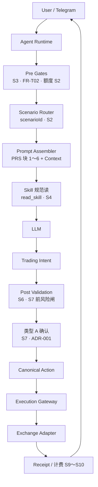
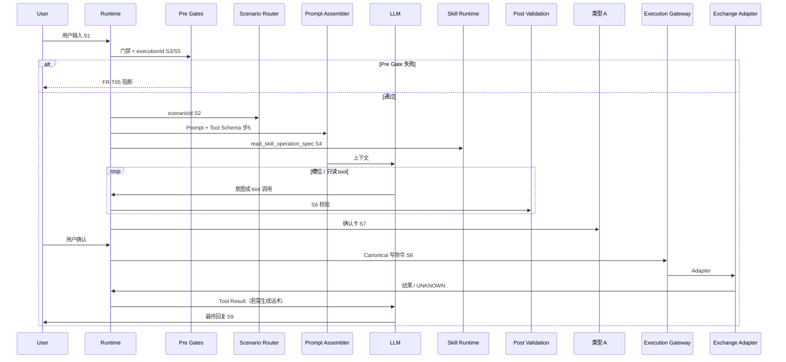
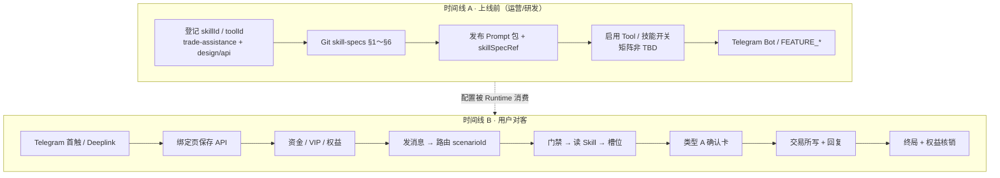

# 端到端全流程指南（人类阅读）

**版本**：`1.2.0` · **维护**：产品 + 规格 owner  

本篇把 **从「从未用过」到「在 Telegram 完成一笔交易写操作并扣费」** 以及 **上线前配置（Prompt / Skill / Tools / 场景）** 串成 **一条可读主线**。

| 项 | 说明 |
|----|------|
| **定位** | **人类导航与讲解**；**不**替代 `specs/requirements/` 中的 FR/SC、步骤编号与验收 |
| **步骤 SSOT** | [`specs/requirements/flows/`](../specs/requirements/flows/README.md)（`activate-trading-agent`、`trade-via-agent`、`consume-and-bill` 等） |
| **鸟瞰图** | [`flow/e2e-closed-loop.md`](../flow/e2e-closed-loop.md)（Mermaid；**图 ≠ 逐步 SSOT**） |
| **联调抽检** | [`journey-validation.md`](./journey-validation.md)（Given/When/Then） |
| **冲突时** | **以 specs 为准**，并回写本篇 |

**与 [`flows.md`](./flows.md) 的分工**：`flows.md` 是 **用户侧主路径 §1～§7 提要**；本篇 **更长、更完整**，并 **显式纳入运营配置面** 与 **Prompt / Skill / Tools / `scenarioId` 分工**。

---

## 1. 四个概念：各管什么、会不会打架

| 概念 | 一句话 | 典型载体 | 在本流程里出现的位置 |
|------|--------|----------|----------------------|
| **运行场景 `scenarioId`** | 这次执行 **走哪条业务线**（路由键） | [`routing-engine`](../specs/requirements/domains/agent/agent-orchestration/routing-engine.md) 寄存器 | 用户发消息后 **意图路由（S2）** |
| **Prompt** | **怎么对话、拼装哪些条文**（PRS L1～L2） | `prompts/`、运营 **Prompt 发布** | 每轮模型调用 **之前** |
| **Skill（A 类）** | **写路径操作规范**（参数/校验/确认/API） | `skill-specs/*.md`、`skillId` | **写之前** `read_skill_operation_spec`（**S4**） |
| **Tools** | **可被调用的能力 ID**（含 B/C 只读与 A 类登记镜像） | `trade-assistance` §8、`toolId` | 模型 **Tool Calling** + Runtime **权限链** |

**设计意图**：四层 **叠加**，不是四选一。冲突多来自 **配置不同步**（例如 Prompt 绑了未发布的 Skill 版本、场景键与登记册不一致、矩阵 PATH 仍 TBD 却启用写能力）。分层说明见 [`prompt-runtime/README`](../specs/requirements/prompt-runtime/README.md)。

### 1.1 Skill 与 Tool：不要混成一层

| 层 | 标识 | 含义 | 谁消费 |
|----|------|------|--------|
| **Skill** | `skillId` | **产品能力抽象**（参数、校验、确认、API 索引） | Runtime **`read_skill_operation_spec`**、类型 A 字段 |
| **Tool** | `toolId` | **运行时调用登记名**（含 B/C 只读、A 类镜像） | 模型 **Tool Schema**、权限链、观测 `agent.tool.call` |
| **Canonical** | 领域动词 + P0 对象 | **与交易所字段解耦** 的执行语义 | **Execution Gateway** 入口 |
| **Adapter** | `venue`（V1：`coobit`） | **PATH/HTTP 落地** | 子账户私有 API |

**一个 Skill 可映射多个未来 Adapter**；V1 仅 Coobit。登记 SSOT：[`trade-assistance` §2.6](../specs/requirements/domains/agent/exchange-agent/trade-assistance.md)、[`canonical-trading-model.md`](../specs/design/canonical-trading-model.md)。

**Prompt 装配（PRS）** 同时包含：**策略条文**、**场景族**、**（块 6）Tool JSON Schema** — 给模型 **可见工具面**。**写路径真源** 仍是 Runtime **读 Skill 规范**，不是把 Tool Schema 当成 Skill 正文。Telegram **类型 A 卡** 是渠道 UI（**S7**），不是首轮 System Prompt 里的「Skill Card」。

### 1.2 Prompt 治理：四类正文，不把 Skill 写进 Prompt

| 治理层 | 对应 `PromptPackType`（示意） | Prompt **只存** | **不存** |
|--------|------------------------------|-----------------|----------|
| **Base** | SYSTEM | 全局行为、铁闸 | Skill §1～§6、Slot、Tool 绑定 |
| **Scenario** | TRADING | 场景叙事、澄清/确认规则 | 参数表、校验矩阵 |
| **Analysis** | ANALYSIS | 解读/分析话术 | 同上 |
| **UX** | SAFETY | 护栏、遥测横幅 | 工作流编排 |

**关系链**（正确方向）：`scenarioId` → **Runtime** → **Skill 选择** → **Prompt 拼装** → 模型；**不是** Prompt 绑定 Skill 正文。

运营控制台字段 **`skillSpecRef`** 在 Demo 中展示为 **Runtime 技能范围（发布门禁指针）**：发布前校验登记册版本，**不等于**「Prompt = Skill 宿主」。量产应提供 **Prompt Assembly Trace**（每层来源：Base / Scenario / Runtime / Output）；Admin Demo 编辑器侧栏为 **示意表**。

规格：`prompt-management/config.md` §1.1a · PRS [`prompt-runtime/README`](../specs/requirements/prompt-runtime/README.md)。**运营包清单（16 包 · 六段正文 · 非 SSOT）**：[`prompt-governance-checklist.md`](./prompt-governance-checklist.md)（旧 `Prompt/Prompt List.md` 已删除）。

---

## 2. Runtime-first 架构（评审用）

**定位**：说明 **控制权在 Runtime、不在 Prompt**；**图 = 逻辑容器**，**步骤编号仍以** [`trade-via-agent` S1～S10](../specs/requirements/flows/trade-via-agent.md) **与** [`execution.md` §1](../specs/requirements/Runtime/execution.md) **为准**。

### 2.1 与「Prompt Bot」栈的分水岭

| 常见简化栈（不足） | 本产品（下限） |
|--------------------|----------------|
| User → Prompt → LLM → Tool → HTTP | User → **Runtime** → 门禁 / 场景 / 读 Skill → … → **Canonical** → **Gateway** → Adapter |
| 场景由 Prompt 猜 | **`scenarioId` 由 Runtime 路由（S2）** |
| 模型 JSON 直打交易所 | **Intent → Canonical Command → Gateway**（[`ADR-004`](../specs/design/adr/004-intent-centric-execution-and-canonical-trading-model.md)） |

详表：[`architecture.md` §「与通用 Agent 栈之对照」](../specs/design/architecture.md)。

### 2.2 逻辑容器总图



**说明**：实现可 **异步/多轮 LLM**（追问槽位、只读 tool）；**因果序** 须满足 [`domain-model.md` §4](../specs/requirements/Runtime/domain-model.md)（例如 **读 Skill 早于类型 A 与首笔写**）。**浏览器预览**：[`e2e-closed-loop.html`](../flow/e2e-closed-loop.html) **Tab 2～3**（与下文 **§2.2 / §2.6** 同源 · **v1.7.0**）。

### 2.3 Pre Gates 与 Post Validation

| 阶段 | 规格步骤 | 负责什么 | 未通过时 |
|------|----------|----------|----------|
| **Pre Gates** | **S3**；[`consume-and-bill` S2](../specs/requirements/flows/consume-and-bill.md) | 全局关、暂停、子账户+API、VIP、计费/权益/Capability | **FR-T05** 拒答；**不宜** 进入完整写链、白烧 Token |
| **Post Validation** | **S6**；**S7 前** R3（[`domain-model` §2](../specs/requirements/Runtime/domain-model.md)） | 槽位、tick/step、限额、偏离带、写参宪法 INV-008/009 | 追问或拒答；**不** 静默写 |

**只读/纯对话**：无 S4～S8 全链，但 **私有读** 仍常须 **Pre Gates**。

### 2.4 Read Phase 与 Write Phase

| Phase | 流程 SSOT | 类型 A | 交易所写 |
|-------|-----------|--------|----------|
| **Read** | [`read-analyze-and-search-via-agent`](../specs/requirements/flows/read-analyze-and-search-via-agent.md) | 默认 **无** | **禁止** 静默写 |
| **Write** | [`trade-via-agent`](../specs/requirements/flows/trade-via-agent.md) | **每笔写必有（S7）** | **Gateway 后** Adapter |

用户从问价转到「帮我买」→ Runtime **重新 S2 路由**，进入 Write Phase（§8）。

### 2.5 Canonical Action Layer（实现主战场）

```text
Skill / Planner（skillId · scenarioId）
      ↓
Trading Intent（结构化意图 · 随版本冻结）
      ↓
Canonical Command（领域动词 + P0 · design SSOT）
      ↓
Execution Gateway（venue · 幂等 · 能力矩阵）
      ↓
Exchange Adapter（V1：Coobit / openapi-ai pin）
      ↓
交易所 HTTP（design/api 矩阵）
```

**文档 SSOT**：[`canonical-trading-model.md`](../specs/design/canonical-trading-model.md)。**可执行 Gateway · DoD B** 在 **所内工程仓**（[`CC-P1-07`](../specs/requirements/contract-closure.md#cc-p1-07)）；本 Git 仓为 **需求/设计对齐**。

### 2.6 单笔写路径时序（Sequence）



**勿用**「LLM 写意图 → 直连 Tool Executor → 交易所」作为 SSOT；**写** 必经 **Canonical + Gateway**。**HTML 预览**：[`e2e-closed-loop.html`](../flow/e2e-closed-loop.html) **Tab 3**。

### 2.7 Runtime 状态机（非线性）

单笔 **`executionId`** 主态（附录 A）：`accepted` → `planning` → **`waiting_confirmation`** → `executing` → `settling` → 终局；**`unknown_pending`** 用于 504/UNKNOWN。

**SSOT**：[`runtime-state-machine.md`](../specs/requirements/Runtime/runtime-state-machine.md)、[`execution.md` 附录 A](../specs/requirements/Runtime/execution.md)。

### 2.8 架构演进优先级（产品/工程）

| 优先级 | 主题 | 原因 |
|--------|------|------|
| P0 | **Canonical + Gateway 落地** | 防 Prompt/模型输出污染执行面 |
| P0 | **Pre Gates 前置** | 降 Token 成本、风控及时 |
| P1 | **Skill/Tool 登记与 Enable 同窗** | 避免耦合与假开放 |
| P1 | **状态机与观测 join `executionId`** | 长链路、在途、部成话术 |
| P2 | 更强 Prompt 条文 | **在** Runtime 门禁 **之后** 锦上添花 |

### 2.9 澄清会话与记忆治理（写路径 · 多轮）

**缺参不写**：用户表达写意图但槽位不全 → **澄清轮**（**`cl:*` 键盘**）补路由/槽位 — **≠ 类型 A 写确认**。SSOT：[`clarify-session`](../specs/requirements/domains/agent/agent-orchestration/clarify-session.md) · [`clarify-user-visible`](../specs/requirements/prompts/shared/clarify-user-visible.md) · [`telegram-and-cards` §澄清键盘](./telegram-and-cards.md)。

**每条 inbound 重意图**：澄清态下用户发「你好」「有哪些币」「都不要了」→ **须** **寒暄/只读/放弃** — **禁止** **盲复读闪兑/限价模板（§2.3）**。

**隔较久回来**：写澄清 **idle/TTL 先达** → **默认 stale**（退出活跃 L1）→ **重意图 ± Resume 门控** — **不依赖**阻塞式「继续/新话题」按钮。SSOT：[`memory-runtime` §14.6](../specs/requirements/Runtime/memory-runtime.md) · [`keys` §2.1](../specs/requirements/domains/admin/trading-agent-config/keys.md)。

**Eval 抽检**：[`evals/clarify-telegram`](../specs/requirements/evals/clarify-telegram.md)（**§11～§13**）· **`eval.memory.idle_default_stale`** · **`eval.memory.resume_classifier_gate`** · **`eval.memory.resume_classifier_multi_episode`** · **`eval.runtime.telegram_update_idempotent`**（**Webhook 幂等**）。

---

## 3. 总览：两条时间线



- **时间线 A**：没有稳定配置，时间线 B 会在门禁或 Publish 处被挡住。  
- **时间线 B**：下文 **§4～§9** 逐步展开；交易写 **逐步编号** 以 [`trade-via-agent` S1～S10](../specs/requirements/flows/trade-via-agent.md) 为准。

---

## 4. 阶段 0 · 上线前配置（运营控制台 + Git）

**目标**：让 Runtime 能 **合法地** 拼装 Prompt、命中场景、读 Skill、调用已登记 Tool。

| 步骤 | 谁做 | 做什么 | 规格入口 |
|------|------|--------|----------|
| 0.1 | 产品 + 架构 | 在 **`design/api` 矩阵** 冻结写 PATH；`skillId`/`toolId` **单行登记** | [`trade-assistance` §4/§8](../specs/requirements/domains/agent/exchange-agent/trade-assistance.md)、[`ADR-002`](../specs/design/adr/002-tool-skill-registry-ssot.md) |
| 0.2 | 产品 + Agent | 维护 **Git `skill-specs`** 正文（§1～§6 自包含） | [`skill-specs/README`](../specs/requirements/skill-specs/README.md) |
| 0.3 | 运营 | **发布 Prompt**（TRADING 等）；**`skillSpecRef`** 指向已登记版本 | [`prompt-management`](../specs/requirements/domains/admin/prompt-management/overview.md) |
| 0.4 | 运营 | **启用** 技能/工具（生产须满足矩阵与审计；Demo 为预览开关） | [`tool-management` FR-TM04](../specs/requirements/domains/admin/tool-management/functions.md) |
| 0.5 | 运营 | 配置 **Telegram Bot**、**`FEATURE_TRADING` / `FEATURE_AGENT_*`** | [`admin-bot-config`](../specs/requirements/domains/agent/telegram/admin-bot-config.md)、[`management-console-v1-prd`](../specs/requirements/domains/admin/management-console-v1-prd.md) |

**量产 Skill 发布**（Runtime **PUBLISHED** 快照）属 **MR-B / 所内 BFF**，与 Demo 控制台「仅启用、不展示 Runtime 发布」的分工见 [`src/admin/README`](../src/admin/README.md) §技能登记页。

**检查点（配置闭环）**：

1. 每个对外 **写** `skillId` 在 §4/§8 **有一行**，且 **主 `scenarioId`** 在 routing-engine **有键**。  
2. TRADING Prompt 的 **`skillSpecRef`** 与 Git **`skillSpecVersion`** 一致且 **已发布**（量产）。  
3. 涉及写的 **`toolId`**：**Enable** 且矩阵 **非 TBD**（或书面延期）。

---

## 5. 阶段 A · 开通：从首触到「能交易」

**流程 SSOT**：[`activate-trading-agent.md`](../specs/requirements/flows/activate-trading-agent.md)（**S1～S5**）  
**展开**：[`initialization-flow.md`](../specs/requirements/domains/agent/onboarding/initialization-flow.md)  
**人话提要**：[`flows.md` §1](./flows.md#1-从有兴趣到能交易)

| 步骤 | 用户侧发生了什么 | 系统/产品要点 |
|------|------------------|---------------|
| **A1** | 在 Telegram 首次说话 | 若 **未绑定实例** → **类型 B 卡** + **产品线 Deeplink**（**不须**先登录交易所主站） |
| **A2** | 打开 **Agent 绑定页**，填 **子账户 UID + API Key/Secret**，点保存 | `POST .../bindings/trading-api`；**§1.2 下限校验**（子账户 Key、UID 一致、权限全开等） |
| **A3** | 在交易所侧给 **子账户币币 USDT** 充值/划转 | 满足后续扣费与交易资金叙事 |
| **A4** | （若需要）提升 **母账号 VIP** | `vipTier` 下限见配置 |
| **A5** | 回到 Telegram，可正常对话 | **绑定 + 门禁快照** 就绪 |

此阶段 **一般不涉及 Skill 写路径**；主要是 **身份、子账户、API、计费前提**。

---

## 6. 阶段 B · 每次会话：消息进入 Runtime

用户任意一条 Telegram 消息都会触发 **一轮可追踪的执行上下文**（可能分配 `executionId`，见计费 flow）。

| 步骤 | 说明 | 与四概念的关系 |
|------|------|----------------|
| **B1** | 渠道进站、会话归因 | Telegram 规范：[`telegram/overview`](../specs/requirements/domains/agent/telegram/overview.md) |
| **B2** | **门禁快照**（全局开关、暂停、子账户/API、VIP、计费/权益） | 未通过 → **`FR-T05`** 可读阻断 + **单一明确下一步** |
| **B3** | **Prompt 注入**（SYSTEM/SAFETY/场景族/变量闸） | 消费 **已发布 Prompt 包**；配方见 `scenarioId` → [`registry`](../specs/requirements/prompts/library/scenarios/registry.md) |
| **B4** | **意图路由 → `scenarioId`** | **业务能力第一维**；见 [`routing-engine`](../specs/requirements/domains/agent/agent-orchestration/routing-engine.md) |
| **B5** | 分支：**只读** vs **写** vs **纯对话** | 只读 → §7；写 → §8 |

**概念管线对照**（评审常用）：[`Runtime/domain-model.md` §1](../specs/requirements/Runtime/domain-model.md) 十步 ↔ `trade-via-agent` S1～S10。

---

## 7. 阶段 C · 只读路径（问价、分析、检索）

**默认**：**无类型 A 确认卡**，**不得静默调用交易所写接口**。

| 项 | 入口 |
|----|------|
| 流程 | [`read-analyze-and-search-via-agent.md`](../specs/requirements/flows/read-analyze-and-search-via-agent.md) |
| 工具目录 | [`trade-assistance` §8 B/C](../specs/requirements/domains/agent/exchange-agent/trade-assistance.md) |
| 人话 | [`flows.md` §6](./flows.md#6-只要分析舆情或翻译不碰下单)、[`user-scenarios.md` §只问价](./user-scenarios.md) |

用户 **从只读转到「帮我买/卖」** 时，Runtime **重新走路由**，进入 §8，并落到 **四轨之一**。

---

## 8. 阶段 D · 交易写路径（核心）

**流程 SSOT**：[`trade-via-agent.md`](../specs/requirements/flows/trade-via-agent.md)  
**确认步骤序**：[`confirmation-flow.md`](../specs/requirements/domains/agent/agent-orchestration/confirmation-flow.md)  
**卡片字段**：[`telegram-and-cards.md`](./telegram-and-cards.md)、[`telegram/overview` §2.5](./telegram-and-cards.md)

### 8.1 产品四轨（互斥）

识别为 **交易写** 后，须落在 **恰一轨**（禁止静默混轨）：

| 轨 | 用户口语示例 | 主 `scenarioId` 族 | Skill 示例 |
|----|--------------|---------------------|------------|
| **闪兑** | 市价买/卖、即时成交 | `trade.spot.flash_convert` | `skill.spot.flash_convert` |
| **现货限价** | 挂单、限价买卖 | `trade.spot.limit_order` | `skill.spot.limit_order` |
| **全仓杠杆** | 借币/全仓市价或限价 | `margin.cross.*` | `skill.margin.cross_*` |
| **合约** | 永续开平仓、条件离场 | `trade.futures.*` 等 | `skill.futures.*` |

细则与 **专节**（现货限价八步、合约八步等）均在 `trade-via-agent` 正文。

### 8.2 单笔写操作：S1～S10（与四概念对齐）

与 **§2 Runtime-first** 对照：S3=Pre Gates，S4/S6/S7 前=Skill 读与 Post Validation，S7=类型 A，S8=Canonical+Gateway。

下表是 **产品必读顺序**；验收条文以 flow 原文为准。

| 步骤 | 名称 | 用户可感知 | Prompt | `scenarioId` | Skill | Tools |
|------|------|------------|--------|--------------|-------|-------|
| **S1** | 用户发起 | 在 TG 说话 | 已注入 | 待判定 | — | — |
| **S2** | 意图路由 | 可能被追问 | 场景条文生效 | **冻结键** | 选定 `skillId` 族 | 暴露可调工具集 |
| **S3** | 门禁 | 被拦或继续 | — | 校验 FEATURE_* | — | Enable + 矩阵 |
| **S4** | 读 Skill 规范 | — | `skillSpecRef` 须有效 | 与登记一致 | **`read_skill_operation_spec`** | — |
| **S5** | `executionId` | — | — | — | — | — |
| **S6** | 槽位/校验 | 机器人追问价量对等 | 不得臆造 tick/step | — | §1～§2 表 | 只读预检类 tool |
| **S7** | 类型 A 确认 | **确认卡** 点确认 | 确认叙事 L5 | — | §3 确认字段 | — |
| **S8** | 调交易所 | 等待结果 | — | — | §6 API 路径 | **写 tool / Gateway** |
| **S9** | 用户可见结果 | 成功/失败/在途话术 | FR-T05 稳定码 | — | — | — |
| **S10** | 终局与扣费 | 额度变化 | — | — | — | — |

**硬规则（务必记住）**：

- **每一笔写** 必须先 **类型 A** 再调私有 API（[`ADR-001`](../specs/design/adr/001-telegram-confirm-before-coobit-write.md)）。  
- **逻辑改单**：**一次** 类型 A 可覆盖 **撤单→下单** 序列，中间不再第二张卡。  
- **504/UNKNOWN**：不得对用户断言「一定成交」——见 §10。

**七段用户体感**（挂单类细节）：`trade-via-agent` **S11～S17** 展开 S6～S9 的产品细序。

---

## 9. 阶段 E · 计费与权益

**流程 SSOT**：[`consume-and-bill.md`](../specs/requirements/flows/consume-and-bill.md)

| 步骤 | 说明 |
|------|------|
| **E1** | 可计费执行前：**S2 额度门禁**（Capability/包额度） |
| **E2** | 运行中：持 **`executionId`** 观测 |
| **E3** | 终局后：**轨 B 权益核销**（`ENTITLEMENT_DEBIT`） |
| **E4** | 用户查消耗：主站/H5 **`/subaccount/billing`（账单与消耗 · `me/commerce`）**（TG **`?start=ab`** / **`ab_ld`** Deeplink · 见 [`commerce-deeplink`](../specs/requirements/domains/web/commerce-deeplink.md)） |

人话：[`flows.md` §4](./flows.md#4-用完了怎么扣钱怎么看账户)。

---

## 10. 阶段 F · 异常与信任

| 情境 | 产品原则 | 入口 |
|------|----------|------|
| 504 / UNKNOWN | 区分「计费可能发生」与「订单是否终态」 | [`architecture`](../specs/design/architecture.md)、[`unknown-state`](../specs/requirements/Runtime/unknown-state.md) |
| 矩阵 **TBD** 能力 | 不得对客承诺闭环；拒答或主站 Deeplink | [`contract-closure`](../specs/requirements/contract-closure.md) |
| 理财/划转须主站 | `WEALTH_ACTION_REQUIRES_WEB` 等 | [`wealth-via-agent`](../specs/requirements/flows/wealth-via-agent.md) |
| 自动化/Pull | 创建→触发→TG | [`automation-alerts`](../specs/requirements/flows/automation-alerts.md) |

---

## 11. 示例走读：现货限价一笔单

**用户故事**：已开通用户说「用 50000 买 0.01 个 BTC，限价」。

| 序 | 发生了什么 | 配置/规格锚点 |
|----|------------|---------------|
| 1 | 消息进站，门禁通过 | `FEATURE_TRADING`、`FEATURE_AGENT_SPOT` |
| 2 | 路由到 **`trade.spot.limit_order`** | `routing-engine`、`skill.spot.limit_order` |
| 3 | Runtime **读取** `skill.spot.limit_order` §1～§6 | Git +（量产）PUBLISHED 快照 |
| 4 | Prompt 提供对话策略；**参数以 Skill 表为准** | `prompts/trading/*` + `skillSpecRef` |
| 5 | 追问/确认 `symbol/side/price/qty` | Skill §1～§2；`intents` |
| 6 | 展示 **类型 A 确认卡**（字段齐） | Skill §3、Telegram §2.5 |
| 7 | 用户点确认 → `POST /sapi/v2/order` | Skill §6、`design/api` |
| 8 | 回复挂单结果；`executionId` 终局 → 核销 | `consume-and-bill` |

**改单**：须换 **`skill.spot.amend_limit_order`**，**一次** 类型 A 后撤单再挂新单。

---

## 12. 配置面 vs 运行面（速查）

| 问题 | 配置面（阶段 0） | 运行面（阶段 A～F） |
|------|------------------|---------------------|
| 用户为什么不能下单？ | 技能/工具未启用、矩阵 TBD、Prompt 未发布 | 门禁：未绑定、VIP、额度用尽 |
| 话术从哪来？ | Prompt 发布包 | 本轮拼装 + Skill 确认字段 |
| 能不能写交易所？ | `skillId` 登记 + PATH 冻结 | S4 读规范 + S7 类型 A + S8 Gateway |
| 场景错轨怎么办？ | 寄存器 + Prompt 绑定审查 | S2 路由 + `runtime-freeze` |

---

## 13. 规格索引（按角色）

| 我想… | 读 |
|-------|-----|
| 开会讲全流程 / Runtime-first | **本篇 §2** + [`e2e-closed-loop`](../flow/e2e-closed-loop.md) |
| Canonical / Gateway | [`canonical-trading-model.md`](../specs/design/canonical-trading-model.md)、[`CC-P1-07`](../specs/requirements/contract-closure.md#cc-p1-07) |
| 状态机 | [`runtime-state-machine.md`](../specs/requirements/Runtime/runtime-state-machine.md) |
| 写验收 / 测试用例 | [`journey-validation.md`](./journey-validation.md)、[`flows/`](../specs/requirements/flows/README.md) |
| 改 Telegram 卡片 | [`telegram-and-cards.md`](./telegram-and-cards.md) |
| 改 Skill 正文 | [`skill-specs/`](../specs/requirements/skill-specs/README.md) |
| 改 Prompt | [`prompt-management/`](../specs/requirements/domains/admin/prompt-management/overview.md)、[`prompts/`](../specs/requirements/prompts/README.md) |
| 改工具登记 | [`tool-management/`](../specs/requirements/domains/admin/tool-management/overview.md) |
| 改场景键 | [`routing-engine`](../specs/requirements/domains/agent/agent-orchestration/routing-engine.md) |
| 评审架构 | [`architecture` §对照](../specs/design/architecture.md) |

---

## 14. 维护约定

- 调整 **S1～S10 语义**、**Canonical 分层** 或 **开通 S1～S5** 时：先改 **`specs/` / `design/`**，再 **同步本篇 §2 与 §8**、[`flows.md`](./flows.md)。  
- 新增 **主路径 `scenarioId`**：同步 **routing-engine + trade-assistance + skill 元数据 + 本篇 §8.1 表**。  
- 评审用架构图变更：**§2.2 / §2.6** 与 [`domain-model.md`](../specs/requirements/Runtime/domain-model.md) **同窗**。  
- 发版对外承诺前：用 [`journey-validation.md`](./journey-validation.md) 抽检 **JV-01～** 系列。
