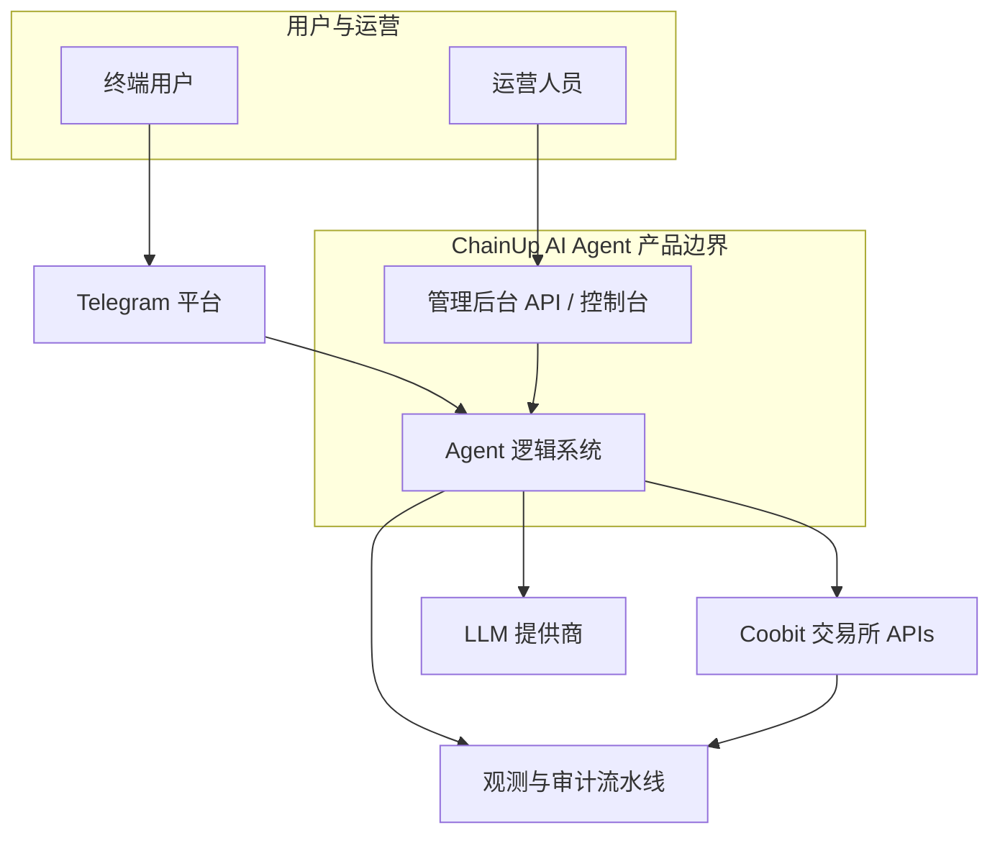
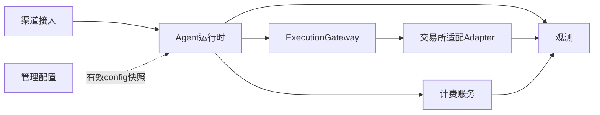
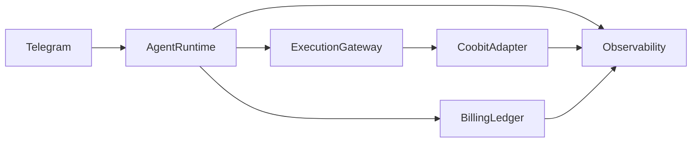

# 架构概览（逻辑视图）

本文给出 **系统如何协作运行** 的 **逻辑架构**（语境 + 容器级叙事）：与 **[`api.md`](api.md)** 的 HTTP/字段契约、**[`requirements/Runtime/overview.md`](../requirements/Runtime/overview.md)** 的运行时横切需求、**[`requirements/flows/`](../requirements/flows/README.md)** 的步骤级主流程 **配套阅读**。**物理拓扑、机器与服务实例划分**见 **[`deployment.md`](deployment.md)**（与运维/Infra 对签）。

## 系统如何运行：文档地图

| 读者意图 | 首选 |
|----------|------|
| **端到端业务步骤**（谁先谁后、分支） | [`requirements/flows/`](../requirements/flows/README.md) |
| **Memory 分层与默认 TTL** | [`requirements/Runtime/memory-runtime.md`](../requirements/Runtime/memory-runtime.md)、[`design/memory-runtime-injection.md`](memory-runtime-injection.md)、**本文「Memory 留存」** |
| **接口与幂等、504、矩阵** | [`api.md`](api.md)、[`requirements/contract-closure.md`](../requirements/contract-closure.md)、[`requirements/closure-remaining.md`](../requirements/closure-remaining.md) **§7～§7.6**（**关单执行路径**） |
| **统一交易语义 · Gateway（文档 vs 实现 · 评审）** | [`canonical-trading-model.md`](canonical-trading-model.md)、[`ADR-004`](adr/004-intent-centric-execution-and-canonical-trading-model.md)、[`trade-assistance` §2.6](../requirements/domains/agent/exchange-agent/trade-assistance.md)；[`CC-P1-07`](../requirements/contract-closure.md#cc-p1-07)；[`requirements-review` §7.5](../../product/requirements-review.md#cc-adr004-review-checklist) |
| **可观测与审计事件** | [`requirements/observability/overview.md`](../requirements/observability/overview.md) |
| **Market Narrative · phase 派生与 hints** | [`market-narrative-runtime.md`](market-narrative-runtime.md)、[`requirements/domains/agent/exchange-agent/market-intelligence.md` §4](../requirements/domains/agent/exchange-agent/market-intelligence.md)、[`openapi/components/market-runtime-schemas.yaml`](../openapi/components/market-runtime-schemas.yaml) |
| **部署环境、发布与逻辑拓扑** | [`deployment.md`](deployment.md) |
| **架构语言（Runtime / Gateway / 意图中心 vs 聊天+工具）** | **本文「与通用 Agent 栈之对照」** |

## 与通用 Agent 栈之对照（架构语言）

**目的**：对内对外 **统一叙事** — 本产品是 **系统工程型 Agent**，**核心链** **不是**「仅 Prompt + Tool Calling → 交易所 HTTP」。**契约与能力面** **仍须** **同窗** [`api.md`](api.md)、[`trade-assistance` §8](../requirements/domains/agent/exchange-agent/trade-assistance.md)、[`agent-coobit-api-allowlist.md`](../requirements/integrations/exchange/agent-coobit-api-allowlist.md)。

| 坊间简化栈（不足处） | 本产品对应（下限） |
|----------------------|---------------------|
| **Agent → Tool → API** | **Tool / `toolId`** **不等于** **交易语义**：须 **Intent → Canonical → Gateway → Adapter → HTTP**（[`canonical-trading-model.md`](canonical-trading-model.md)、[`ADR-004`](adr/004-intent-centric-execution-and-canonical-trading-model.md)）。 |
| **单一「Agent」包揽一切** | **Agent 运行时** **管** **`executionId` 生命周期**、编排、确认门、计费交界、观测（[`Runtime/execution.md`](../requirements/Runtime/execution.md)）；**Execution Gateway** **管** **`venue`、领域动词收敛、幂等入口**，**勿与 Runtime 混为一谈**（上文容器表）。 |
| **Skill 分包即产品真理** | **意图中心执行**：登记表 **`skillId`/`toolId`** **表达能力与意图面**（[`trade-assistance` §2.6](../requirements/domains/agent/exchange-agent/trade-assistance.md)）；**Adapter**（含 **`openapi-ai` pin**）**仅为出站实现宿主** — [`integrations/exchange/overview.md`](../requirements/integrations/exchange/overview.md)。跨所演进 **禁止** **仅以「某所 Skill」** **做领域 SSOT**。 |
| **仅单次会话** | **单次可计费执行** **与** **长驻编排** **分层**：**`scenarioId` / 步骤流** **偏 Workflow**（[`routing-engine.md`](../requirements/domains/agent/agent-orchestration/routing-engine.md)）；**监控·任务·`taskId`** **偏跨会话状态机**（[`monitoring-tasks.md`](../requirements/domains/agent/exchange-agent/monitoring-tasks.md)、[`automation-alerts.md`](../requirements/flows/automation-alerts.md)、[`state-machine.md`](../requirements/domains/agent/agent-orchestration/state-machine.md)）。**「持久 Goal / Portfolio 能力」** **若** **独立升格**，**须** **专项 MR** **对齐上列宿主**，**避免** **与 `scenarioId` 命名打架**。 |

**确定性边界（金融下限）**：写前 **类型 A / FR-T11**（[`ADR-001`](adr/001-telegram-confirm-before-coobit-write.md)、[`confirmation-flow.md`](../requirements/domains/agent/agent-orchestration/confirmation-flow.md)）；**UNKNOWN / 504** **与对账**（本文「504」专节、[`Runtime/reconciliation.md`](../requirements/Runtime/reconciliation.md)、[`Runtime/recovery.md`](../requirements/Runtime/recovery.md)）。

## C4 · 系统语境（Context）

- **用户触达（首版）**：以 **Telegram** 为主入口；**§2.5 · 类型 A**（总则 **§2～§2.6**）**与** **确认门** 见 [`domains/agent/telegram/overview.md`](../requirements/domains/agent/telegram/overview.md)、[`api.md`](api.md)「Telegram Bot API」、[ADR-001](adr/001-telegram-confirm-before-coobit-write.md)。
- **Coobit**：私有交易/账务 API 与用户主站能力；**子账户 scope** 与 **不得在终态不明时向用户断言成交** 见下文与 [`exchange-agent/overview.md`](../requirements/domains/agent/exchange-agent/overview.md)。**对上 Coobit 的 HTTP** **优选** **ChainUp 所内 `openapi-ai` 官方发布物**（与 GitBook OpenAPI 同窗）**实现**，**须**与 **[`api.md`](api.md) 矩阵** 及 **[`agent-coobit-api-allowlist.md`](../requirements/integrations/exchange/agent-coobit-api-allowlist.md)** **同窗** — **详** [`integrations/exchange/overview.md`](../requirements/integrations/exchange/overview.md)。

## C4 · 容器级逻辑视图（Container）

以下为 **逻辑容器**（可映射到多条实际服务或单体内模块；**名称不作为实现 SSOT**）：

| 逻辑容器 | 职责摘要 | 需求/设计索引 |
|----------|-----------|----------------|
| **渠道接入** | 接收 Telegram `Update`、验签、与会话/绑定摘要对齐 | [`integrations/telegram/`](../requirements/integrations/telegram/bot-api.md)、[`telegram/overview.md`](../requirements/domains/agent/telegram/overview.md) **§2.5 · §2～§2.6** |
| **Agent 运行时** | 编排（`scenarioId`/步骤）、Planner/工具门禁、上下文与 **一次 `executionId` 可计费执行** 边界 | [`agent-orchestration/overview.md`](../requirements/domains/agent/agent-orchestration/overview.md)、[`Runtime/execution.md`](../requirements/Runtime/execution.md)、[`exchange-agent/overview.md`](../requirements/domains/agent/exchange-agent/overview.md) |
| **统一交易语义 · Execution Gateway** | **将** **`skillId`/`toolId` 所表达之意图** **收敛为** **Canonical 命令**（[`canonical-trading-model.md`](canonical-trading-model.md)），**解析 `venue`（V1：`coobit`）**、**能力检查与幂等入口**，**再** **委派** **交易所适配**。**不** **替代** **`skillId` 登记表**（[`ADR-004`](adr/004-intent-centric-execution-and-canonical-trading-model.md)）。**可执行 Gateway 代码** **在** **所内工程仓**；**本** **`specs/`** **仅** **文档 A**。 | [`canonical-trading-model.md`](canonical-trading-model.md)、[`trade-assistance.md`](../requirements/domains/agent/exchange-agent/trade-assistance.md) §2.6；[`CC-P1-07`](../requirements/contract-closure.md#cc-p1-07)；[`requirements-review` §7.5](../../product/requirements-review.md#cc-adr004-review-checklist) |
| **交易所适配（Adapter）** | **子账户凭据范围内** **对上 Coobit OpenAPI**（**V1 唯一实现**）。**HTTP 出站默认** **由** **所内 `openapi-ai` 官方包**（Skill/CLI/MCP）**作为 Coobit Adapter 之实现载体**，**tag/commit 须 pin**（[`integrations/exchange/overview.md`](../requirements/integrations/exchange/overview.md)）；504/UNKNOWN 归一与对账 | [`api.md`](api.md)、[`agent-coobit-api-allowlist.md`](../requirements/integrations/exchange/agent-coobit-api-allowlist.md)、本文「504」专节、[数据流](#agent-运行时数据流概念) |
| **计费账务** | 可计费执行 **终局** 后的 Token/账务 API（**不**替代 [`billing.md`](../requirements/domains/admin/billing-management/overview.md) 公式） | [`flows/consume-and-bill.md`](../requirements/flows/consume-and-bill.md)、[`billing.md`](../requirements/domains/admin/billing-management/overview.md) §10.1 |
| **管理配置** | 全所 **`configKey`**、Bot/Webhook 运维 **`secretRef`**、审计 | [`management-console-v1-prd.md`](../requirements/domains/admin/management-console-v1-prd.md)、[`trading-agent-config/`](../requirements/domains/admin/trading-agent-config/overview.md) |
| **观测** | 结构化事件（工具调用、交易私有 API、`billing.*`） | [`observability/overview.md`](../requirements/observability/overview.md) §2 |

## 信任边界与开通（摘要）

**Agent 专用子账户** 开立、**子账户交易 API** 经 **Agent 产品线绑定页 §1.2** **`POST .../bindings/trading-api` 服务端校验通过后** 绑定并托管；**Secret 不进运营台**；**默认仅用子账户 scope**，禁止主账户 Key 作为默认交易通路（[`exchange-agent` FR-T01](../requirements/domains/agent/exchange-agent/overview.md)）。开通与 **产品线 Deeplink** 见 [`onboarding/overview.md`](../requirements/domains/agent/onboarding/overview.md) §1.1；全局键与 Kill 见 [`config.md`](../requirements/domains/admin/management-console-v1-prd.md)。

## 上下文（产品定位）

- **本产品**：ChainUp AI Agent（Coobit）
- **外部系统**：Coobit 交易所（用户、认证、币币账务、交易与风控等）

## 交易所私有 API：504 UNKNOWN 与写操作对账

**产业语义**：[Coobit OpenAPI · Basic Information](https://exchangedocsv2.gitbook.io/open-api-doc-v2/openapi-basic-information.md) 规定 **HTTP 504** 表示网关侧 **响应超时**，**执行结果 UNKNOWN**，**不得**直接当作 **失败** **或** **成功** 向用户 **断言终态**。

**Agent / 交易所网关须遵守**（与 [`api.md`](api.md) **通用契约**、[`overview.md`](../requirements/domains/agent/exchange-agent/overview.md) **FR-T01 / FR-T05** 一致）：

| 行为 | 约定 |
|------|------|
| **504 / 空响应 / 无法解析业务码** | 将该次 **写调用**（下单、撤单等）记为 **UNKNOWN**；**禁止**据此更新 **「已成交 / 已撤销」** 类用户可见结论。 |
| **对账** | **异步或同步** 使用 **查单** 接口（`GET` **order** 等，**PATH** 见 [`api.md`](api.md) **矩阵** · 币币/杠杆/合约分行）按 **`orderId`** 或 **`newClientOrderId` / `clientOrderId`**（**字段名以各产品线 OpenAPI 为准**）**拉取终态**；必要时 **退避重试**并受 **429 / 410 / 418** 约束（同 [`api.md`](api.md)）。 |
| **幂等与重试** | **须**为写委托生成或透传交易所接受的 **客户端订单号**（如 **`newClientOrderId`**）；**同一业务意图** 的 **安全重试** **须** **复用**该号 **或** **先** 查单据实 **无单** 后再 **换新号**（**所内须冻结**细则，避免 **双倍下单**）。**`executionId`**（计费/编排）与 **交易所侧幂等键** **分层**：详见 [`api.md`](api.md) **「请求幂等（写）」**。 |
| **用户触达** | 对账 **未完成** 前：**中性** 文案（如仍在确认）；**终态明确** 后再 **可读成功/失败** + **`billCode` / 稳定码**（**FR-T05**）。 |
| **计费交界** | **不得**在 **交易所终态未明** 时向用户 **虚构** 成交；**可计费执行** 与 **结算评估** 的先后与 **504** 语义 **以** [`billing.md`](../requirements/domains/admin/billing-management/overview.md) **§10.1**（**D-2 与 UNKNOWN 交界**）、[`flows/consume-and-bill.md`](../requirements/flows/consume-and-bill.md) **及** **FR-T01** **为准**（本文 **不** 重复计费公式）。 |

## 在途（D-1）与紧急停止（首版会签）

| 主题 | 首版冻结 |
|------|----------|
| **在途执行**（**`config.md` §11 D-1**） | **(A)** **已采纳**：在途 **允许完成当前原子步** 后结束；**新**执行在 **全局关 / 运营暂停 / 计费阻断** 后 **按** [`overview.md`](../requirements/domains/agent/exchange-agent/overview.md) **FR-T02～T04** **拒绝**。**(B)** 立即强中止 — **非首版**，须 **书面变更** 并全环境一致。 |
| **紧急停止**（**`FEATURE_TRADING=OFF`**、**运营暂停**、产品线 **`FEATURE_AGENT_*` OFF**） | **新**写 **一律拒绝**。**不**自动向交易所 **批量撤销** 已在途 **挂单 / 条件单**（**无**首版「一键全撤」产品承诺）；**用户** **须**在 **主站**管理残留委托 **或** 在 **后续版本** **补** **显式撤单**工具。**Telegram** **须** **可读提示**（**`exchange-agent` FR-T05**）**勿误导**「已代撤单」。 |

## Agent 运行时数据流（概念）

**Telegram** 入口（**先于 Coobit 写**：[`domains/agent/telegram/overview.md`](../requirements/domains/agent/telegram/overview.md) **§2.5 · 类型 A**（总则 **§2～§2.6**）、[`api.md`](api.md) **「Telegram Bot API」专节**）→ **Agent 编排**（**`scenarioId` / 步骤图**：[`agent-orchestration/overview.md`](../requirements/domains/agent/agent-orchestration/overview.md)；**交易写前** **`read_skill_operation_spec`**：[`trade-assistance.md`](../requirements/domains/agent/exchange-agent/trade-assistance.md)；**上下文预算/压缩**：[`agent-context/overview.md`](../requirements/domains/agent/agent-context/overview.md)；**Memory 默认留存**：**本文** **[「Memory 留存」](#memory-留存热--温--冷设计默认值--v0)** **与** [`memory-runtime.md`](../requirements/Runtime/memory-runtime.md)；**Prompt 版本**由 **交易所后台** [`prompt-management.md`](../requirements/domains/admin/prompt-management/overview.md) **治理**）→ **Execution Gateway（统一交易语义层）**（[`canonical-trading-model.md`](canonical-trading-model.md)、[`ADR-004`](adr/004-intent-centric-execution-and-canonical-trading-model.md)）**将意图落实为 Canonical 命令并路由 `venue`** → **子账户托管凭据** **经** **Coobit Adapter（含 `openapi-ai` 官方宿主，pin 版本）** 调 **Coobit 私有 API**（[`api.md`](api.md) **矩阵** · [`integrations/exchange/overview.md`](../requirements/integrations/exchange/overview.md)）· **计费**仅在 **可计费执行终局** 调 **账务 API**（子账户 · 币币 USDT）→ **结构化事件** 入 **`observability`**（**`agent.tool.call` / `trading.exchange_private`（含 `exchangeOutcome`/`unknown`） / `billing.*`**，见 [`observability.md`](../requirements/observability/overview.md) **§2**）。**产品线 Deeplink** 用于 **Key/onboarding（`me/agent/*`）** 恢复；**交易所站内 Deeplink** 用于 **Billing、理财/划转** 等（**`exchange-agent` §8.3～8.4**）。**504 对账语义** 见上文 **「504 UNKNOWN 与写操作对账」**。

与 `requirements/flows/` 主流程对应：**开通 / 资金** → [`activate-trading-agent.md`](../requirements/flows/activate-trading-agent.md)；**单次消费与扣费** → [`consume-and-bill.md`](../requirements/flows/consume-and-bill.md)；**自然语言成交** → [`trade-via-agent.md`](../requirements/flows/trade-via-agent.md)；**条件单与告警** → [`automation-alerts.md`](../requirements/flows/automation-alerts.md)。**`executionId`**：由 Agent 运行时分配，贯穿 [`exchange-agent` FR-T01](../requirements/domains/agent/exchange-agent/overview.md) → [`billing` FR-B05 `idempotencyKey`](../requirements/domains/admin/billing-management/overview.md) → [`observability` §2](../requirements/observability/overview.md)；**禁止**用渠道 message id **直接替代**。

## Memory 留存：热 / 温 / 冷（设计默认值 · v0）

与 **[`requirements/Runtime/memory-runtime.md`](../requirements/Runtime/memory-runtime.md)** **§2～§4** **对签**。**以下为全所逻辑默认值**；**租户/环境覆盖** **须** **可审计**（**配置快照版本** **同窗** **`Execution` §1 步 2**）。

| **级** | **绑定（L 层）** | **默认保留（v0）** | **终裁 / 备注** |
|--------|------------------|---------------------|-----------------|
| **热** | **L0/L1**（回合工作集 + **本 `executionId`** 工具/编排快照） | **session 空闲 ≥24h**，**或** **execution 终局后 ≥2h**，**两者** **先** **达到** **阈值者** **触发** **热面回收**（**与** **`persistence` 检查点** **非** **同一概念**） | **可调参数** **`design`/Runtime 配置 MR** |
| **温** | **可观测索引、抽检与排障**（**`event-storage`** **方向**） | **默认 30 自然日**（**范围** **7～90d** **所内** **择一** **写死** **为** **环境变量**） | **与** **`observability`/SLO** **对签** |
| **冷** | **L3**（审计、账务、计费 ledger） | **≥ 365d** **或** **法务/合规** **更高下限**（**取更严**） | **billing / audit** **条文** |

**Semantic 记忆块**（**若** **产品解冻**）：**默认** **等同** **热级 TTL** **或** **更短**；**不得** **默认** **长于** **热级** **且无** **独立** **FR**。

**STM 运行阈值（v0 · 与热级独立）**：**澄清空闲续/新** **`STM_IDLE_RESUME_PROMPT_SEC=1800`**（**30min**）— **仅** **活跃写澄清 + 模糊 inbound**；**全量 session 热回收** **`STM_HOT_RECYCLE_SESSION_IDLE_SEC=86400`**。**优先级与管线** → [`memory-runtime-injection.md` §2.1](./memory-runtime-injection.md)；**需求** → [`memory-runtime` §14.6](../requirements/Runtime/memory-runtime.md)、[`keys` §2.1](../requirements/domains/admin/trading-agent-config/keys.md)。

**逻辑架构** **不** **抄写** **Prompt 拼装键** — **见** **`prompt-management`**。

---

## 仍需与实现对签的条目

- **契约收口**：[`contract-closure.md`](../requirements/contract-closure.md) **§4 解冻 MR**；**§5** 与 **`config.md` §13** 联动；**§6 入口索引**。
- **物理拓扑与发布**：[`deployment.md`](deployment.md)（实例、网络分区、DR — **待 Infra**）。
- **Mini App / Web App**：**非**首版必选；移动 App **暂缓**。
- **同名 §7.4**：[`billing.md` §7.4](../requirements/domains/admin/billing-management/overview.md) = **结算策略**；[`config.md` §7.4](../requirements/domains/admin/management-console-v1-prd.md) = **运营协查 + 计费流水导出** — 与 [`api.md`](api.md) 脚注一致。**防串号**见各需求文档 §3。
- **观测事件 `stableReason` 字段**：**若** **落** **结构化 schema**，**须** **与** [`api.md`](api.md) **附录 · Taxonomy**、[`observability/overview.md`](../requirements/observability/overview.md) **§2.2** **同窗 OpenAPI MR**。

---

**本文档**：逻辑架构 + **统一交易语义 / Execution Gateway（[`canonical-trading-model`](canonical-trading-model.md)、[`ADR-004`](adr/004-intent-centric-execution-and-canonical-trading-model.md)；**契约** [`CC-P1-07`](../requirements/contract-closure.md#cc-p1-07)；**人类评审** [`requirements-review` §7.5](../../product/requirements-review.md#cc-adr004-review-checklist)）** + **504 / 对账**、**D-1 / 紧急停止**、**Memory 留存 v0** + **「与通用 Agent 栈之对照」**；**与** [`api.md`](api.md) **同频维护** · **矩阵收口**：[contract-closure.md](../requirements/contract-closure.md) · **交易所公档**：[Open API Doc V2](https://exchangedocsv2.gitbook.io/open-api-doc-v2)
