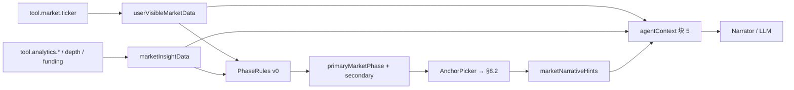

# Design · Market Narrative Runtime（phase 派生 · v0 草案）

**路径**：`specs/design/market-narrative-runtime.md`。

**职责**：冻结 **Market State → `marketPhase` → Narrative Hints** 的 **设计默认值与派生管线**。**需求架构总入口（MNRA）** → [`market-narrative-runtime/README`](../requirements/market-narrative-runtime/README.md)、[`scenario-matrix`](../requirements/market-narrative-runtime/scenario-matrix.md)。**FR/SC 宿主** → [`market-intelligence` §4](../requirements/domains/agent/exchange-agent/market-intelligence.md)、[`market-runtime-payload`](../requirements/domains/agent/exchange-agent/market-runtime-payload.md)、[`common-phrases` §8](../requirements/prompts/shared/common-phrases.md)。**PRS 消费** → [`prompt-runtime/README`](../requirements/prompt-runtime/README.md)。**OpenAPI 形状** → [`market-runtime-schemas.yaml`](../openapi/components/market-runtime-schemas.yaml)。

**契约状态**：**草案 · 解冻前 TBD** — **数值阈值** **须** **所内 analytics MR** **与** **回测** **后** **写死**；**本文** **仅** **管线 + 原则 + 占位口径**。

---

## 1. 管线（逻辑）

**原则**：

1. **PhaseRules** **纯确定性**（**`FR-MI06`**）— **禁止** **LLM 输出 phase**。  
2. **AnchorPicker** **从** **登记锚表** **择 1～3 句** — **禁止** **运行时扩库**。  
3. **Ticker-only** **默认** **不跑** **深度/Funding/突破** 规则（**同窗** **MI §4.1**）。

---

## 2. PhaseRules v0（占位 · 须 MR 替换数值）

**配置宿主**：**`ai-settings` / Runtime analytics config**（**键名 **`design` MR**）**。**所有比较** **须** **带 **`asOf`** **与** **symbol scope**。

| **规则 ID（示意）** | **输入** | **输出 phase** | **占位条件（v0 · 非终裁）** |
|---------------------|----------|----------------|----------------------------|
| **PR-STRUCT-01** | 24h range / ATR vs N 日 | `sideways` | range/ATR **<** `T_sideways` |
| **PR-STRUCT-02** | 趋势斜率 + 价在区间位置 | `trending_up` / `trending_down` | 斜率 **>** `T_trend` |
| **PR-VOL-01** | volume24h vs avgVolume | `low_volume` / `volume_spike` | **<** `T_low_vol` / **>** `T_spike` |
| **PR-MOM-01** | 动量指标 / 连续 K 线 | `weak_momentum` / `strong_momentum` | analytics 规则表 |
| **PR-VOLAT-01** | realized vol vs baseline | `elevated_volatility` / `volatility_compression` | 百分位阈值 |
| **PR-MICRO-01** | spread bps | `wide_spread` | spread **>** `T_spread_bps` |
| **PR-MICRO-02** | depth notional @ N 档 | `thin_book` | **<** `T_depth` |
| **PR-EVT-01** | breakout detector | `breakout` / `breakdown` | 结构位 + 量确认 |
| **PR-FUND-01** | fundingRate | `funding_crowded_long` / `_short` / `_neutral` | **|**rate**| vs `T_funding` |

**复合优先级**：**同窗** [`common-phrases` §8.5](../requirements/prompts/shared/common-phrases.md)。

**Stale**：Facts **`asOf`** **超 **`Δt_stale_market`** → **跳过** **PhaseRules** **与** **hints**（**`FR-MI05`**）。

---

## 3. AnchorPicker

**输入**：`primaryMarketPhase`、`effective_locale`（`zh-Hans` | `zh-Hant` | `en`）。

**输出**：`recommendedNarratives[]`（**≤3**）。

**算法（v0）**：

1. **查** **§8.2 对应 phase 行**（**locale 桶**）。  
2. **随机/轮询禁** — **须** **确定性**（**如** **固定取第 1 句 + 可选第 2 句若 secondary 存在**）。  
3. **Funding phase** **须** **在 hints 之外** **仍** **保留 **`fundingRate`** **于 **`marketInsightData`**（**`FR-MI07`**）。

---

## 4. 观测

**事件**：**`agent.market.phase_computed`** — **同窗** [`observability/overview.md` §2.1](../requirements/observability/overview.md)。

**必备字段（示意）**：`userId`、`sessionId`、`executionId`、`symbol`、`primaryMarketPhase`、`secondaryMarketPhases[]`、`factSources[]`、`marketPhaseSource=rules|tool`、`narrativeHintCount`、`ts`。

---

## 5. 实现对签清单

- [ ] **OpenAPI**：[`market-runtime-schemas.yaml`](../openapi/components/market-runtime-schemas.yaml) **与** **Runtime 注入 JSON** **字段级一致**。  
- [ ] **PhaseRules** **单测** **覆盖** **§3.2.1 每族 ≥1**。  
- [ ] **Eval**：**`eval.market.narrative_*`** **全绿**。  
- [ ] **阈值** **首填** **staging** **并** **登记** **`design/api` 或 ai-settings MR**。

---

**文档版本**：0.1.0 · **维护**：Agent Runtime + 产品 · **本版**：**初稿 · phase 管线 + 占位规则表**。
