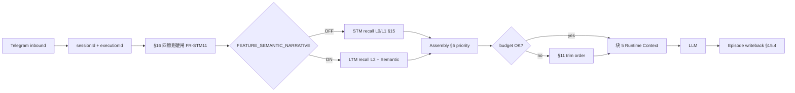
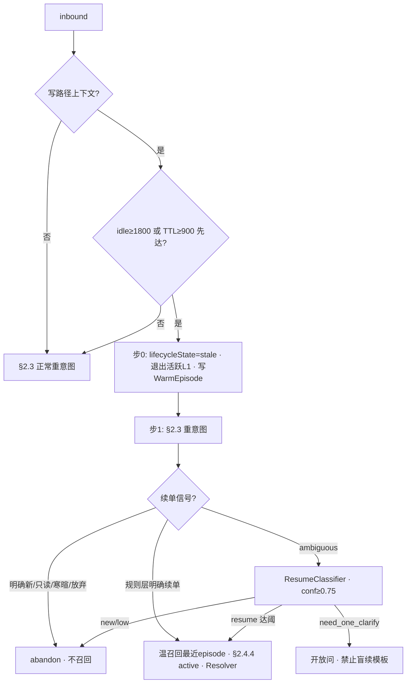

# Design · Memory Runtime Injection（STM/LTM · v0）

**路径**：`specs/design/memory-runtime-injection.md`。

**职责**：冻结 **inbound → 治理硬闸 → 召回 → 装配 → 裁剪 → 写回** 的 **设计管线**。**需求 SSOT** → [`memory-runtime.md`](../requirements/Runtime/memory-runtime.md) **§14～§16**；**配置键** → [`keys` §2.1](../requirements/domains/admin/trading-agent-config/keys.md)；**OpenAPI** → [`memory-runtime-schemas.yaml`](../openapi/components/memory-runtime-schemas.yaml)。

**契约状态**：**STM 路径 · 已承诺**（**含 §16 四原则硬闸**）；**LTM/Semantic · 草案 · 默认 OFF** — **对客「已记住你」须** **`contract-closure` §1.2**。

---

## 1. 管线（逻辑）

---

## 2. STM 召回（v0 · 已承诺）

**触发**：每条 inbound · [`memory-runtime` §10](../requirements/Runtime/memory-runtime.md) **须** **先** **§16.1 硬闸**。

### 2.1 双阈值 · 优先级（MUST）

| **阈值** | **配置键 · 默认** | **触发行为** |
|----------|-------------------|--------------|
| **写路径 stale（先达者）** | **`STM_IDLE_RESUME_PROMPT_SEC=1800`** **或 **`STM_CLARIFY_SESSION_TTL_SEC=900`** | **写澄清/写 L1** → **默认 **`stale_prior_write`** · 退出活跃 L1 · 温索引** → **§2.3 重意图 ± Resume 门控** |
| **Session 热面回收** | **`STM_HOT_RECYCLE_SESSION_IDLE_SEC=86400`** | **清 L0 + session 活跃 L1** → **下条须新意图起票** |
| **Execution 热回收** | **`STM_HOT_RECYCLE_EXECUTION_AFTER_TERMINAL_SEC=7200`** | **终局 execution 之 L1 退出活跃集** |

**优先级（MUST）**：

1. **每条 inbound** → **clarify-session §2.3 重意图**（**含** **放弃/只读/寒暄** **即时处理** · **stale 态亦 abandon**）— **不等待** **idle/TTL**。  
2. **类型 A 存活** → **§14.6 stale** **不得** **取消/改写 **`pending_confirm`** — **全序** **[`clarify-session` §1.1](../requirements/domains/agent/agent-orchestration/clarify-session.md)**。  
3. **idle 或 clarify TTL 先达 + 写路径上下文** → **§2.4 默认 stale**（**主路径**）— **非** **阻塞式续/新 UI**。  
4. **规则层明确续单** → **bypass 分类器**；**ambiguous** → **Resume 分类器** — **未达 **`RESUME_CLASSIFIER_MIN_CONFIDENCE`** → **`new_intent`**。  
5. **≥ 24h session 空闲** → **全量热回收**（**温索引亦失效**）。

**出站 Normative 去重**：**同窗** [`clarify-session` §2.5](../requirements/domains/agent/agent-orchestration/clarify-session.md) — **不同 inbound** **禁止** **连续两轮** **逐字相同** **用户可见正文**（**`SC-CLARIFY-08`**）。

### 2.2 四原则硬闸（FR-STM11 · 装配前 MUST）

| **步** | **动作** | **失败则** |
|--------|----------|------------|
| **1 invalidate** | **§16.4**：abandon/过期/终局/热回收 → **移出活跃 L0/L1** | **不得** **注入已失效 clarify/confirm** |
| **2 filter** | **§16.3 / §15.3**：strip routingHints、clarify JSON、raw API、CoT | **0** **处** **内部条文于 messages** |
| **3 inject** | **§16.2 / §15.1～§15.2**：L0 有界 turns + L1 摘要/Facts | **按 §5 注入序** |
| **4 verify** | **§16.5**：②④ **仍在**；**L2/Semantic** **未误清**（STM 清空路径） | **拒扩/告警** **若** **关键 Facts 被静默删** |

**OpenAPI 对账**：**`MemoryGovernanceGateResult`** · **`AgentRuntimeMemoryContext.memoryGovernanceGate`**。

### 2.3 召回表

| **步** | **读** | **写 Prompt** |
|--------|--------|---------------|
| **1** | **L0** 近 **`STM_L0_MAX_TURNS`（默认 10）** messages / rolling summary | **③ 用户输入** 同窗 |
| **2** | **L1** 同 **`executionId`** 类型 A + **`userVisible*` Facts + clarify 人话摘要** | **②④** **优先于** **③** **之冲突字段** |
| **3** | **新 execution 问价/余额** | **须** **新 **`agent.tool.call`** **或 stale 声明** |

**STM 清空**（**FR-STM01**）：**模式** **`STM_SESSION_CLEAR_MODE`**（**默认 `in_place`**）；**L0 + session 活跃 L1**；**不触** **Semantic** — **§13**、**Telegram §2.8**。

**STM 写入准入**：**§15** — **非全量聊天**；**写回** **§15.4**。

### 2.4 空闲 · 默认 stale + Resume 门控（MUST · 主路径）

**SSOT**：[`memory-runtime` §14.6](../requirements/Runtime/memory-runtime.md) · [`clarify-session` §2.4](../requirements/domains/agent/agent-orchestration/clarify-session.md)。

| **组件** | **职责** |
|----------|----------|
| **`WarmExecutionEpisode`** | **温层摘要** — **`executionId`、staleAt、resolvedSlots 人话**；**同 session 多条 · 默认召回最近 stale** |
| **`ResumeClassifier`** | **仅 ambiguous** — **`new_intent`/`resume_prior_write`/`need_one_clarify`** + **confidence** — **禁止写参** |
| **`cl:resume`/`cl:new`** | **fallback** — **仅当 **`STM_IDLE_DEFAULT_POLICY=prompt_resume_or_new`** |

---

## 3. LTM / Semantic 召回（草案 · OFF 默认跳过）

**前置**：**`semanticNarrativeEnabled=true`** **且** **无 **`userMemoryRevokedAt`**。

| **步** | **动作** |
|--------|----------|
| **1** | **读 L2** 配置域偏好 → **注入位 ⑤** |
| **2** | **读 **`semanticNarrativeBlock`**（allowlist 裁剪）→ **⑥** |
| **3** | **禁止** **用 Semantic** **单独驱动写/类型 A 数值** — **FR-MEM04** |

**写入流水线（FR-MEM09 · 解冻 MR 实现）**：

1. **来源**：用户明示话束 **或** **类型 C 确认卡** — **禁止** **默认从 tool JSON 落库**  
2. **allowlist 校验**（**`SemanticPropositionType`**）  
3. **歧义/symbol** → **澄清或类型 C 确认**  
4. **持久化** + **`agent.memory.semantic_updated`**  
5. **撤销** → **`userMemoryRevokedAt`** + **停止注入**

---

## 4. 预算裁剪（§11 · 确定性）

**超 budget 时顺序**（**先裁后者**）：

1. **L0** 远端轮次 → **rolling summary 再压**  
2. **Semantic 次要句**（**不得半条命题** — **SC-MEM05**）  
3. **L2 非安全字段**  
4. **仍不足** → **短答/拒扩** — **禁止删 ②④ Facts**

**观测**：**`agent.context.memory_trimmed`** · **`trimmedLayers[]`** — **同窗** OpenAPI **`MemoryTrimmedLayer`**。

---

## 5. STM vs LTM 用户动作分流

| **用户说法 / 入口** | **管线** | **事件（建议）** |
|---------------------|----------|------------------|
| **重新开始 / 新话题 / `/new`** | **STM 清空** · **§13** | **`agent.memory.session_cleared`** |
| **`cl:new` 点按** | **同上** + **`ClarifySession.abandoned`** | **同上** |
| **`cl:resume` 点按** | **合并 **`resolvedSlotsSoFar`** + Fresh Facts** — **禁止类型 A 直至 INV-008** | **可选 **`clarifyTurn++`** 观测** |
| **清空记忆 / 不再记住** | **LTM 撤销** · **§9 FR-MEM05** | **`userMemoryRevokedAt`** + **确认卡** |

**禁止** **同一按钮/同一意图** **混两种删除** — **Telegram §2.7 vs §2.8**。

---

## 6. 实现对签清单

- [ ] **OpenAPI**：[`memory-runtime-schemas.yaml`](../openapi/components/memory-runtime-schemas.yaml) **§14～§16 形状** **与 Runtime 注入 JSON 一致**  
- [ ] **配置键**：[`keys` §2.1](../requirements/domains/admin/trading-agent-config/keys.md) **进入有效配置快照**  
- [ ] **四原则硬闸**：**`MemoryGovernanceGateResult`** **每 inbound 可观测**（**staging 至少抽样**）  
- [ ] **OFF 默认**：**无 **`semanticNarrativeBlock`**（**`SC-MEM01`**）  
- [ ] **裁剪单测**：**§11 顺序** + **`eval.memory.budget_trim`**  
- [ ] **STM P0 回归**：**`eval.memory.stm_governance_regression`** + **`eval.clarify.*`**（**见 §7**）  
- [ ] **STM 清空**：**`eval.memory.session_clear_stm`** + **§2.8 UX**  
- [ ] **续/新 callback**：**`cl:resume`/`cl:new`** **OpenAPI 枚举** **与 BFF 注册表一致**  
- [ ] **LTM 宣称前**：**§9.5 解冻 MR + §1.2 六款**

---

## 7. Eval · CI 登记（需求层 · 所内 MR 执行）

**不** **在本 Git 实现 Runner** — **须** **所内 Agent Runtime / BFF CI** **引用下列 **`evalSetId`**（**GWT** [`evals/memory-runtime.md`](../requirements/evals/memory-runtime.md) · [`evals/clarify-telegram.md`](../requirements/evals/clarify-telegram.md)）：

| **优先级** | **`evalSetId`** | **SC** |
|------------|-----------------|--------|
| **P0** | **`eval.memory.stm_governance_regression`** | **`SC-STM10`** |
| **P0** | **`eval.clarify.reintent_each_inbound`** | **`SC-CLARIFY-05`** |
| **P0** | **`eval.clarify.abandon_on_cancel`** | **`SC-CLARIFY-06`** |
| **P0** | **`eval.clarify.read_interrupts_write`** | **`SC-CLARIFY-07`** |
| **P0** | **`eval.memory.idle_default_stale`** | **`SC-STM12`** |
| **P0** | **`eval.memory.resume_classifier_gate`** | **`SC-STM13`** |
| **P0** | **`eval.memory.resume_classifier_multi_episode`** | **`SC-STM13`** |
| **P0** | **`eval.clarify.no_internal_jargon`** | **`SC-CLARIFY-09`** |
| **P0** | **`eval.clarify.one_question_per_turn`** | — |
| **P1** | **`eval.memory.stm_write_allowlist`** | **`SC-STM07`** |
| **P1** | **`eval.memory.idle_resume_or_new_topic`** | **`SC-STM11`**（**fallback 模式 only**） |
| **P1** | **`eval.memory.session_clear_stm`** | **`SC-STM01`** |
| **P2** | **`eval.memory.stm_l0_window_bound`** | **`SC-STM08`** |

**关单索引**：[`closure-remaining` OP-MEM](../requirements/closure-remaining.md#cc-remaining-open-close-path)。

---

**文档版本**：0.5.0 · **维护**：Agent Runtime + 产品 · **本版**：**§2.1 类型A豁免 · §2.5 去重互引 · multi-episode/no_jargon eval**。承 0.4.0。
