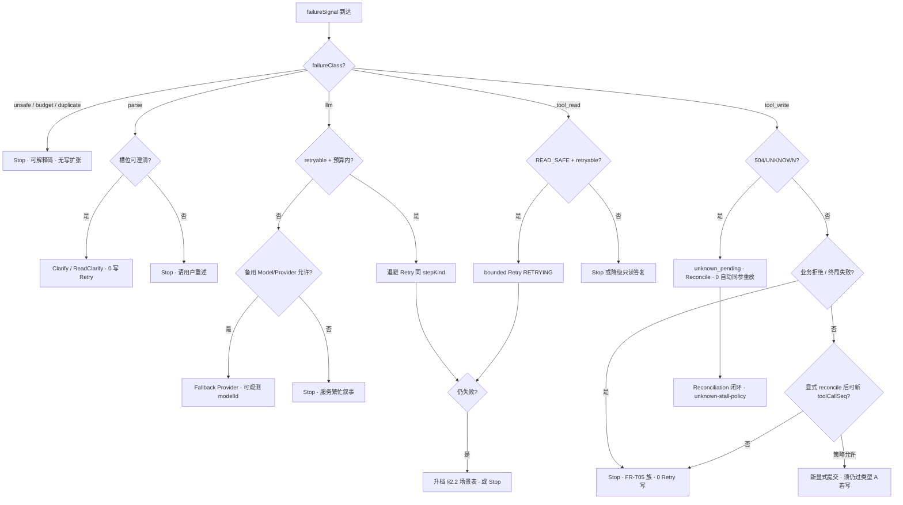

# Runtime · Fallback 策略（类型学与场景决策树）

**职责**：规定 **平台侧** 在 **LLM 超时**、**解析/结构化失败**、**工具不可用**、**不安全动作**、**UNKNOWN/504** 等情境下的 **降级、重试、对账与恢复** 之 **场景决策树 SSOT** — **属于 Runtime / 编排策略**。**实现级退避/队列** → [`recovery.md`](./recovery.md)；**编排层用户可见重试边界** → [`retry-policy.md`](../domains/agent/agent-orchestration/retry-policy.md)。**平台行为、错误枚举与编排分支**以本目录与 **`domains/`** 各域正文为准。

**用户可见话术**：MVP **不设 **`prompts/fallbacks/`**；若需 Markdown 评审，可落在 **`prompts/shared/`** **或与 **`prompts/confirmation/`** **同窗** 的条文增补 — **须同窗本条 §5**。

**同窗**（短）：[`recovery.md`](./recovery.md)；[`error-normalization.md`](./error-normalization.md)；[`unknown-state.md`](./unknown-state.md)；[`failure-matrix.md`](./failure-matrix.md)；[`reconciliation.md`](./reconciliation.md)；[`retry-policy.md`](../domains/agent/agent-orchestration/retry-policy.md)；[`session-concurrency-policy.md`](../domains/agent/agent-orchestration/session-concurrency-policy.md) **§5.3**。**类型表另链** `domains` / `integrations` / `observability` → 见 **§1 表** 与 [`boundaries.md`](./boundaries.md)。

---

## 1. Fallback 类型（下限分类）

| 类型 | 触发示意 | 策略锚（文档） |
|------|-----------|----------------|
| **LLM / Provider** | 超时、5xx、`provider_refusal`、429 | [`recovery.md`](./recovery.md)；[`integrations/llm/provider-routing.md`](../integrations/llm/provider-routing.md)；[`ai-settings/overview.md`](../domains/admin/ai-settings/overview.md) |
| **解析 / 结构化** | JSON schema、tool args 校验失败、槽位不齐 | [`tool-management/runtime-contract.md`](../domains/admin/tool-management/runtime-contract.md)；[`clarify-session.md`](../domains/agent/agent-orchestration/clarify-session.md)、[`read-clarify-session.md`](../domains/agent/agent-orchestration/read-clarify-session.md) |
| **Tool / 交易所** | `toolId` 失败、矩阵 **`TBD`**、504 UNKNOWN、可重试网关错误 | [`exchange-agent/overview.md`](../domains/agent/exchange-agent/overview.md) **`FR-T05`**；[`reconciliation.md`](./reconciliation.md)；[`unknown-stall-policy.md`](../risk/unknown-stall-policy.md) |
| **不安全动作** | 未确认写、越权工具、Policy block、Kill/Pause | [`confirmation-flow.md`](../domains/agent/agent-orchestration/confirmation-flow.md)；ADR-001；[`prompts/safety/`](../prompts/safety/)；[`kill-switch.md`](../risk/kill-switch.md) |

---

## 2. 场景决策树（MUST · P1 SSOT）

**输入三元组**（**每条失败/异常** **须** **可归类**）：

| 轴 | 枚举（示意） | **索引** |
|----|--------------|----------|
| **`failureClass`** | **`llm` / `parse` / `tool_read` / `tool_write` / `unsafe` / `budget` / `duplicate`** | **§1 类型表** · [`failure-matrix` §2](./failure-matrix.md) |
| **`executionPhase`** | **`planning` / `clarifying` / `waiting_confirmation` / `executing` / `unknown_pending` / `settling` / `terminal`** | [`runtime-state-machine.md`](./runtime-state-machine.md) |
| **`stepKind`** | **`llm_call` / `parser` / `tool_invoke` / `outbound_push` / `reconcile_query`** | [`execution.md`](./execution.md) **§1** |

### 2.1 总序决策（MUST）

**禁止** **在未完成下列 **1～4** **之前** **进入** **用户可见终局成功** **（** **写路径** **尤其** **）**：

**硬闸（叠于全树）**：

| **闸** | **MUST** |
|--------|----------|
| **G1 确认门** | **任何 Retry/Fallback** **不得** **跳过** **类型 A / 读技能 / FR-T02** — **`SC-AO-06`** · [`retry-policy` §2](../domains/agent/agent-orchestration/retry-policy.md) |
| **G2 写幂等** | **`create_order` 等写** **禁止** **无 **`idempotencyKey`** **之** **自动 Retry 同参** — [`runtime-contract` §3](../domains/admin/tool-management/runtime-contract.md) |
| **G3 UNKNOWN** | **`504`/超时** **须** **`unknown_pending`** **或** **Reconcile** — **禁止** **映射 SUCCESS** — [`unknown-state.md`](./unknown-state.md) |
| **G4 并发** | **`unknown_pending` + 新写** **默认挡** — [`session-concurrency-policy` §5.3](../domains/agent/agent-orchestration/session-concurrency-policy.md) |
| **G5 参数血缘** | **Retry** **不得** **引入** **`fallback_default`/`llm_inferred_unconfirmed`** **写参** — **INV-009** · [`runtime-invariants.md`](./runtime-invariants.md) |

### 2.2 场景 → 动作表（扩表 · MUST）

**列**：**Then** **为** **默认路径**；**例外** **须** **config + ADR**。**用户 copy** **宜** **方向** **见** **§5**。

#### A · LLM / Provider

| **场景 ID** | **When（构造）** | **Then（Runtime 动作）** | **Retry?** | **Fallback?** | **用户可见（宜）** |
|-------------|------------------|--------------------------|:----------:|:-------------:|---------------------|
| **FB-A1** | **`llm_call` 超时** · 预算内 | **退避 Retry** **同 **`modelId`** **（** **`retryAttempt+1`** **）** | ✅ 有界 | — | 「稍等，我再试一次…」 |
| **FB-A2** | **Provider 5xx** · 未超 **`LLM_MAX_RETRIES`** | **同 FB-A1** **或** **切换备用 Provider**（**可观测 **`providerId`** **）** | ✅ | ✅ | 「服务繁忙，正在切换线路…」 |
| **FB-A3** | **`provider_refusal` / 内容策略拒答** | **Stop** · **0** **同参硬 Retry** | ❌ | **可选** **换 Model ** **仅** **读路径** | 「这类问题我暂时无法直接回答…」 |
| **FB-A4** | **429 rate limit** | **按 **`retry_after`** **退避** **再试** | ✅ 有界 | — | **0** **终局成功暗示** |
| **FB-A5** | **LLM 全失败 · 写路径 **`waiting_confirmation` 前** | **Stop** · **保留已澄清槽位** · **0** **假类型 A** | ❌ | ❌ | 「暂时无法生成确认单，请稍后再试。」 |
| **FB-A6** | **LLM 全失败 · 只读路径** | **Stop** **或** **规则化降级**（**如** **仅 ticker 数字** **无 narrative**） | ❌ | **可选** **规则层** | 「行情服务繁忙，这是最新价：…」 |

#### B · 解析 / 结构化

| **场景 ID** | **When** | **Then** | **Retry?** | **Fallback?** | **用户可见（宜）** |
|-------------|----------|----------|:----------:|:-------------:|---------------------|
| **FB-B1** | **tool args JSON 校验失败** · **1 次可修复** | **同轮 ** **Repair prompt** **（** **L 内** **）** **→** **仍失败** **→** **Stop** | ✅ **≤1** **repair** | ❌ | 「我没理解数量/价格，请再说一次。」 |
| **FB-B2** | **Parser 槽位缺失 · 写意图** | **转** **写澄清** **`ClarifySession`** — **0** **写 Retry** | ❌ | **澄清 UX** | **同窗** **`clarify-user-visible`** |
| **FB-B3** | **Parser 槽位缺失 · 只读** | **转** **只读澄清** **`ReadClarifySession`** — **`rc:*`** | ❌ | **读澄清** | **同窗** **`read-clarify-session`** |
| **FB-B4** | **schema 失败 · 确认后回填** | **Stop** · **0** **静默改单** · **须** **新 inbound 或** **新 **`executionId`** | ❌ | ❌ | 「确认信息有误，请重新发起。」 |

#### C · Tool / 交易所

| **场景 ID** | **When** | **Then** | **Retry?** | **Fallback?** | **用户可见（宜）** |
|-------------|----------|----------|:----------:|:-------------:|---------------------|
| **FB-C1** | **LOW 只读 **`get_balance`** **超时** | **`RETRYING`** **退避** **≤ **`TOOL_READ_MAX_RETRIES`** | ✅ | — | **0** **报终局** |
| **FB-C2** | **MEDIUM/HIGH 写 **`create_order`** **业务拒绝**（余额不足等） | **Stop** **`FAILED`** · **`FR-T05`** **稳定码** | ❌ | ❌ | **业务可读拒绝** |
| **FB-C3** | **写 POST **`504`/UNKNOWN** | **`unknown_pending`** **→** **Reconcile 有界** — **§2.1 F1** | ❌ **自动同参** | **对账链** | 「已提交，结果确认中…」 |
| **FB-C4** | **矩阵 PATH `TBD`** | **Stop** · **`FR-T05`** **主站/协查** | ❌ | ❌ | 「该功能暂不可用。」 |
| **FB-C5** | **只读 tool 全失败** | **Stop** **或** **部分答**（**若** **已有缓存 Facts**） | ❌ | **缓存只读** | 「暂时查不到，请稍后再试。」 |
| **FB-C6** | **Reconcile 后仍 UNKNOWN · 超 stall Δt** | **告警 + 用户触达 + 终局/人工路径** | ❌ | **stall 策略** | **同窗** **`unknown-stall-policy`** |

#### D · 不安全 / 门禁

| **场景 ID** | **When** | **Then** | **Retry?** | **Fallback?** | **用户可见（宜）** |
|-------------|----------|----------|:----------:|:-------------:|---------------------|
| **FB-D1** | **未确认 **`call_exchange_write`** | **Stop** · **须** **类型 A** | ❌ | ❌ | **确认卡** |
| **FB-D2** | **Kill/Pause 拒新写** | **Stop** · **`FR-T05`** | ❌ | ❌ | 「系统维护中，暂不能下单。」 |
| **FB-D3** | **Retry 试图跳过确认** | **Stop + 观测 **`confirmationBypassBlocked=true`** | ❌ | ❌ | **N/A（内部负例）** |
| **FB-D4** | **`FR-AO06` 预算顶** | **Stop** · **可解释** | ❌ | ❌ | 「这一步尝试次数过多，请简化问题或稍后再试。」 |

#### E · 幂等 / 重复

| **场景 ID** | **When** | **Then** | **Retry?** | **Fallback?** | **用户可见（宜）** |
|-------------|----------|----------|:----------:|:-------------:|---------------------|
| **FB-E1** | **重复 Telegram **`update_id`** | **Idempotent ignore** | ❌ | ❌ | **0** **第二出站** |
| **FB-E2** | **重复终态回调** | **合并同一 **`executionId`** **终局** | ❌ | ❌ | **0** **二次成功/失败** |

### 2.3 Retry vs Fallback vs Reconcile vs Stop（速查）

| **动作** | **定义** | **典型场景** | **禁止** |
|----------|----------|--------------|----------|
| **Retry** | **同 **`executionId`** **·** **同 **`toolCallSeq`** **或** **同 LLM step** **之有界再试** | **FB-A1/A2/A4** · **FB-C1** | **写同参无脑循环** · **跳过确认** |
| **Fallback** | **换 Provider/Model/规则层/澄清 UX** **仍服务用户目标** | **FB-A2/A6** · **FB-B2/B3** | **静默削弱写确认** |
| **Reconcile** | **查单/WS/REST 对账** **驱动 **`unknown_pending`** **离悬** | **FB-C3/C6** | **冒充 SUCCESS** |
| **Stop** | **终局失败或可解释阻断** **+ **`stableReason`** | **FB-D*** · **业务拒绝** | **无限「请重试」** |

### 2.4 与 `failure-matrix` 对齐

**[`failure-matrix` §2](./failure-matrix.md)** **每一行** **须** **能映射** **到** **本篇 **§2.2** **至少一行** **或** **§2.1 硬闸**。**新增失败类** **须** **同步** **两表**。

---

## 3. 观测与配置（索引）

### 3.1 宜观测字段（逻辑名 · B 阶段 OpenAPI）

| 字段 | **说明** |
|------|----------|
| **`fallbackDecision`** | **`retry` / `provider_fallback` / `clarify` / `reconcile` / `stop` / `idempotent_ignore`** |
| **`failureClass`** | **§2 输入轴** |
| **`retryAttempt`** | **当前步第几次** |
| **`confirmationBypassBlocked`** | **负例：试图 Retry 跳过确认** |
| **`providerFallbackFrom` / `providerFallbackTo`** | **LLM 降级链** |

### 3.2 配置键（语义 · 键名 OpenAPI/`ai-settings` 收束）

| **语义** | **默认方向** | **宿主** |
|----------|--------------|----------|
| **LLM 步 Retry 上限** | **有界（如 2）** | **`ai-settings` / `design` MR** |
| **只读 Tool Retry 上限** | **宽于写** | **`runtime-contract` §3** · **`design`** |
| **Provider 降级链** | **Health 驱动** | **`ai-settings` FR-MC407** |
| **UNKNOWN stall Δt** | **有界** | [`unknown-stall-policy.md`](../risk/unknown-stall-policy.md) |

**v0**：**本篇** **锁** **语义**；**具体键名** **不** **在 **`trading-agent-config/keys.md`** **重复** **直至** **所内 OpenAPI MR**。

---

## 4. 与 `prompts/` 分界（MVP）

- **`prompts/`** **七目录**：见 [`prompts/README.md`](../prompts/README.md)。  
- **本条** **不** 维护英文 Prompt 正文；**§2 决策树** **与** **§5 用户可见方向** **为** **Runtime 索引**；**L 润色** **落 **`prompts/shared/`** **时** **须** **同窗本条**。

---

## 5. 用户可见模式（宜 · zh-Hans 骨架）

| **场景组** | **宜方向** | **禁止** |
|------------|------------|----------|
| **LLM 繁忙** | 短句 + **可选** **一次自动 Retry 不打扰** | **假成交/假确认** |
| **解析失败** | **指向缺失槽位** **或** **澄清钮** | **内部 schema 词** |
| **504/UNKNOWN** | **「确认中」+ 可查单指引** | **SUCCESS 语气** |
| **业务拒绝** | **`FR-T05`** **稳定摘要** | **Retry 诱导重复下单** |
| **预算/门禁** | **可解释 + 下一步**（简化/主站/稍后再试） | **无限循环感** |

**同窗**：[`prompts/shared/common-phrases.md`](../prompts/shared/common-phrases.md)；[`unknown-state.md`](./unknown-state.md) **用户可见副本**。

---

## 6. 验收（`SC-RT-FB-*`）

| ID | Then |
|----|------|
| **`SC-RT-FB-01`** | **LLM 超时** **→** **有界 Retry** **可观测 **`retryAttempt`** **→** **仍失败** **Stop** **且** **0** **写路径假类型 A** |
| **`SC-RT-FB-02`** | **Provider 降级** **须** **观测 **`providerFallback*`** **且** **0** **跳过确认门** |
| **`SC-RT-FB-03`** | **Parser 缺槽写意图** **→** **Clarify** **0** **`call_exchange_write`** |
| **`SC-RT-FB-04`** | **Parser 缺槽只读** **→** **ReadClarify** **`rc:*`** **0** **写** |
| **`SC-RT-FB-05`** | **写 **`504`** **→** **`unknown_pending`** **+** **0** **自动同参 **`create_order`** **Retry** |
| **`SC-RT-FB-06`** | **Retry/Fallback** **负例** **不得** **跳过类型 A** — **`confirmationBypassBlocked`** **或等价观测** |
| **`SC-RT-FB-07`** | **LOW 只读 tool** **Retry** **≤** **配置上界** **且** **计** **一次** **预算（** **`FR-AO06`** **）** |

**Eval**：[`evals/fallback-retry-decision-tree.md`](../evals/fallback-retry-decision-tree.md)。

---

## 7. 后续 P1（索引）

**v0 P1**：**用户追问状态机** → [`unknown-stall-policy.md`](../risk/unknown-stall-policy.md) **§2 v0.2** · **`SC-RISK-07*`** · **`eval.unknown.*`**。

---

**文档版本**：0.4.0 · **维护**：Agent Runtime owner · **本版**：**P1 — §2 场景决策树 · `SC-RT-FB-*` · eval 束**。**承** 0.3.1。
