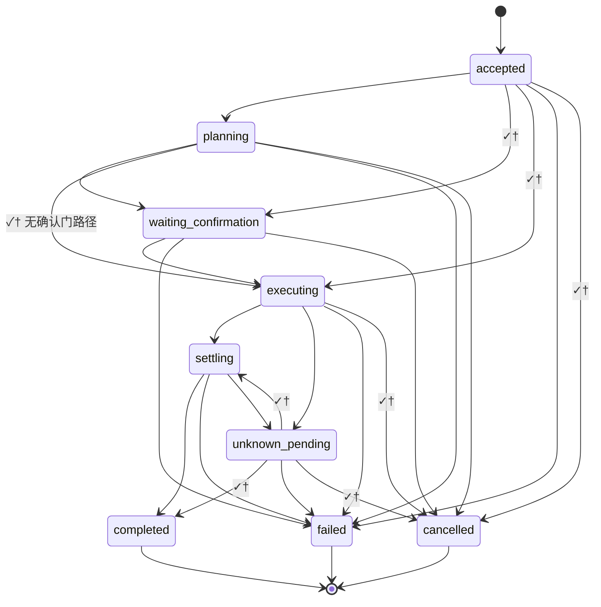

# Runtime · 状态机总览（单笔 `executionId` · Transition Contract 入口）

**路径**：`specs/requirements/Runtime/runtime-state-machine.md`。

**职责**：为 **单笔可计费执行** **`executionId`** **提供统一的 Runtime 状态叙事与迁移契约入口**：**分域**（避免状态爆炸）、**主态词** **（与附录 A 对齐）**、**非法迁移** **原则**、**恢复** **索引**。**逐边** **迁移规则** **终裁** → [`execution-transition-matrix.md`](./execution-transition-matrix.md) **§2.2**；**其余总则** **§2～§9**。**不**替代 **[`execution.md`](./execution.md) 附录 A** **字段表**；**不**替代 **[`trade-via-agent.md`](../flows/trade-via-agent.md) S5.1** **部成/在途** **口径**；**不**替代 **`taskId`/`agentState`** **他轨**。

**同窗**：[附录 A](./execution.md)；[`execution-transition-matrix.md`](./execution-transition-matrix.md)（**§2.2** **逐边契约**）；[`runtime-invariants.md`](./runtime-invariants.md)；[`memory-runtime.md`](./memory-runtime.md)；[`unknown-state.md`](./unknown-state.md)；[`reconciliation.md`](./reconciliation.md)；[`persistence.md`](./persistence.md)；[`recovery.md`](./recovery.md)；[`failure-matrix.md`](./failure-matrix.md)；[`runtime-truth-source-map.md`](./runtime-truth-source-map.md)。

---

## 1. Runtime Domain Separation（分域 · 防爆炸）

**原则**：**同一 `executionId`** **上** **允许多维真相并存**，**但** **「主态词」只描述 Runtime 生命周期阶段**；**交易所结果态**、**外部观测**、**对账进度** **不得** **默认升格为** **与** **附录 A 主行** **同级的 Runtime 态**（**部成/在途** → [`trade-via-agent.md`](../flows/trade-via-agent.md) **S5.1**）。

| **分域** | **含义（摘要）** | **典型归属** |
|----------|------------------|--------------|
| **Runtime State** | **平台编排生命周期**（附录 A **主行**） | 本文 + [`execution.md`](./execution.md) **附录 A** |
| **Exchange Execution Status** | **订单/成交在交易所侧的中间态与终态** | **`integrations/exchange`**、**`exchange-agent` FR**、观测 `invocationState` **等** |
| **Observation State** | **通道/工具的可达视图**（含延迟、部分回填） | **observability**、**504/UNKNOWN** **叙事** |
| **Settlement / Reconciliation State** | **REST↔WS↔会话推导** **的对账进度与采信** | [`reconciliation.md`](./reconciliation.md)、[`unknown-state.md`](./unknown-state.md) |

---

## 2. 主态词（与附录 A 一致）

**有序列举**（**逻辑推进**，**实现可并发子状态**）：**`accepted`** → **`planning`** → **`waiting_confirmation`**（*写路径常见*）→ **`executing`** → **`settling`** → **终局三态之一**：**`completed` / `failed` / `cancelled`**；**`unknown_pending`** **可** **自** **`executing`/`settling`** **进入** **并在对账后** **收口到** **终局态**（**不得** **长期** **冒充** **`completed`**）。

**主态 SSOT 表** → [`execution.md`](./execution.md) **附录 A**。

---

## 3. 总图（与迁移矩阵 §2 单步 **✓ / ✓†** 对齐 · 非线程模型）

**边集合** **与** [`execution-transition-matrix.md`](./execution-transition-matrix.md) **§2** **主格** **一致**（**含** **全部** **✓** **与** **✓†**；**✓†** **条件** **见** **该篇 §2.1**）。**主格对角线** **「子态」** **（** **`executing` / `settling` / `unknown_pending`** **内演进** **）** **不画自环** — **见** **矩阵 §3**。

**扩容**：**放宽矩阵**（**✗→✓**）**须** **同步** **附录 A、矩阵与本图**（**见** [`runtime-truth-source-map.md`](./runtime-truth-source-map.md) §2 首行）。**`failed → unknown_pending`** **为** **矩阵** **✗†** **（** **例外须 ADR** **）** **—** **本图** **不画**。

**UNKNOWN 原则**：**`unknown_pending` ≠ 业务成功**；**未拿到可采信终局前** **默认** **不得** **向用户或计费 narrative** **断言** **「已成交」** — [`unknown-state.md`](./unknown-state.md)、[`architecture.md`](../../design/architecture.md)。

**逐对「是否允许」** → [`execution-transition-matrix.md`](./execution-transition-matrix.md)。

---

## 4. 非法迁移（同一 `executionId` · 产品下限）

**下列迁移** **须** **禁止** **或** **等价于** **新开** **`executionId`** **（以设计冻结为准）**：

| **从 → 到** | **原则** |
|-------------|----------|
| **`completed` → 任何非终局主态** | **终局** **不可逆** **回卷** **到** **执行扩张** |
| **`failed` → `executing` / `settling` / `planning`** | **新尝试** **默认为** **新执行** **或** **显式「恢复 MR」** **定义之** **replay** |
| **`cancelled` → `executing` / `settling`** | **同上** |
| **`accepted` → `completed` / `settling`（跳过门禁/确认）** | **违反** **`execution` §1** **因果序** |

**允许**：**子状态** **内** **重试/重入**（**如** **工具 `RETRYING`**）**不** **等同** **上表** **主态回退** — [`retry-policy.md`](../domains/agent/agent-orchestration/retry-policy.md)、[`admin/tool-management/runtime-contract.md`](../domains/admin/tool-management/runtime-contract.md)。

---

## 5. 崩溃恢复与回放（索引）

- **检查点 / 幂等 / 恢复语义** → [`persistence.md`](./persistence.md)（**含** **检查点放置** **相对** **外向 IO**）、[`locking.md`](./locking.md)（**主态** **单写者** **与** **并发协调**）、[`execution.md`](./execution.md) **§2**。  
- **队列实例崩溃后的 Resume** → **须** **满足** **与本条 §4** **不矛盾** **的** **终局单调性**；**细节** **以实现 MR** **+** **本篇** **同窗** **对签**。  
- **错误类 → 平台动作** → [`failure-matrix.md`](./failure-matrix.md)、[`runtime-error-taxonomy.md`](./runtime-error-taxonomy.md)。

---

**文档版本**：1.0.5 · **维护**：产品 + Agent Runtime owner · **本版**：**同窗** **`runtime-invariants`**；**职责** **指** **矩阵** **§2～§9** **终裁**。**承** 1.0.4。
