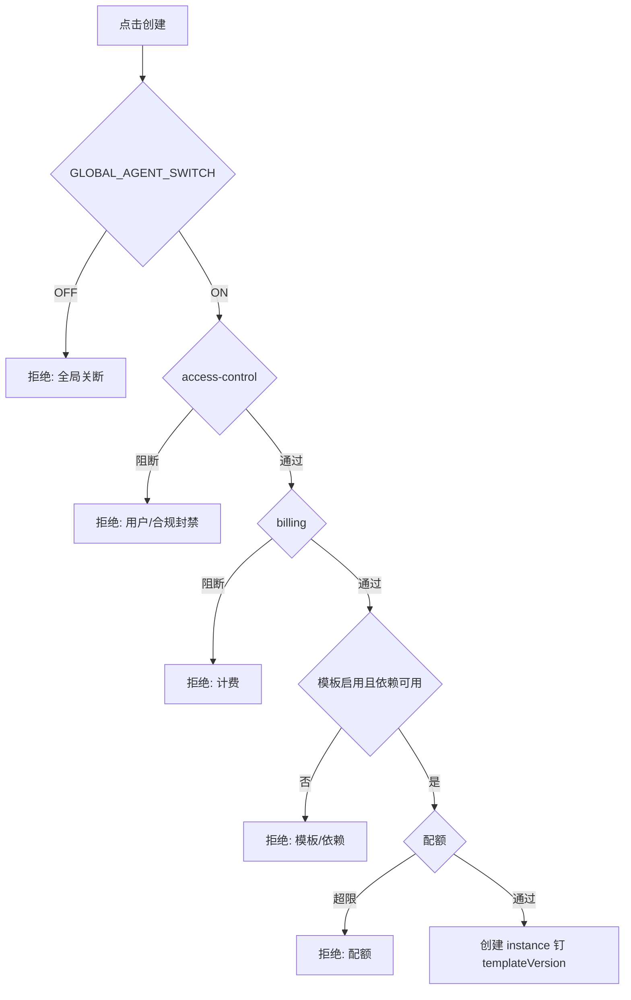

# Agent Management · 流程

**端到端业务主路径**仍以 **[`../../../flows/`](../../../flows/)**、[`exchange-agent`](../../agent/exchange-agent/overview.md) 为准。本文档写 **管理台操作者**视角的 **步骤、分支与系统反应**，与 [`functions.md`](functions.md) 需求展开对签。

---

## 0. 参与者与系统

| 参与者 | 动作 |
|--------|------|
| **运营用户** | 登录 RBAC → 进入模块一各子导航 |
| **管理台 BFF/API** | 校验权限、拼装依赖服务调用、写 **审计** |
| **核心域服务** | 模板/实例/Runtime 状态机、门禁读 **附录 A** |
| **外部依赖** | `prompt-management`、`tool-management`、`ai-settings`、`access-control`、`billing`、`observability` |

### 0.1 全局门禁横幅（FR-AM-G01）

1. 运营进入 **任一**「模板列表 / 实例列表 / 实例详情」首屏。  
2. 前端拉取 **门禁只读状态**（可与列表 **同请求**或 **轻量轮询**）。  
3. **`GLOBAL_AGENT_SWITCH`** 为 **OFF** 时：**顶栏固定 Banner**。**关闭规则（V1）**：**无永久关闭**；**可** 「**当日不再显示**」——**UTC** 自然日复位后 **须再现**（[`functions.md`](functions.md) **§5.1**、**SC-AM-21**）。  
4. **不写**开关；改键 **跳转** `trading-agent-config` 或 **外链**运维文档。

---

## 1. 模板（Template Management）

### 1.1 新建并发布模板（快乐路径）

1. 运营进入 **Template** → **创建**，填 **内部名/展示名** → 保存 → 得 **草稿** `templateId`。  
2. 在编辑页依次：**绑定 Prompt（T04）→ Tool Profile（T05）→ 默认模型（T06）→ 默认风控（T07）**。  
3. 点击 **校验**：调用 **矩阵校验** + **依赖健康检查**；失败 → **置顶错误面板**（哪一项、缺失 PATH/哪个包不可用）。  
4. 通过后 **提交发布**：生成 **`templateVersion` N**，状态 **已发布**，**审计：published**。  
5. **启用**：若发布后默认停用，运营 **启用（T08）** → **新建实例**可选中该模板。

### 1.2 已发布模板要改 Prompt / Tool / 模型

1. **禁止**原位覆盖 **已发布版本**。  
2. 运营选 **复制为新版本**：系统创建 **草稿 N+1**，继承 N 的配置。  
3. 修改后 **再走发布**：生成新版本线；**存量实例仍为 N**。**V1**：**无**控制台「升级实例绑到 N+1」流程（见 **`functions` I07 / §8**）；仅 **运维 Runbook / 后置 MR**。

### 1.3 停用模板

1. 运营点 **停用** → 填 **原因码** → 确认。  
2. **立即**：**I02** API **拒绝该 `templateId`**（`AGENT_TEMPLATE_DISABLED` 等与 **§7.1** / OpenAPI 对齐）。  
3. **存量实例**：**V1 默认** **路径 A**（**仅禁止新建**，存量可继续跑）；**路径 B**（停用触发 **异步批量 Pause**）**非默认**，见 [`rules.md`](rules.md) **§6**；若启用须有 **进度与失败明细**。

### 1.4 克隆模板（T09）

1. **已发布行**：模板列表 **或详情** → **克隆** → 输入 **新内部名/展示名** → 确认。  
2. 系统 **新 `templateId` + 草稿**，配置引用 **所选 `templateVersion` 快照**。  
3. **不**继承「已发布/启用」。  
4. **审计 `TEMPLATE_CLONED`**；跳转 **新模板编辑页**。  

**仅从草稿**：无 **`templateVersion`** 可摘时仍可 **克隆** → **复制当前草稿快照** 至 **新 `templateId` + 草稿**；审计须 **区分源为草稿**。详见 [`functions.md`](functions.md) **T09**、**SC-AM-15**。

### 1.5 删除草稿模板（T10）

1. **仅** `DRAFT` 且 **服务端校验无 FK 阻断** 时显示 **删除**。  
2. **二次确认** → **调用删除** → **审计 `TEMPLATE_DRAFT_DELETED`** → 列表移除。  
3. **已发布**模板：**无删除按钮** → 运营改用 **停用（1.3）**。

---

## 2. 实例（Agent Instance）

### 2.1 创建实例（带门禁）

1. **通过后**：返回 `instanceId`，详情页 **初始 Runtime** 可为 **Stopped**（或「待绑定」——若创建与绑定分拆）。  
2. **失败后**：详情抽屉或 toast **展示与用户/运营一致的原因**；可追溯 **`lastProductBlockReason`**（若有）。

### 2.2 绑定与换绑子账户

1. **首次绑定**：在详情 **绑定区**选择 **已通过 onboarding 的子账户**（或发起开通引导链接）→ 确认 → **审计**。  
2. **换绑**：二次确认 → （策略）**Pause 新执行** → 换绑完成 → **Resume** 可选自动/人工。  
3. **全程**：界面 **永不**展示 **Secret**；仅 **Key id / 绑定状态**。

### 2.3 修改实例参数（I05）

1. 运营打开 **参数**分区 → 编辑 **白名单字段** → **预览合并结果**（可选但推荐）：展示 **模板默认 + overrides + 全局**  Effective 结果（只读计算）。  
2. 保存 → **服务端校验** → 成功写审计；失败 **字段级报错**。

### 2.4 删除实例

1. **软删**：确认 → **实例对用户隐藏** → 后台可恢复窗口（若有）。  
2. **硬删**：额外 **风险提示** → 系统在途检查 → **不通过**则 **中止**并列原因 → **不得**静默部分删除关键资源。

### 2.5 实例列表导出（I08）

1. 运营设置 **筛选条件**（与界面列表一致）。  
2. 点击 **导出** → 权限校验 **`INSTANCE_LIST_EXPORT`**（或等价角色）。  
3. **小额**：同步 CSV **下载**；**大额**：**异步任务** → **进度** → **署名/水印 URL**（时效由策略定）。  
4. **审计 `INSTANCE_LIST_EXPORTED`**：筛选摘要 hash、导出行数、操作者。

### 2.6 批量 Runtime（R06）

1. 列表 **勾选**多台实例 → **批量 Pause** 或 **批量 Stop**。  
2. **二次确认** + **统一原因码**（对内）。  
3. BFF **逐条或批量 API** → 聚合 **成功/失败**列表（`instanceId`、`code`、`message`）。  
4. 前端 **结果抽屉**：可 **重试失败项**（可选）或 **导出失败 CSV**。  
5. **全局 OFF**：**批量 Pause / Stop** 须被接受并下发；返回 **逐条**成功/失败，部分失败 **仅因**实例态/绑定等 **个案原因**。**不得**在 **`GLOBAL_AGENT_SWITCH` = OFF** 且无 **合规 OVERRIDE** 备案时，无依据地将整批复核为拒绝。**批量 Start / Resume** 仍不适用（与 [`functions.md`](functions.md) **§5.1 G01**、[`rules.md`](rules.md) **§8** 一致）。  
6. **审计**：`RUNTIME_BATCH_PAUSE` / `RUNTIME_BATCH_STOP` + `batchId`。

---

## 3. 运行控制（Runtime Control）

### 3.1 实例生命周期状态（与命令）

建议 **控制台展示**下列 **机电态**（实现可映射到内部_fsm；**必须与 `agentState` 区分展示**——后者为 **门禁聚合**）。

| 机电态（示例） | 含义 | 通常允许的操作 |
|----------------|------|----------------|
| **Stopped** | 未运行 / 未调度 | Start |
| **Running** | 可接单/可被调度 | Pause、Stop |
| **Paused** | 实例级暂停 | Resume、Stop |
| **Degraded / Error** | 运行异常（心跳失败等） | **按策略**只允许 Stop / _diag_（产品定） |
| **Transitioning** | 启动中/停止中 | **禁用**重复点击或 **防抖** |

**命令效果（期望）**：

- **Start**：Stopped → Running（若全局/OPS/绑定未阻断）。  
- **Resume**：Paused → Running。  
- **Pause**：Running → Paused；**在飞请求**收尾策略 **exchange-agent SSOT**。  
- **Stop**：→ Stopped（**V1 默认可再起**）。

### 3.2 与全局 OPS 同时进行

**场景**：实例 **Running**，运营对实例 **Pause**；同时 **OPS 全局 Pause**。

- **控制台**：并列展示 **两行原因**：「实例已暂停」「全站 OPS 暂停」。  
- **Resume 实例**：在 **OPS 仍暂停**时，可实现为 **仍为不可执行**，但 UI **勿暗示**「实例已 Running 即可交易」——须 **仍以聚合门禁为准**。

---

## 4. 运行日志（Agent Logs）

### 4.1 协查一次用户投诉（典型）

1. 客服在 **实例详情**确认 `userId` / `instanceId`。  
2. 打开 **Agent Logs → Conversation**：定位 **时间点**与用户描述一致的消息 → 复制 **`executionId`**（若存在）。  
3. 切 **Tool Log**、**Error Log**，以 **`executionId` 过滤** → 核对 **工具失败 / 429 / 交易所错误**。  
4. 若需 **全链路 trace** 或 **导出**：跳转 **`observability-management`**（权限足够时）→ 生成 **带水印**导出。

### 4.2 权限不足

- **只读运营**：可见 **摘要列**；点击 **原文** → **403** 或 **申请按钮**（若流程存在）。  
- **导出**：**独立角色**；无则 **无按钮**。

---

## 5. 与审计相关的流程锚点

凡以下动作 **须**产生 **不可篡改审计事件**（字段：`actor`、`actionType`、`targetType`、`targetId`、`before/after` 快照 ref、`reasonCode`、`timestamp`）：模板发布、模板停用、**草稿模板删除（T10）**、**模板克隆（T09）**、实例创建/删除、**实例列表导出（I08）**、绑定/换绑、`instanceOverrides` 变更、`RUNTIME_*` 命令、**`RUNTIME_BATCH_*`（R06）**。

详见 [`rules.md`](rules.md) 规则 1。
