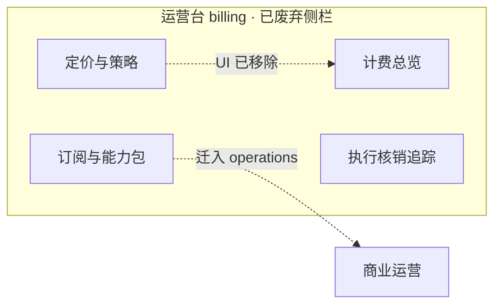

# 运营台 · 计费与账务梳理（Capability 核销）

**路径**：`specs/requirements/domains/admin/billing-management/admin-console-billing-pages-reconciliation.md`  
**读者**：产品、后台、账务、Runtime 联调  
**端到端鸟瞰**：[`flow/e2e-closed-loop.md`](../../../../flow/e2e-closed-loop.md) **阶段 F · `BILLING_ADM`** · [**运营台 Demo IA 锚点表**](../../../../flow/e2e-closed-loop.md#admin-demo-ia-e2e)  
**SSOT 商业模型**：[`commerce-model.md`](commerce-model.md) · **域总览**：[`overview.md`](overview.md) · **FR 表**：[`functions.md`](functions.md) · **IA 配置**：[`config.md`](config.md) · **低保真**：[`admin-console/page-specs.md`](../../admin-console/page-specs.md) · **原型**：`src/admin/src/pages/billing/*`

---

## 0. Demo 对齐快照（2026-05-27 · `src/admin`）

| 侧栏 | 路由 · pageId | 原型要点 |
|------|---------------|----------|
| 计费总览 | `/billing/overview` · `billing.overview` | 六宫格入口；Runtime 四卡 + 趋势；MC501/506；MC512 阻断汇总（**无** Usage Breakdown / 商业到账四卡） |
| 商业运营 | `/billing/operations` · `billing.operations` | 5 Tab：套餐 · 资源 · **计费规则**（扣减+场景+MC509 双签）· 订单 · 用户消耗 |
| 执行核销 | `/billing/ledger` · `billing.ledger` | **ENTITLEMENT_DEBIT** 核销列表 + 单笔追踪；链 **执行详情** / **执行链路协查** |

**已下线 UI**：`billing.pricing`（→ overview）、独立 `billing.commerce`（→ `operations?tab=rules`）。**FR-MC502** 仍可在域规格/keys 叙述，**无**运营台定价 Tab。

下文 **§2.2** 为 **历史四页** 归档（FR 对位）；**§3** 为 **当前原型** 分页说明。**实现 SSOT**：**§0** · [`page-specs.md`](../../admin-console/page-specs.md) · `src/admin/src/pages/billing/*`。

---

## 1. 计费逻辑（运营台 IA 依据）

| 维度 | 当前 |
|------|------|
| **对客售卖单元** | **订阅档位 + Capability + 加购包** |
| **S5 落账** | **`POST …/entitlements/debit` · `ENTITLEMENT_DEBIT`**（**`BILLING_SETTLE_POLICY=ENTITLEMENT_ONLY`**） |
| **用尽策略** | **配额用尽即停**；续用仅 **升级/买包**（**FR-B21**） |
| **用户回看** | **`me/commerce`** · H5 **`/subaccount/billing`** |
| **运营协查锚点** | **`executionId` + `capabilitySkuId` + 核销状态** + `billingTraceId` |
| **Token 单价** | **Metering 成本观测**；**套餐价** 在 **Commerce 目录/PSP** |

**结论**：运营台分工为 **观测（总览）· 商品与权益配置（商业运营）· 核销事实（执行追踪）**。

---

## 2. 页面一览（闭环 IA · 2026-05-27）

**现 IA（Demo）**：侧栏 **总览 | 商业运营 | 执行核销**；商业运营内 **套餐 → 资源 → 计费规则 → 订单 → 用户消耗**；总览六宫格链各 Tab 与 ledger。

---

## 2.1 当前 Demo 对位（`src/admin`）

| 入口 | 路由 · `pageId` | 主 FR | 原型要点 | 缺口 |
|------|-----------------|-------|----------|------|
| **计费总览** | `/billing/overview` · `billing.overview` | **MC501**、**506**、**512** | 六宫格链商业运营/ledger；Runtime 四卡 + 7 日趋势；健康 + **配额阻断** 汇总 | **P2** ledger **阻断原因** 下钻统一 |
| **商业运营** | `/billing/operations` · `billing.operations` | **MC509～511**、**510** | 五 Tab（见 §0）；**MC509** 在 **计费规则** Tab | **P2** **MC511** 导出 |
| **执行核销** | `/billing/ledger` · `billing.ledger` | **MC503**、**504** | 核销主列 + 双 Tab | **P2** **MC507** 导出 |

**遗留路由（无侧栏）**：`/billing/pricing` → overview；`/billing/commerce` → `operations?tab=rules`。

---

## 2.2 归档 · 历史四页对照（FR 对位 · 非当前 UI）

展开：旧侧栏四页 mermaid 与对照表（仅供 FR 迁移阅读）

| 旧侧栏 | 现归宿 |
|--------|--------|
| 定价与策略 | **无 UI**；**MC502** → keys/BFF |
| 订阅与能力包 | **`billing.operations`** 各 Tab + **rules**（目录/场景） |

---

## 3. 分页说明（当前原型）

### 3.1 计费总览 `billing.overview`

**职责**：运行观测 + **商业运营入口** + **MC512** 摘要；**不**配置售价/扣次。

**实现**：`BillingOverviewPage.tsx` · `mockBillingRuntimeOverview` · `useCommerceAdminSnapshot`。

| 块 | 状态 | 备注 |
|----|------|------|
| 商业运营六宫格 | ✅ | 含 **执行核销** 直链 |
| Runtime 四卡 + 7 日趋势 | ✅ | Token 标 **观测** |
| MC501/506 健康 | ✅ | `mockBillingHealth` + 网关错误表 |
| MC512 配额阻断 | ✅ | Phase2 关时 **启用指引** Alert |
| Usage Breakdown / 商业到账四卡 | — | **未展示**（mock 字段可保留） |

### 3.2 商业运营 `billing.operations`

**职责**：**售价与配额配置**、**扣次与场景映射**、**订单协查**、**用户权益**。

**实现**：`BillingOperationsPage.tsx` · `billingPaths.ts`（`?tab=`）。

| Tab | 组件 | FR | 状态 |
|-----|------|-----|------|
| **subscriptions** | `SubscriptionsPanel` | 套餐档位 | ✅ |
| **packs** | `ResourcesPanel` | 可售资源 | ✅ |
| **rules** | `BillingRulesPanel` | 扣减 + 场景映射；**MC509** `CommerceCapabilityCatalogEditor` | ✅ session 可编辑映射/扣减；前缀/兜底只读 |
| **orders** | `OrdersPanel` · `CommerceOrderDetailDrawer` | Crypto 订单 | ✅ 筛选 + **详情 §3.2.1**；pack-grant **演示** |
| **consumption** | `ConsumptionPanel` | **MC510** | ✅ 用户协查 |

#### 3.2.1 订阅订单 · 详情抽屉（`CommerceOrderDetailDrawer`）

**实现**：`OrdersPanel.tsx` · `CommerceOrderDetailDrawer.tsx` · `MOCK_COMMERCE_CRYPTO_ORDERS` · `commercePaymentAddresses.ts` · `commerceOrderId.ts`  
**用户端同窗**：[`admin-console-web-billing-reconciliation.md`](../../web/admin-console-web-billing-reconciliation.md) **§0.1**

| 区块 | 字段（演示 Mock / 未来 API） |
|------|------------------------------|
| **订单信息** | 订单号（纯数字 14～20 位）· 状态 · 类型（升级/加购）· 商品名 + productId · 用户 · 下单时间 |
| **支付信息** | 实付 USDT · 网络 · 目录标价 · 支付截止 · **用户支付地址**（完整 · 可复制）· 链上确认进度 |
| **链上到账** | 到账时间 · **付款方地址**（脱敏，有交易时）· 交易哈希 · PSP 参考号 |
| **权益入账** | 入账状态 · 入账时间 · `packGrantId`（加购）· Capability · 授予额度/周期 · 生效档位 · 订阅周期至 |
| **操作** | 链用户消耗 · 链商品配置 · 加购 **SETTLED** 时 pack-grant 演示按钮 |

**列表筛选**：用户 · 订单号片段 · 状态 · 类型 · 商品 · 网络 · 状态 Chip 统计。

**订单号规则**：同窗 [`commerceOrderId.ts`](../../../../src/admin/src/pages/billing/commerceOrderId.ts) · OpenAPI 数字串（与 **`executionId` 规则独立**）。

### 3.3 执行核销追踪 `billing.ledger`

**目标**

- **主列表** = **ENTITLEMENT_DEBIT 事实表**。
- **主筛**：**纯数字 `executionId`（10～19 位）**、`userId`、`capabilitySkuId`、**核销状态**、**失败原因（quota/gateway）**（同窗 [`naming-standard.md`](../../standards/naming-standard.md) §1）。
- **协查**：→ 执行详情（计费镜像卡）→ observability。

**当前实现**：`BillingLedgerPage.tsx` · `ledgerTable.tsx` · `useBillingLedgerRows` · `debitStatusTag.tsx`。

| 块 | 状态 | 建议调整 |
|----|------|----------|
| 核销列表列 | ✅ | 保持 |
| 单笔追踪 Tab | ✅ MC503 | 与 observability 深链已接 |
| 导出 | ❌ MC507 | 异步导出 MR |
| 页眉「执行核销追踪」 | ✅ | 与侧栏、`BILLING_LEDGER` 同窗 |

---

## 4. 与其它模块边界

| 模块 | 关系 |
|------|------|
| **`runtime.execution-detail`** | 总览 Tab **核销摘要**（Capability · 状态 · `billingTraceId`）— **已接** `ExecutionDetailBillingMirror` |
| **`observability` 日志检索** | **MC503** 时间线 join；**不得** 用 Token 扣费替代核销状态 |
| **用户 Web `domains/web`** | **订阅/支付** 在 Web；Admin **配置 + 协查 + 健康** |
| **`consume-and-bill` S2/S5** | 真链：`internal/billing/entitlements/*` · 小样 `productionRuntime/*` |
| **`closure-remaining` OP-BILL** | 生产 BFF 接线 · staging 探针 — 不替代本页 IA |

---

## 5. 建议实施顺序（MR 友好）

| 优先级 | 范围 | 交付物 |
|--------|------|--------|
| ~~**P0**~~ | ~~商业运营~~ | ~~订阅档位 / 资源 / 规则 / 订单 / 消耗~~ — **Demo 已落地**（2026-05-27） |
| ~~**P1**~~ | ~~总览 + ledger~~ | ~~MC501/506、512、轨 A 退款隔离~~ — **已落地** |
| **P2** | 商业运营 | **MC511** 收入导出；生产 **pack-grants/apply** |
| **P2** | 执行核销 | **MC507** 导出与列表同源；与总览 **512** **阻断下钻** 统一 |
| **P3** | 全模块 | 生产 Hosted BFF · [`bff-worker-wiring.md`](bff-worker-wiring.md) · [`staging-mr-bill-runbook.md`](staging-mr-bill-runbook.md) |

---

## 6. 环境 / 探针（联调时）

| 变量 / 脚本 | 作用 |
|-------------|------|
| `VITE_USE_BILLING_COMMERCE_API` | **`admin/billing/commerce/*`**（总览 MC512 + 商业运营） |
| `VITE_USE_BILLING_LEDGER_API` | **`admin/billing/traces`** |
| `PHASE2_COMMERCE_RAILS_ENABLED` | 总览 **Commerce** 区开关 |
| `./scripts/staging-mr-bill-probe.sh` | Admin + Web 路径冒烟（**pricing** API 可探 · **无**定价页） |

---

## 7. 维护约定

- **改运营台 IA 或 Tab**：先改 **本篇 §0、§2.1、§3**，再改 [`config.md`](config.md)、[`page-specs.md`](../../admin-console/page-specs.md)、[`demo-routing.md`](../../admin-console/demo-routing.md)、`src/admin`。
- **实质需求变更**：同窗 [`product/roadmap.md`](../../../../product/roadmap.md) 横切 · 计费行（见仓库维护约定）。

---

**文档版本**：0.4.0 · **文档对齐原型**：2026-05-27 · **维护**：后台 + 账务产品
