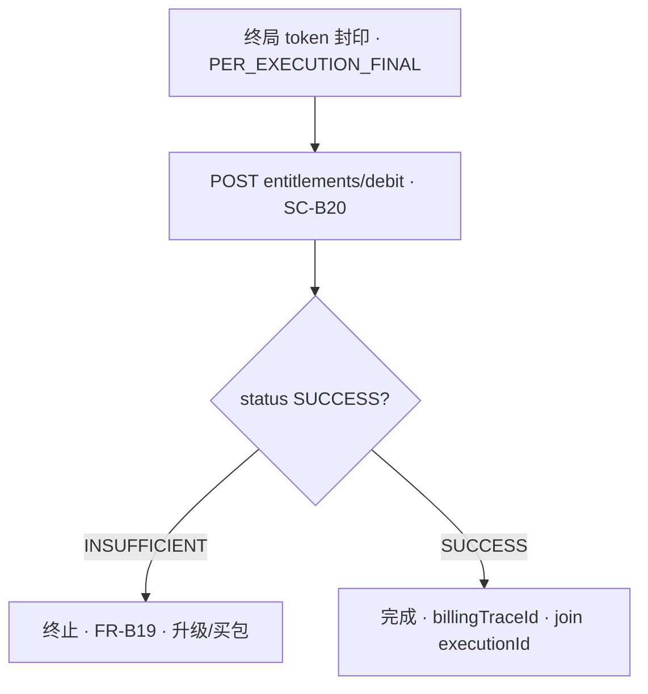

# 计费域 · 流程（Billing Flow）

**上级**：[`overview.md`](overview.md) · **消费主路径 S2/S5**：[`consume-and-bill.md`](../../../flows/consume-and-bill.md) · **商业 SSOT**：[`commerce-model.md`](commerce-model.md)

| 阶段 | 概念 | 说明 | 契约 |
|------|------|------|------|
| **资格与策略** | 运行时限流/余额 **与** **`BILLING_SETTLE_POLICY=ENTITLEMENT_ONLY`** | **S2** **Capability 额度**（[`commerce-model`](commerce-model.md)）；**写路径** **子账户 USDT** **仅** **交易/理财消耗**（**§7.4.1**） | [`consume-and-bill`](../../../flows/consume-and-bill.md)、[`commerce-model.md`](commerce-model.md) |
| **额度核销（轨 B）** | **S5** **`POST …/entitlements/debit`** · **`ENTITLEMENT_DEBIT`** · **SC-B20** | **唯一** Agent 消耗清算步；**S2** **`GET …/entitlements/balance`** | [`internal/billing-entitlements.yaml`](../../../../openapi/internal/billing-entitlements.yaml) |
| **平台级导出 · 退款** | **FR-MC504/M507**、**FR-MC505** | 见 **functions**；**Commerce 收入** **FR-MC511** | [`functions.md`](functions.md) |

**说明**：**S5** **见** [`consume-and-bill`](../../../flows/consume-and-bill.md) **与下图**；**不含** **子账户 Token/USDT 扣费（原轨 A）**。

---

## Mermaid（S5 · 轨 B 核销 · 示意）

---

**文档版本**：0.3.0 · **维护**：产品 + 账务 owner · **本版**：**仅轨 B**；**移除双轨/轨 A S5**。**承** **0.2.1**。
