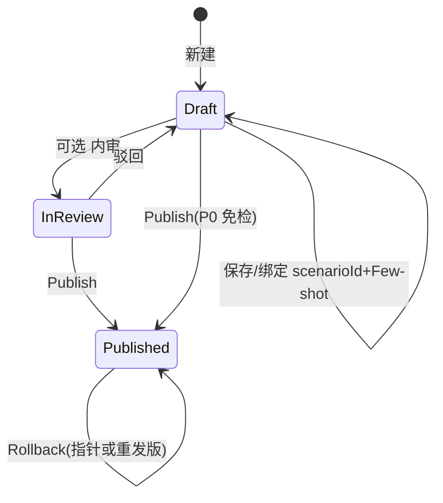

# Prompt Management · 流程

与 [`functions.md`](functions.md) **FR-PM**、[**`management-console-v1-prd`** §5](../management-console-v1-prd.md) **模块二**对签。

---

## 1. 场景 Prompt 包（TRADING / ANALYSIS / SAFETY · 草稿线）

1. **创建草稿**：得名 **`promptPackId`**（或由系统分配）；选 **`promptPackKind`**。  
2. **编辑**：正文、变量占位符、`scenarioId`、**Few-shot**，**服务端校验 schema**。  
3. **（可选）评审**：Approver 通过后 **解锁 Publish**。  
4. **Publish**：`promptPackVersion + 1`，写审计 **`PROMPT_PUBLISHED`**，触发 **运行时缓存失效**（语义见 **`design`**）。  
5. **回滚**：选历史 **`promptPackVersion`** → **`PROMPT_ROLLBACK`**；**不改变**履历中 **既有版本记录**。

---

## 2. 系统 Prompt 包（SYSTEM · LOCKED）

1. **首版发布后** → **`LOCKED=true`**。**禁止 PATCH 正文**。  
2. **修改路径**：**「新建版本」** → 复制 **当前生效快照** → 编辑 **新草稿（未生效）** → **Publish** 覆盖 **生效指针**。  
3. **履历**：每条 **`promptPackVersion`** **只读**。  

---

## 3. 沙箱调用（FR-PM06）

1. **选草稿** + fixture。  
2. **BFF** 路由到 **staging 推理**网关（模型 **ai-settings sandbox**）。  
3. **不落**计费生产流水 **或** 记 **`SANDBOX` 账务桶**（会签：`billing`/成本中心）。  

---

## 4. 与 Runtime 汇合点

**读路径**：Orchestration / Runtime 用 **`scenarioId`**（及 `user` / `locale` 等上下文）解析 **当前生效**的 **`promptPackId` + `promptPackVersion`**。**失败策略**：见 [`functions.md`](functions.md) **§2.9**、**§7**、`exchange-agent` **`FR-T05`**。

**拼装 / 注入 / 冻结 / Tool SSOT**：[`runtime-injection.md`](runtime-injection.md)（**与** **`GET` 响应块顺序** **对签**，见 [`functions` §2.9](functions.md)）。

---

## 5. 审计锚点（摘要）

详见 [`functions.md`](functions.md) **§2.1**、[`rules.md`](rules.md) **§1**。
