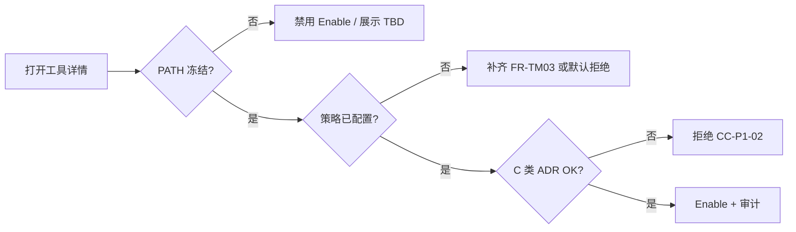

# Tool Management · 流程

对齐 [`functions.md`](functions.md) **FR-TM**、[`runtime-contract.md`](runtime-contract.md) **§5·§7**（校验链 · Freeze）**与 **`management-console-v1-prd` §13** **SC-MCV1-05**。

---
**关单余量（MR 首节）**：[`closure-remaining` §0](../../../closure-remaining.md#closure-remaining-quicklinks) · [§6 / §6.4](../../../closure-remaining.md#cc-exec-solve-path)（[**§6.4 问题→动作**](../../../closure-remaining.md#cc-problem-to-action)）；**主契约** [`contract-closure`](../../../contract-closure.md)。

## 1. 登记对齐 → Registry

1. **架构/网关** MR **解冻** **`design/api` 矩阵** 一格（登记表 **同行更新**）。  
2. **`trade-assistance` §8** 若新增 **`toolId`** → **同源 MR**。**CC-P1-03**：登记表形态 **ADR** —— [**`contract-closure`**](../../../contract-closure.md)。  
3. **本模块** Registry **job**/**webhook** 拉取 → 行 **`FROZEN`**；未完成则 **`TBD`**。

---

## 2. 启用（FR-TM04）

1. **二次确认** + **原因**（对内）。  
2. **写** `TOOL_ENABLED`。  
3. **BFF**：模板 **T05** 可选列表 **纳入**（若 **`toolProfile`** 聚合逻辑需要 **联合** **`tool-matrix`**）。

---

## 3. 停用

1. **立即**：**新**会话编排 **不得**选该 **`toolId`**（**运行时**语义见 **`exchange-agent`**）；**在飞** session **收尾** [**D-1**](../management-console-v1-prd.md) **附录 A §11**。  
2. **审计** `TOOL_DISABLED`。

---

## 4. Schema 检视

**只读打开**默认；若有 **白名单字段**允许运营改 **描述类**文案 → **不走** **`TBD`** 格 **误判为已交付**。

---

## 5. 日志协查（FR-TM05）

1. **`toolId` + 时间窗**（可选 `userId`、`executionId`）。  
2. **跳转** [`observability-management`](../observability-management/overview.md) **嵌入** **或** 新开 Tab。  
3. **权限**：**`TOOL_LOG_VIEW`** **独立**或与 **Risk** 共用（[`rules`](rules.md)）。

---

## 6. Tool Profile（T05）与在飞策略

1. **保存 / 发布模板**时 **BFF** **解析 `toolProfileRef`** → **`toolId[]`**：**任一项** **`enabledOperational=false`** **或** **`matrixStatus∈{TBD,DEFERRED无备注}`** → **整单失败** **`409`/`422`** · **`TOOL_DISABLED` / `TOOL_MATRIX_TBD`**（**条目级 `failures[]`** **与否** **`design`** **冻结**）；**与** **`agent-management` SC-AM-04** **对签**（[`functions`](functions.md) **SC-TM-09**）。  
2. **在飞会话**：编排 **会话开始时刻** **已 Resolve** **之绑定** —— **运营侧 Disable `toolId`** **后**：**新建**会话 **不得**选用；**在飞** **收尾 · 降级**（[**D-1**](../management-console-v1-prd.md) **附录 A §11**）语义见 **`exchange-agent`/`runtime`**（本域 **不** **复述**运行时状态机）。
