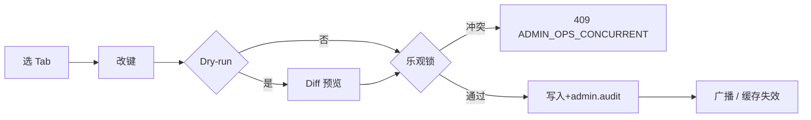

# Trading Agent Config · 流程

对齐 [`functions.md`](functions.md)、[`keys.md`](keys.md)，以及 [`management-console-v1-prd.md`](../management-console-v1-prd.md) 附录 **A §9**（`agentState`）。

## 1. 编辑提交

- `GLOBAL_AGENT_SWITCH` / 清空 `SYMBOL_ALLOWLIST`：二次确认 + 可选双人审批（[`rules.md`](rules.md)）。
- `configVersion` 递增：由 `design` / OpenAPI 冻结。

## 2. 回滚（FR-MC708）

选择历史快照覆盖当前 → 审计 + 广播。元数据：[`keys.md` §6](keys.md#6-写路径元数据fr-mc707708)。

## 3. agentState（读）

派生顺序由 `design` / OpenAPI 冻结。示例语义：`GLOBAL_AGENT_SWITCH=OFF` → `GLOBAL_OFF`；`OPS_GLOBAL_AGENT_PAUSE` 有效时 → `OPS_SUSPENDED`。须与附录 A、`exchange-agent`、`telegram` 同源。

## 4. 渠道镜像与 Bot 配置（FR-MC706～711）

运行时读到的有效 `configVersion` 须与控制台最近一次成功写入一致（**SC-TAC-04**，[`functions.md`](functions.md) §4）。**Webhook 运维动作**（**setWebhook** 等）**不改变**该口径之 **`configVersion`** **与否** **由 `design`/OpenAPI 单列**；**须**与 **`getWebhookInfo`** **摘要** **同窗可观测**。

---

[`../../agent/exchange-agent/overview.md`](../../agent/exchange-agent/overview.md) · [`../../../../design/api.md`](../../../../design/api.md)
