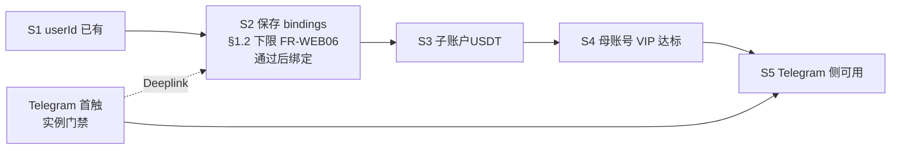

# 初始化流程 · 端到端序

本卷落实从 **未完成 Telegram/API 绑定**到「渠道内可下发可计费执行」的业务顺序，与 [`activate-trading-agent.md`](../../../flows/activate-trading-agent.md) **S1～S5** 对签。单笔 `executionId` 与扣费顺序见 [`consume-and-bill.md`](../../../flows/consume-and-bill.md)。

---

## 0. 与 `activate-trading-agent` 的步骤映射

| 流程步 | 本卷展开重点 |
|--------|----------------|
| **S1** · Agent 绑定页可达 | §1.1：**产品线 Deeplink → Agent 绑定页**；**不须**交易所主站前置 |
| **S2** · 子账户 + API | §1.2、§4：单页录入 **`agentSubAccountUid`**、Key/Secret、服务端 **§1.2** 下限校验、就绪判据、幂等 |
| **S3** · 子账户币币 USDT | 扣减主体叙事以 [`billing` §2](../../../domains/admin/billing-management/overview.md) 为 SSOT；本节不重复公式 |
| **S4** · VIP 下限 | §1.4、`activation-policy`：稳定码与附录 A 同窗 |
| **S5** · Telegram 可用 | `telegram-binding`、`activation-policy`：绑定 + 全局/渠道开关 |

---

## 1. 分阶段展开

### 1.1 前置：产品线绑定上下文（不须交易所主站）

- **入口**：用户经 **Telegram Deeplink** **到达 Agent 产品线绑定页**（[`telegram-binding.md`](telegram-binding.md)、[**`FR-WEB01`**](../../web/agent-onboarding.md)）；**不要求**用户 **访问 Coobit 交易所主站 / H5**。  
- **保存前**：用户可在页内录入 **`agentSubAccountUid`**、Key/Secret；**未提交保存** **不得**宣称「已开通 Agent」类成功结论。  
- **提交保存时**：**须**具备 **`FR-WEB01`** **所指可归因之产品线绑定上下文**（Deeplink / session / **`design` 冻结**）；**`POST .../bindings/trading-api`** **成功后** **确立** **Telegram ↔ 实例 / 账务可归因锚点**（同窗 **`telegram-binding`**、**`billing`**）。

### 1.2 Agent 绑定页：校验 API 凭据后绑定与子账户就绪闭链

**触发**：用户经 **Telegram Deeplink** **到达 Agent 产品线绑定页**（**非**交易所主站）；在页内 **明示提交** **`agentSubAccountUid`**（与交易所 **`subUid`** 同窗）、**子账户 API Key + Secret**。

**前置（产品级）**：**Agent 专用子账户**达到 [`billing` §2](../../../domains/admin/billing-management/overview.md)、[`product.md`](../../../product.md) 与用户摘要 **同窗**口径下的「就绪」（子账户开立可走 **交易所**既有账户能力；**本页不承载**多步开户向导）。

**系统须达成的事务意图**（顺序 **强制**：**先校验，后实例化/绑定**；实现可映射为多步内部编排，不须单 HTTP）：

**对上 Coobit HTTP（宿主）**：服务端本条 **探测/校验** 默认 **`openapi-ai`/Skill**，**制品须 pin**。**PATH/次序契约**仍以 **`design/api`「绑定保存 · 交易所探测矩阵」** **冻结为准**。详见 **[`integrations/exchange/overview`](../../../integrations/exchange/overview.md)**。**出站白名单/网关实现对签须同窗**。

1. **保存时**服务端使用用户提交的 **`agentSubAccountUid`**、**`apiKey`/`apiSecret`（须成对）** **调用交易所接口完成凭据与账户态校验**；**具体 PATH、调用身份（母账户代理 vs 子账户 Key 兜底）与建议次序** **以** [**`design/api.md`**](../../../../design/api.md) **「用户侧 Agent 开通 / 绑定 API」** **及** **「绑定保存 · 交易所探测矩阵」** **冻结为准**（同窗 **`POST`** **`/api/v1/me/agent/bindings/trading-api`**）；**任一校验项失败** → **不得**创建或切换 **Active** 绑定、**不得**向用户展示「已成功开通」类结论。  
2. **保存时校验下限（实例创建与绑定前置 · 须全部通过）** — 与 [`web/agent-onboarding.md`](../../web/agent-onboarding.md) **FR-WEB06**、[`openapi` · `TradingApiBindRejectCode`](../../../../openapi/components/onboarding-schemas.yaml) **同窗**；失败应答 **`Problem.code`** / **`details.missingPermissions`** **须与** [**`design/api.md`**](../../../../design/api.md) **「绑定保存 · 交易所探测矩阵」** **及** **前述枚举** **对签**：  
   - **子账户归属**：须判定 Key 所属账户为 **子账户**（非主账户母账本 API Key）；**须使用用户提交的 **`apiKey`/`apiSecret`** **成对** **参与**签名探测或等价校验。若为 **主账户 Key** → 返回可读错误，提示 **Agent 仅支持子账户 API Key**，**禁止**进入实例化。  
   - **`agentSubAccountUid` 与 Key 归属一致**：若 **`TradingApiBindRequest.agentSubAccountUid`** **非空**（当前产品线绑定页 **必填**），服务端 **须** 将其与 **子账户归属探测**得到的该 Key 所属 **`subUid`** **做规范化一致比对**（如 trim；**禁止**弱化为「仅提示」）；**不一致** → **`AGENT_BIND_SUBACCOUNT_UID_MISMATCH`**，**禁止**进入实例化。  
   - **子账户状态**：该子账户须为 **启用/可操作**态（非禁用、冻结等业务否定态）。若为 **禁用或未激活** → 提示用户 **先激活或解禁子账户**，**禁止**进入实例化。  
   - **API 与产品线权限**：须校验该 Key 已开启 **API 交易权限**（或所内等价「允许 API 下单/私有读写」开关），且 **币币（现货）**、**杠杆**、**合约** 权限均已开启（与 **`permission-authorization`** / 交易所矩阵 **摘要一致**；缺一项须 **逐项可归因**）。未开启 → 提示用户在交易所侧 **开启对应权限后重试**，**禁止**进入实例化。  
   - **聚合失败**：若多项同时不满足，**优先**暴露 **子账户归属 → **`agentSubAccountUid` 一致性** → 子账户状态 → 权限缺项** 顺序中最靠前的一类稳定 **`code`**（或允许 `details.missingPermissions[]` 列出多项，**禁止**笼统「校验失败」无归因）。  
3. **仅在校验成功后**：**创建 Agent 实例**（若该 Telegram 上下文尚无实例，或按 **`agent-management`** 规则幂等复用）、将凭据 **交由本产品 Runtime 托管**（[`permission-authorization.md`](permission-authorization.md)），并完成 **Telegram 会话锚点 ↔ 可归因主体/实例** 的可审计映射（[`telegram-binding.md`](telegram-binding.md)）。  
4. **页面须展示**与 Deeplink 签发上下文一致的 **Telegram 账号**（例如 **`@username` / 脱敏 id**），以便用户确认绑定对象。

**完成判据（产品级）**：与 **子账户就绪、API 有效**相关的 **FR-T02** 链路条件（宿主见 [**`trade-assistance`/`portfolio-insight`/…**](../exchange-agent/trade-assistance.md) **同窗条文**）在 Runtime **可被判定为满足**；**禁止**「API 已成功、账本未挂载」与用户可见摘要 **长期矛盾**。

### 1.3 Telegram（可与 1.2 时间上交错）

- **目标**：建立 [`telegram-binding.md`](telegram-binding.md) 所述 **会话 ↔ `userId`（及允许的实例上下文）**可验证映射；**首触**须校验 **该 Telegram 锚点**是否已在 **实例绑定**中登记，**若否** → Deeplink（同窗 **`telegram-binding` §2**）。  
- **顺序**：典型路径为 **Telegram 首触 → 产品线 Deeplink → Agent 绑定页（§1.2）→ 明示保存**；**禁止**仅用 Telegram 侧交互 **替代** **§1.2** **API 凭据校验与明示提交**。  
- **门禁**：最终是否可执行仍由 **FR-T02** 全链（含 1.2）在 [`consume-and-bill.md`](../../../flows/consume-and-bill.md) **S2** 裁决。

### 1.4 资金与准入（邻域 SSOT）

- **S3 · USDT**：用户将 **计价/扣费所需** USDT 可用余额置于 **该 Agent 专用子账户 · 币币**（[`billing` §2](../../../domains/admin/billing-management/overview.md)、**FR-T03** 同窗）。  
- **S4 · VIP**：**母账号** **`vipTier`** ≥ **`AGENT_MIN_VIP_TIER`**（[`config` FR-C07](../../../domains/admin/management-console-v1-prd.md)、[`keys`](../../../domains/admin/trading-agent-config/keys.md) 同窗）；**禁止**按 Agent **子账户**独立 VIP 比对。  
- **归因诚实性**：因 VIP/计费/合规导致的阻断 **不得**用「未绑 Telegram」或含糊「API 坏了」替代（[`activation-policy.md`](activation-policy.md)）。

---

## 2. 与 `consume-and-bill` S2 交界

凡可能触发 **私有成交/持仓叙事**或 **可计费 accepted** 的路径，**须先**通过 **FR-T02** 所涵顺序（全局/运营暂停、子账户、API、VIP（**母账号 `vipTier`**）、计费等，详文见 exchange-agent 与 consume-and-bill）。

**当阻断原因可明确归类为 onboarding（子账户未就绪、API 未生效等）**：会话应答须满足 **FR-T05** — 可读摘要与指向 **Agent 产品线绑定页**的 Deeplink，引导用户打开 **§1.2** **绑定页**完成 **校验与绑定**（**不须登录交易所主站**）。

**当阻断原因实为 API 吊销、待轮换完成后的再绑定，或运营收窄模板权限**（**非**本子账户未开立）：恢复与归因下限同窗 [`permission-authorization.md`](permission-authorization.md) **§5～6**（**`ON-PERM-02`、`ON-PERM-03`**）；**不得**用「再走一遍 §1.2 绑定/校验链」泛泛替代 **可证伪的** API/权限问题。**实例 Pause、`GLOBAL_OFF`、Warm-up** 与 onboarding 的话术分界同窗 [`runtime-provisioning.md` §3](runtime-provisioning.md)。

---

## 3. 失败与分支（产品下限）

| 用户可见现象 | 摘要下限 | 归因宿主 |
|----------------|----------|-----------|
| 子账户未就绪 | 说明「交易专用子账户侧未就绪」，并给出 **交易所站内** **子账户就绪**引导链（**绑定页 §1.2** **不等价**于「子账户未开立」归因） | **`AGENT_SUBACCOUNT_BLOCKED`** 族，[`boundaries.md`](../exchange-agent/boundaries.md) |
| **绑定页保存**：主账户 Key / **`agentSubAccountUid` 与 Key 所属 `subUid` 不一致** / 子账户禁用 / 权限未全开 | 须 **可归因** copy（同窗 **§1.2 项 2**、**FR-WEB06**）；引导用户 **换子账户 Key**、**核对子账户 UID**、**激活子账户** 或 **在交易所开启 API·币币·杠杆·合约** | **`TradingApiBindRejectCode`**（[`onboarding-schemas`](../../../../openapi/components/onboarding-schemas.yaml)）；HTTP **`Problem.code`** **同窗**；**探测 PATH** [**`design/api.md`**](../../../../design/api.md) **「绑定保存 · 交易所探测矩阵」** |
| API 吊销/权限/待轮换（含 **运营收窄 FR-T01 已依赖只读**） | 与「余额/VIP」区分；优先再走 **§1.2 绑定页**重新校验/绑定，其次 **交易所 API 管理 / 安全策略**页；**收窄只读**须在摘要/稳定码上 **与子账户未就绪区分**，**禁止**用 **`AGENT_SUBACCOUNT_BLOCKED`** **冒充**（**`ON-PERM-03`**） | **`AGENT_TRADING_API_REQUIRED`** 等 **`design/api` 与用户侧矩阵**；轮换/吊销见 [`permission-authorization` §3、§5–6](permission-authorization.md) |
| 编排部分成功 | 禁止静默「半开通」；可重试、可解释错误、或工单路径 | FR-ON01、产品线 / 工单路径 |
| 仅 VIP/余额/合规 | 与 access-control、billing 稳定码一致 | [`activation-policy.md`](activation-policy.md) |

---

## 4. 幂等与单链默认（FR-ON04）

| 规则 | 要求 |
|------|------|
| 重复确认 | 同一 **`userId`** 短时间多次完成确认，须 **收敛**：目标态已满足时应 **幂等**，不新增互斥的第二套活跃子账户+绑钥 |
| 冲突 | 若检测到 **两条互斥绑定均标为 active**，须 **拒绝新执行**并向运营暴露可对账诊断，禁止随机择一静默继续 |
| 多实例未来态 | 若允许多 Agent 实例/多子账户策略，须有 **ADR + agent-management** 规则；首版沿用 **单一活跃链路**默认值 |

---

## 5. 审计（下限 · 不落 Secret）

| 事件类型 | 留痕字段（示例粒度） |
|----------|---------------------|
| 打开开通入口/绑定页 | 时间、`userId`、入口Campaign/粗来源（若产品有）；**Deeplink** 上下文中的 **Telegram 锚点脱敏 id**（若可得） |
| 用户提交/校验结果 | `userId`、success/failure、**failure `code`**（校验失败须可归因）、子账户 **公开 id**（若可得）；**禁止**在默认审计载荷中落 **Secret** |
| API 绑定态迁移 | 公开 **`agentTradingApiKeyId`** 的旧/新、原因枚举 |
| Telegram 绑定/换绑 | 按渠道 SSOT **脱敏后的**会话锚点 |

---

## 6. Mermaid（开通子链可视化）

---

## 7. 验收草案 · Given / When / Then

以下用例 **可**映射到 **`metrics`/TC**（如 **`config` §14 TC-21**同窗 [`consume-and-bill`](../../../flows/consume-and-bill.md)）；**数据以 `design`/OpenAPI **冻结** **`userId`、摘要、会话回包**字段名为准。

**同窗**：**API 密钥轮换 / 吊销 / 运营收窄**的 GWT 见 [`permission-authorization` §6](permission-authorization.md)（**`ON-PERM-01～03`**）；**Telegram** 侧重 **误判「子账户未开」** 见 [`telegram-binding` §6.3 **`TG-GWT-03`**](telegram-binding.md)；**`agentState`、实例 Pause、Warm-up** 与 **狭义 onboarding** 的话术分界见 [`runtime-provisioning` §3](runtime-provisioning.md)。**§7.1～7.4** 不重复上述条目，评审时 **须**一并执行或映射到 TC。

### 7.1 `ON-GWT-01` · 绑定页 S2 后主路径可会话

- **Given**：测试 **`userId`** 已在 **Agent 产品线绑定页**完成 **`S2`**（[`activate-trading-agent`](../../../flows/activate-trading-agent.md)）：即 **§1.2** **校验成功**并完成 **实例化与绑定**，摘要中 **`agentTradingApiBindingStatus`**（或等价键）表示已绑定；已满足 **S3～S4** 或测试夹具显式 **Mock** 为满足。  
- **When**：用户在 **Telegram** 发送 **一条不触及写、仅须私域只读**的请求（与 **FR-T02** 同窗用例，如 **Portfolio** 只读场景）。  
- **Then**：运行时 **不因**单独 **`AGENT_SUBACCOUNT_BLOCKED`**（**无**合规/计费/VIP 并行失败）拒答；若 **仍**拒答，**则** `lastProductBlockReason`/会话稳定码 **不得**归类为 **纯粹 onboarding 未完成**——须出 **缺陷单**修 **摘要与 Runtime 分歧**（SC-ON-01）。

### 7.2 `ON-GWT-02` · onboarding 阻断须有 Deeplink

- **Given**：**`userId`** **故意**处于 **子账户未就绪** **或** API **未 Active**（测试数据或沙箱开关）。  
- **When**：用户 **在 Telegram** **发起**须 **`trading.exchange_private`** 的请求。  
- **Then**：应答须含 **摘要**（与子账户/API 语义一致）与 **产品线 Deeplink**（指向 **Agent 绑定页 · §1.2**）；严禁仅返回「请稍后再试」。用户在 **Agent 产品线绑定页**完成 **§1.2** **凭据校验与绑定**（或测试注入等价成功回调）后，须有 **可查状态**的机制使 **同一意图**不因 **同一 onboarding 缺口**被无限拦截（SC-ON-02）。

### 7.3 `ON-GWT-03` · I02 与用户摘要同源

- **Given**：同一 **`userId`**；测试数据使其 **尚未**完成上文 **§1.2** 所述 **校验成功 + 绑定**就绪。  
- **When**：控制台执行 **I02** 或拉取 **用户摘要**；若 I02 失败，记录 **`code`**；同刻读取摘要 **`agentState`、`agentTradingApiBindingStatus`、`lastProductBlockReason`。  
- **Then**：失败码与摘要字段 **指向同一事实**；禁止「I02 成功 / 摘要 `NORMAL`」与 **实测子账户/API 未就绪**长期共存（SC-ON-03）。

### 7.4 `ON-GWT-04` · Secret 不出现在默认面

- **Given**：默认工单导出、默认用户摘要 JSON、关闭 debug 的结构化会话日志（**不含**用户仅在浏览器输入框内短时持有的 Secret）。  
- **When**：对上述载体按实现定义的 Secret 形态做检索。  
- **Then**：零命中明文 Secret；任一命中即为 P0（SC-ON-04）。**允许**：用户在 **§1.2 绑定页**输入 Secret **用于单次校验** — **不得**因此放宽 **日志/导出**默认面的 **无 Secret** 要求。

---

## 8. `FR-T02` **参考顺序**（同窗 **consume-and-bill S2**）

与 [`consume-and-bill`](../../../flows/consume-and-bill.md) **S2**：**全局关 → 运营暂停 → 子账户就绪 +（凡须 FR-T01）API 有效 → VIP（母账号 `vipTier`）→ 计费**。本域职责 **聚焦于** 「子账户 + API」两段；其余因子以 exchange-agent/access-control/billing **正文**为准。

---

**文档版本**：1.5.6 · **维护**：产品 + Accounts owner · **本版**：§1.2 **`openapi-ai`/`integrations`** 宿主短段。**承** **1.5.5**。
