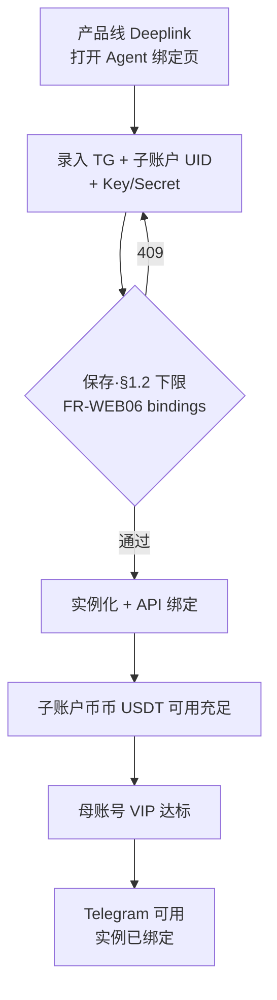

# 流程：从入口到可交易 Agent（开通路径）
**关单余量（MR 首节）**：[`closure-remaining` §0](../closure-remaining.md#closure-remaining-quicklinks) · [§6 / §6.4](../closure-remaining.md#cc-exec-solve-path)（[**§6.4 问题→动作**](../closure-remaining.md#cc-problem-to-action)）；**主契约** [`contract-closure`](../contract-closure.md)。

## 文首摘要

**书写规范**：[`../standards/business-process-standard.md`](../standards/business-process-standard.md) §2～§6；存量对齐批次见 **[`../standards/STANDARDS-ADOPTION.md`](../standards/STANDARDS-ADOPTION.md)** Wave F。

| 项 | 内容 |
|----|------|
| **流程名** | 从入口到 **可交易 Agent**（开通路径） |
| **主渠道** | **会话**：Telegram（[`telegram/overview.md`](../domains/agent/telegram/overview.md) **§2.5 · 类型 A**、**总则 §2～§2.6** · Deeplink/阻断）；**开通与绑定**：**Agent 产品线 Web/H5** **绑定单页**（[`web/agent-onboarding.md`](../domains/web/agent-onboarding.md)） |
| **涉及 `domains`** | [`onboarding/overview.md`](../domains/agent/onboarding/overview.md)（域级 **SSOT**：[**`initialization-flow.md`**](../domains/agent/onboarding/initialization-flow.md) **步骤展开**）；[`web/agent-onboarding.md`](../domains/web/agent-onboarding.md) **FR-WEB01～06**（**Agent 产品线绑定页 UX**）；[`overview.md`](../domains/agent/exchange-agent/overview.md) **FR-T01/T02**；[`billing.md`](../domains/admin/billing-management/overview.md) **§2** |
| **`design/`** | [`../../design/api.md`](../../design/api.md) **子账户 scope**、**交易 API**、**用户侧 `me/agent/*` 绑定与交易所探测矩阵**；[`../../design/architecture.md`](../../design/architecture.md) （504/UNKNOWN 若后续开通链触及） |
| **对上 Coobit HTTP** | 服务端 **绑定校验/探测**：默认 **`openapi-ai`/Skill**，**制品须 pin**；PATH 仍以 **`design/api`「绑定保存 · 交易所探测矩阵」** 为准；同窗 [`integrations/exchange/overview`](../integrations/exchange/overview.md) · [`agent-coobit-api-allowlist`](../integrations/exchange/agent-coobit-api-allowlist.md) |
| **端到端鸟瞰 · 架构语言** | [`flow/e2e-closed-loop.md`](../../../flow/e2e-closed-loop.md) **文首「架构语言」** → [`architecture` §「与通用 Agent 栈之对照」](../../design/architecture.md) |

**定位**：业务步骤级；**门禁条文与验收**以域文档为准，本文只编排 **谁先谁后**。

---

## 参与文档

- [`../domains/agent/onboarding/overview.md`](../domains/agent/onboarding/overview.md)（**总览与子域切片**）；[`../domains/agent/onboarding/initialization-flow.md`](../domains/agent/onboarding/initialization-flow.md)（**本流程与之对签的步骤展开**）；[`../domains/web/agent-onboarding.md`](../domains/web/agent-onboarding.md)（**Agent 产品线绑定页 UX · FR-WEB**）
- [`../domains/agent/exchange-agent/overview.md`](../domains/agent/exchange-agent/overview.md) **FR-T01、FR-T02**
- [`../domains/admin/billing-management/overview.md`](../domains/admin/billing-management/overview.md) **§2**
- [`../../design/api.md`](../../design/api.md)（**子账户 scope 交易 API** 契约；**保存绑定校验 PATH** 见 **「用户侧 Agent 开通 / 绑定 API」「绑定保存 · 交易所探测矩阵」**）
- [`../integrations/exchange/overview.md`](../integrations/exchange/overview.md) **探测/校验对上 Coobit：`openapi-ai`（pin）+ 矩阵/`allowlist` 同窗**
- [`../domains/agent/telegram/overview.md`](../domains/agent/telegram/overview.md)（**本版** **唯一**会话渠道 · **§2.5 · 类型 A**（总则 **§2～§2.6**）· **Deeplink / 阻断**）
- [`../contract-closure.md`](../contract-closure.md) **子账户/API 就绪**、**`design/api`** **矩阵、`config.md`** **§13 发布勾选（CC-P0 交叉）**

---

## 主路径（Happy path）

### S1 · Agent 产品线绑定页可达

- **执行者**：用户 / Agent Web  
- **动作**：用户经 **Telegram Deeplink** **打开 Agent 绑定页**（**不须进入 Coobit 交易所主站**）。  
- **前置**：无  
- **产出**：绑定页可加载（同窗 [**`FR-WEB01`**](../domains/web/agent-onboarding.md)）  
- **关联**：[`initialization-flow` §1.1](../domains/agent/onboarding/initialization-flow.md)

### S2 · 绑定页：保存 · §1.2 下限校验 · 再绑定（实例化）

- **执行者**：用户 + Agent 产品线 Web（[`web/agent-onboarding.md`](../domains/web/agent-onboarding.md) **`FR-WEB01～06`**）  
- **动作**：用户在 **Agent 绑定页**查看 **Telegram 账号**摘要；录入 **`agentSubAccountUid`**（与交易所 **`subUid`** 同窗）、**Agent 专用子账户**下的 **API Key + Secret** 并 **保存** → **`POST /api/v1/me/agent/bindings/trading-api`**（[`user/onboarding.yaml`](../../openapi/user/onboarding.yaml)）**服务端经交易所 API 校验** — **须全部满足** [**`initialization-flow` §1.2 项 2**](../domains/agent/onboarding/initialization-flow.md)（**子账户 Key**；**`agentSubAccountUid` 与 Key 所属 `subUid` 一致**；**子账户启用**；**API·币币·杠杆·合约权限**）；失败 **`409`** **`TradingApiBindRejectCode`**（[`onboarding-schemas.yaml`](../../openapi/components/onboarding-schemas.yaml)，含 **`AGENT_BIND_SUBACCOUNT_UID_MISMATCH`**）；探测 PATH [**`design/api.md`**](../../design/api.md) **「绑定保存 · 交易所探测矩阵」** → **仅通过后** **创建 Agent 实例（若需要）**、**托管 Key**并达成 **[`billing.md`](../domains/admin/billing-management/overview.md) **§2「Agent 专用子账户（就绪）」** **且** **子账户交易 API（Agent 绑定）** 生效**。  
- **前置**：S1  
- **产出**：子账户就绪 + API 绑定状态满足 [`overview.md` FR-T02](../domains/agent/exchange-agent/overview.md)  
- **关联**：[`onboarding/overview` §1.1](../domains/agent/onboarding/overview.md)，[`../domains/agent/exchange-agent/overview.md`](../domains/agent/exchange-agent/overview.md) **FR-T01**

### S3 · 子账户 · 币币 USDT 资金就绪

- **执行者**：用户  
- **动作**：用户将 **USDT** **充入 / 划转**到 **该子账户 · 币币**（满足后续 **最小扣费单位** 与使用预期）。  
- **前置**：S2  
- **产出**： **`billing`** 与 **`FR-T03`** 口径下可用的 **币币 USDT 余额**叙事  
- **关联**：[`billing.md`](../domains/admin/billing-management/overview.md) **§2**；[`../domains/agent/exchange-agent/overview.md`](../domains/agent/exchange-agent/overview.md) **FR-T03**

### S4 · VIP 达到准入下限

- **执行者**：系统（只读 **母账号** **`vipTier`**）及用户（在所内升级 **母账号**会员）
- **动作**：**母账号** **VIP** 达到 **`config.md` FR-C07** 配置下限（**`vipTier` ≥ `AGENT_MIN_VIP_TIER`**；**非**按子账户独立 VIP）。
- **前置**：S3  
- **产出**：不满足则 **`MEMBERSHIP_BLOCKED`**（见域文档）  
- **关联**：[`config.md`](../domains/admin/management-console-v1-prd.md) **FR-C07**，[`../domains/agent/exchange-agent/overview.md`](../domains/agent/exchange-agent/overview.md) **FR-T02**

### S5 · 在 Telegram 发起使用

- **执行者**：用户 + Agent  
- **动作**：用户在 **Telegram** 发起 Agent 使用：**若 Telegram 锚点尚无可用实例绑定**，须 **先**收到 Deeplink 并完成 **S2**（[`telegram-binding`](../domains/agent/onboarding/telegram-binding.md) **§2**）；在 **全局开关**与 **`CHANNEL_TELEGRAM=ON`** 前提下，**不再**被 **`AGENT_SUBACCOUNT_BLOCKED`** / `MEMBERSHIP_BLOCKED` / `BILLING_BLOCKED` 拦截。  
- **前置**：S1～S4  
- **产出**：可进入会话内执行链路（读写另见 **`trade-via-agent`**、`consume-and-bill`）；**首次达成开通就绪 ∧ Telegram 已绑定** 时 **可选按语言解析投递一条欢迎语**（[`telegram/overview.md`](../domains/agent/telegram/overview.md) **§2.1.1**）  
- **关联**：[`telegram/overview.md`](../domains/agent/telegram/overview.md)（**§2.1.1** 欢迎语；**§2.5 · 类型 A / §2～§2.6**）；[`trade-via-agent.md`](trade-via-agent.md)（**就绪后写路径**）；[`../domains/agent/exchange-agent/overview.md`](../domains/agent/exchange-agent/overview.md) **FR-T02**

---

## 分支与异常（简表）

| 现象 | 用户动作 |
|------|----------|
| 子账户未就绪 **或** API 未生效 | 再次经 **产品线 Deeplink**打开 **Agent 绑定页**并 **保存**（**§1.2** **`POST bindings/trading-api`** **下限校验** [**FR-WEB06**](../domains/web/agent-onboarding.md)；失败须 **`TradingApiBindRejectCode`** **可归因**）；**不须登录交易所主站**；或按交易所侧提示 **解冻**/修正 Key |
| 子账户交易 API 异常（吊销/权限等） | **优先**在 **Agent 绑定页**重新录入并 **通过校验**；**仍失败**再视交易所策略转 **API 管理**（**`AGENT_TRADING_API_REQUIRED`**） |
| VIP 不足 | 升级 **母账号**会员（**`vipTier`** 达标） |
| 子账户币币 USDT 不足 | 充值或划转至 **子账户币币**（**常**经 **主站 / H5** 或 Telegram **可点击**充值 / Billing 引导链，见 [`overview.md`](../domains/agent/exchange-agent/overview.md) **FR-T03、FR-T05**） |
| 查看消耗/配额 / 计费说明 | 打开 **主站 / H5** **`/subaccount/billing`（账单与消耗 · `me/commerce`）**；**常**由 Telegram **Deeplink**（**`?start=ab`**）带入已登录会话 — [`billing.md` §0](../domains/admin/billing-management/overview.md)、**FR-B17～B20**、[**`web/agent-billing.md`**](../domains/web/agent-billing.md) |

---

## Mermaid（与 onboarding 叙事一致）

---

## 计费与门禁交界

不涉及 **单笔 `executionId` 扣费**细节；就绪后每一笔执行见 [`consume-and-bill.md`](consume-and-bill.md)。

## 渠道与交互

阻断与 Deeplink、**Bot API** 下限见 [`telegram/overview.md`](../domains/agent/telegram/overview.md)（**总则 §2～§2.6**）；**会话内每笔交易所写 · §2.5 · 类型 A** **见** [`trade-via-agent.md`](trade-via-agent.md)。**不写**第二张卡片字段表。
