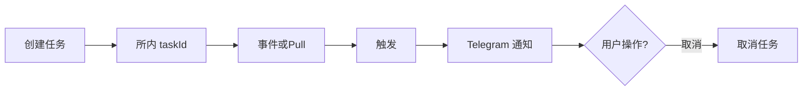

# 流程：条件类自动化与告警

**定位**：用户 **创建 / 管理** **条件单、到期提醒、风险阈值** 等 **长驻任务**；**触发** 后经 **Telegram** 通知；**不含** **网格/DCA 全量机器人**（**`overview.md` §1.3**）。
**关单余量（MR 首节）**：[`closure-remaining` §0](../closure-remaining.md#closure-remaining-quicklinks) · [§6 / §6.4](../closure-remaining.md#cc-exec-solve-path)（[**§6.4 问题→动作**](../closure-remaining.md#cc-problem-to-action)）；**主契约** [`contract-closure`](../contract-closure.md)。

## 文首摘要

**书写规范**：[`../standards/business-process-standard.md`](../standards/business-process-standard.md) §2；对齐计划：[**`../standards/STANDARDS-ADOPTION.md`](../standards/STANDARDS-ADOPTION.md)**。

| 项 | 内容 |
|----|------|
| **流程名** | 条件类自动化与告警（创建 → 触发 → 推送） |
| **主渠道** | Telegram（[`telegram/overview.md`](../domains/agent/telegram/overview.md) **§2.5 · 类型 A**（创建写）；**推送 · 类型 D** **· §2～§2.6 · 必选能力 #8**） |
| **涉及 `domains`** | **`overview-legacy-migration` §2（旧§10 Push/自动化）、`monitoring-tasks`、`trade-assistance` §2 · `FR-T09`、§8.3～8.5、[`agent-orchestration` 执行面分卷](../domains/agent/agent-orchestration/overview.md)、`billing`（若计量） |
| **`design/`** | **`api.md` 自动化 / Pull 依据** |
| **端到端鸟瞰 · 架构语言** | [`flow/e2e-closed-loop.md`](../../../flow/e2e-closed-loop.md) **文首「架构语言」** → [`architecture` §「与通用 Agent 栈之对照」](../../design/architecture.md) |

## 参与文档

- [`../domains/agent/exchange-agent/overview-legacy-migration.md`](../domains/agent/exchange-agent/overview-legacy-migration.md) **§2**（旧 **§10.2** / **`FR-T06`（Push）**、**§10.6** 自动化/长驻任务）；[`../domains/agent/exchange-agent/monitoring-tasks.md`](../domains/agent/exchange-agent/monitoring-tasks.md)
- [`../domains/agent/telegram/overview.md`](../domains/agent/telegram/overview.md) **§2.5 · 类型 A**（**S1** 创建写）；**§2～§2.6**；**必选能力 #8**（**S5** 触发推送 · **类型 D**）
- [`../../design/api.md`](../../design/api.md) **自动化 endpoint 行**
- [`../integrations/exchange/overview.md`](../integrations/exchange/overview.md) **条件单/API 写上 Coobit 时：`openapi-ai`（pin）+ allowlist · 契约同窗**
- [`../domains/admin/billing-management/overview.md`](../domains/admin/billing-management/overview.md) **长驻任务计费口径**（若 **`billing.md` §10** 单独立项 **计量键**）
- [`../domains/agent/exchange-agent/trade-assistance.md`](../domains/agent/exchange-agent/trade-assistance.md) **§2 · `FR-T09`**（**所内写**须 **类型 A**；**同窗** **本文 S1**）；**§8.3、§8.5**（**Pull 工具与矩阵门禁**）
- [`../contract-closure.md`](../contract-closure.md) **闭环 §1～§4**：**`taskId`/Pull/`trade-assistance` §8** 与 **`design/api`** **矩阵解冻 MR** **对签**
- [`../domains/agent/agent-orchestration/runtime-freeze.md`](../domains/agent/agent-orchestration/runtime-freeze.md) **§3.11**（**`monitoring.*` 创建/取消写** **最小编排**）

## 主路径（Happy path）

### S1 · 创建任务（含写确认）

- **执行者**：用户 + Agent / 运行时  
- **动作**：经 **Telegram** 或 **连续对话** 委托 **创建**任务（条件表达式 **以所内引擎为准**）。凡 **在所内落地的写**（**创建 conditionOrder、取消** **等**）**每笔** **须先** [`telegram/overview.md`](../domains/agent/telegram/overview.md) **§2.5 · 类型 A** 卡片确认 **再**调 API（**ADR-001**；**`FR-T09`** · [`trade-assistance.md`](../domains/agent/exchange-agent/trade-assistance.md) **§2**；写路径全流程见 [`trade-via-agent.md`](trade-via-agent.md)；自动化叙事回溯 [`overview-legacy-migration.md`](../domains/agent/exchange-agent/overview-legacy-migration.md) **§2**）。  
- **前置**：无（**或** 用户已具备会话与产品前置，见 S2）  
- **产出**：**任务创建请求** / **已确认写** 之业务 ID  
- **关联**：[`trade-assistance.md`](../domains/agent/exchange-agent/trade-assistance.md) **§2**

### S2 · 门禁

- **执行者**：Agent 运行时  
- **动作**：**写类**（如创建条件单）**须** **`FEATURE_TRADING=ON`** 及 **FR-T02** 通过；**仅查询列表** **可走**只读路径（**FR-T02** 按域定义 **可免**）。  
- **前置**：S1（写路径）**或** 独立只读查询  
- **产出**：通过 / 阻断  
- **关联**：[`overview.md`](../domains/agent/exchange-agent/overview.md) **FR-T02**

### S3 · 持久化

- **执行者**：所内引擎 / 存储  
- **动作**：**条件 / 任务** 与 **`userId`** 绑定；建议独立 **`taskId`** 与 **`executionId` 可关联**（**observability**）。  
- **前置**：S1 + S2 通过（写路径）  
- **产出**：**`taskId`**（及可观测键）  
- **关联**：[`monitoring-tasks.md`](../domains/agent/exchange-agent/monitoring-tasks.md)

### S4 · 监听（事件或 Pull）

- **执行者**：所内引擎 + 行情/账户只读依据（Pull 时）  
- **动作**：**事件** 驱动 **或** **定时 Pull + 阈值**（**FR-T06**）；Pull 类 **须**与 [`trade-assistance.md`](../domains/agent/exchange-agent/trade-assistance.md) **§8.3、§8.5** 及 **`design/api`** **矩阵**对签。  
- **前置**：S3  
- **产出**：**监听句柄** / 调度状态  
- **关联**：[`overview-legacy-migration.md`](../domains/agent/exchange-agent/overview-legacy-migration.md) **§2**

### S5 · 触发与推送

- **执行者**：运行时 + **Telegram**  
- **动作**：引擎命中 → 组装 **Telegram** 推送（**类型、标的、时间、可选 Deeplink**）。  
- **前置**：S4  
- **产出**：用户侧 **通知消息**（**必选能力 #8**）  
- **关联**：[`telegram/overview.md`](../domains/agent/telegram/overview.md) **必选能力 #8**（**§2～§2.6** · 触发推送）

### S6 · 取消（可选分支）

- **执行者**：用户 + 运行时  
- **动作**：用户 **显式取消** → 调所内 **取消** API → **可观测** **`task.cancelled`**。  
- **前置**：S3（**须**存在任务）  
- **产出**：任务 **终态 cancelled**  
- **关联**：[`contract-closure.md`](../contract-closure.md) **§1**（**`taskId`**）

### S7 · 计费与终局

- **执行者**：计费域 + 运行时  
- **动作**：计量与扣费 **不**在本文展开；见 [`billing.md`](../domains/admin/billing-management/overview.md)、[`consume-and-bill.md`](consume-and-bill.md)（**`executionId` / `FR-T01`** **同窗**）；自动化/Push 叙事见 [`overview-legacy-migration.md`](../domains/agent/exchange-agent/overview-legacy-migration.md) **§2**。  
- **前置**：与 **可计费执行** 同窗（若产品定义长驻任务计量）  
- **产出**：按 **billing** 域  
- **关联**：[`consume-and-bill.md`](consume-and-bill.md)

## 任务类型扩充（Pull 阈值 · CEX）

**对签** [`trade-assistance.md`](../domains/agent/exchange-agent/trade-assistance.md) **§8.3、§8.5**：在 **条件单写**、**到期/理财**、**价格突破** 外，**所内引擎** **可登记** **下列只读 Pull 触发器**（**须** **有** **行情/账户只读** **依据**；**无依据** **不得** **伪称触发**）：

- **资金费率过线**（**`tool.futures.funding_summary`** **或等价**）  
- **合约风险度 / 保证金率**（**`tool.account.risk_snapshot`** **子字段**）  
- **标记价相对用户设定阈值**（**与** **`tool.market.ticker`** **同源**）  

**仍排除**：**网格/DCA 全策略** **单任务**（**`exchange-agent` §1.3**）。

## Mermaid

