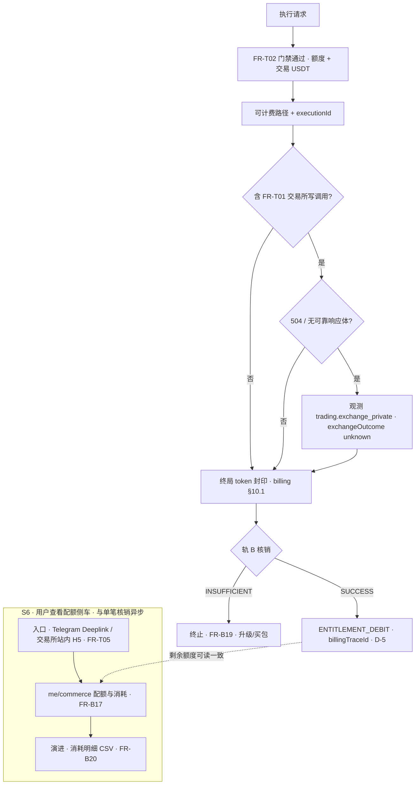

# 流程：使用 Agent 与权益核销（消费主路径）
**关单余量（MR 首节）**：[`closure-remaining` §0](../closure-remaining.md#closure-remaining-quicklinks) · [§6 / §6.4](../closure-remaining.md#cc-exec-solve-path)（[**§6.4 问题→动作**](../closure-remaining.md#cc-problem-to-action)）；**主契约** [`contract-closure`](../contract-closure.md)。

## 文首摘要

**书写规范**：[`../standards/business-process-standard.md`](../standards/business-process-standard.md) §2～§6；存量对齐：**[`../standards/STANDARDS-ADOPTION.md`](../standards/STANDARDS-ADOPTION.md)** Wave F。

| 项 | 内容 |
|----|------|
| **流程名** | 单次「可计费执行」：**Capability 额度门禁** + **计量/封印** + **轨 B 权益核销（`ENTITLEMENT_DEBIT`）** — **不** **Agent 消耗 S5 扣子账户 Token/USDT** |
| **主渠道** | **Telegram**（发起）；**配额/消耗展示**常见经 **交易所站内** **`me/commerce` H5/Deeplink** |
| **涉及 `domains`** | [`overview.md`](../domains/agent/exchange-agent/overview.md)；[`billing.md`](../domains/admin/billing-management/overview.md) **§7.4.1（交易侧 USDT · 写路径）**；[`commerce-model.md`](../domains/admin/billing-management/commerce-model.md) **§5.3（执行记录 join）**；[`observability.md`](../observability/overview.md)；[`onboarding/overview.md`](../domains/agent/onboarding/overview.md)（Deeplink 恢复） |
| **`design/`** | [`../../design/architecture.md`](../../design/architecture.md) **504/UNKNOWN**；[`../../design/api.md`](../../design/api.md) **账务 · `internal/billing/entitlements/*`、`me/commerce*`、运营 `admin/billing/commerce/*` · OpenAPI 同窗**（**历史 `me/billing*` → CC-P0-03**） |
| **对上 Coobit HTTP** | **含** **FR-T01** **类交易所写时**：出站默认经 **`openapi-ai`**（**须 pin**）；PATH **仅以** **allowlist** **与** **矩阵** **为界** — [`integrations/exchange/overview.md`](../integrations/exchange/overview.md) |
| **端到端鸟瞰 · 架构语言** | [`flow/e2e-closed-loop.md`](../../../flow/e2e-closed-loop.md) **文首「架构语言」** → [`architecture` §「与通用 Agent 栈之对照」](../../design/architecture.md) |
| **统一交易语义 · 评审（写路径与扣费交界）** | [`canonical-trading-model.md`](../../design/canonical-trading-model.md)、[`ADR-004`](../../design/adr/004-intent-centric-execution-and-canonical-trading-model.md)、[`trade-assistance` §2.6](../domains/agent/exchange-agent/trade-assistance.md)；[`CC-P1-07`](../contract-closure.md#cc-p1-07)；[`requirements-review` §7.5](../../../product/requirements-review.md#cc-adr004-review-checklist)；[`Runtime/execution` §1 步 7](../Runtime/execution.md) |

**定位**：单次「可计费执行」与 **轨 B 权益核销** 的 **业务序**；**字段与公式**见域文档。

---

## 参与文档

- [`../domains/agent/exchange-agent/overview.md`](../domains/agent/exchange-agent/overview.md) **FR-T01、FR-T02、FR-T04、FR-T05**
- [`../domains/admin/billing-management/commerce-model.md`](../domains/admin/billing-management/commerce-model.md) **Capability / 轨 B 清算 / 用尽即停**
- [`../domains/admin/billing-management/flow.md`](../domains/admin/billing-management/flow.md)（**运营台流程表 · S5/internal、退款链路 · 轨 B 核销**）
- [`../domains/admin/billing-management/overview.md`](../domains/admin/billing-management/overview.md) **§0**、**FR-B17～B20（用户侧配额/消耗）**、**§7.3 / §7.3.1 / §7.4.1（交易 USDT · 写路径）**（含理财边界）
- [`wealth-via-agent.md`](wealth-via-agent.md) **（理财矩阵写：`wealth.subscribe` / `wealth.redeem`）**
- [`../domains/agent/onboarding/overview.md`](../domains/agent/onboarding/overview.md) **§1.1**（**产品线绑定页 §1.2 / Deeplink** 恢复）；[`../domains/agent/onboarding/telegram-binding.md`](../domains/agent/onboarding/telegram-binding.md)（会话侧）
- [`../domains/agent/telegram/overview.md`](../domains/agent/telegram/overview.md)（**本版** **唯一**会话渠道 · **§2.5 · 类型 A**（总则 **§2～§2.6**）· **FR-T05** 下限）
- [`../../design/architecture.md`](../../design/architecture.md) **504 UNKNOWN、查单对账**（**与交易所写调用交界**）
- [`../../design/canonical-trading-model.md`](../../design/canonical-trading-model.md)、[`../../design/adr/004-intent-centric-execution-and-canonical-trading-model.md`](../../design/adr/004-intent-centric-execution-and-canonical-trading-model.md)（**写路径统一语义**）；[`../contract-closure.md`](../contract-closure.md) **CC-P1-07**；[`requirements-review` §7.5](../../../product/requirements-review.md#cc-adr004-review-checklist)；[`../Runtime/execution.md`](../Runtime/execution.md) **§1 步 7**
- [`../integrations/exchange/overview.md`](../integrations/exchange/overview.md) **对上 HTTP · `openapi-ai`（pin）与 allowlist 同窗**
- [`../observability/overview.md`](../observability/overview.md) **§2.1～2.2**（**`trading.exchange_private`、UNKNOWN**）
- [`../contract-closure.md`](../contract-closure.md) **可对签边界、`config.md`** **§13「发布」与 CC-P0-05（D-5/D-7）**；**Agent 消耗关单** **`contract-closure` §8（轨 B）**

---

## 主路径（概念序 → **`S{n}`**）

### S1 · 发起执行请求

- **执行者**：用户  
- **动作**：在 **Telegram** 发起 **Agent 执行请求**（可能触发推理 / 工具 / 交易；**本版** **仅**此渠道）。  
- **前置**：门禁见 S2  
- **产出**：一次潜在 **可计费**会话步骤  
- **关联**：[`telegram/overview.md`](../domains/agent/telegram/overview.md)（**§2.5 · 类型 A**（总则 **§2～§2.6**）· **会话进站**）

### S2 · 门禁链路 {#s2-dual-gates}

> **跨流程 SSOT**：[`trade-via-agent.md` S3](trade-via-agent.md)、[`wealth-via-agent.md` 门禁](wealth-via-agent.md)、[`read-analyze-and-search-via-agent.md` S7](read-analyze-and-search-via-agent.md) **须** **与本节双门禁同窗**（**交易 USDT** **≠** **Agent S5 扣 Token**）。

- **执行者**：Agent 运行时  
- **动作**：顺次裁决 **FR-T02**：全局关 → 运营暂停 → **子账户就绪** **且**（凡 **须 `FR-T01` 交易所侧调用**）**子账户交易 API 有效** → **VIP** → **（写路径）子账户 USDT 可用** 满足 **交易/理财消耗**（**§7.4.1** **仅** **交易侧**，**≠** Agent 消耗 Token 扣费）→ **商业额度**：**当前 Capability** 须在 **订阅/加购包** 内有 **可用额度**；**用尽** → **阻断** + **`FR-T05`** **升级/买包** — [`commerce-model.md`](../domains/admin/billing-management/commerce-model.md) **`FR-B19`/`SC-B21`**。**宿主**：[`consumptionBillingHost.ts`](../../../src/admin/src/productionRuntime/consumptionBillingHost.ts) **`runConsumeAndBillS2CommerceGate`**。
- **前置**：会话已建立  
- **产出**：通过 / 阻断 + **`lastProductBlockReason`**  
- **关联**：[`onboarding/overview.md` §1.1](../domains/agent/onboarding/overview.md)、[`commerceEntitlementS2Evaluate.ts`](../../../src/admin/src/productionRuntime/commerceEntitlementS2Evaluate.ts)；**写路径一键编排**：[`writePathConsumeAndBillOrchestrator.ts`](../../../src/admin/src/productionRuntime/writePathConsumeAndBillOrchestrator.ts) **`runWritePathConsumeAndBill`**

### S3 · 分配 executionId（可计费 accepted）

- **执行者**：Agent 运行时  
- **动作**：对 **可计费**路径在 **accepted** 时分配 **`executionId`**（**FR-T01**）。  
- **前置**：S2 通过且路径被判定 **可计费**  
- **产出**：**`executionId`**  
- **关联**：[`../domains/agent/exchange-agent/overview.md`](../domains/agent/exchange-agent/overview.md) **FR-T01**

### S4 · 业务终局与 token 封印

- **执行者**：运行时 + 计费域规则  
- **动作**：默认 **成功结束 + token 封印**，见 [`billing.md`](../domains/admin/billing-management/overview.md) **§10 D-2**、**§10.1**；**504/UNKNOWN** 与 **用户可见语义**交叉读取 **`design/architecture`、billing §10.1**。  
- **前置**：S3  
- **产出**：终局语义（可触发结算评估）  
- **关联**：[`billing.md`](../domains/admin/billing-management/overview.md)

### S5 · 结算评估与扣减（仅轨 B）

- **执行者**：计费 / 权益服务  
- **动作**：**`BILLING_SETTLE_POLICY=ENTITLEMENT_ONLY`（默认）** → **`POST …/billing/entitlements/debit`** 落账 **`ENTITLEMENT_DEBIT`** · **`SC-B20`**（**`idempotencyKey`** `{executionId}:rail-b:entitlement-debit`；**`INSUFFICIENT`** → **终止**，**不得** **fallback 子账户 Token 扣费**）→ 得 **`billingTraceId`**。**不**调用 **`POST …/internal/billing/charges`**（**Agent 消耗不计轨 A**）— [`commerce-model.md` §4](../domains/admin/billing-management/commerce-model.md)。  
- **前置**：S4  
- **产出**：核销记录（**`billingTraceId`**、**`commercialSettlementType=ENTITLEMENT_DEBIT`**）。用户侧 **`me/commerce`** / 运营 **`admin/billing/commerce/*`** **可读** **消耗与剩余额度**。  
- **关联**：[`billing-management/flow.md`](../domains/admin/billing-management/flow.md)；**宿主**：[`consumptionBillingHost.ts`](../../../src/admin/src/productionRuntime/consumptionBillingHost.ts) **`runConsumeAndBillS5Settlement`**（**默认无 `tokenCharge`**）；**写路径编排**：[`writePathConsumeAndBillOrchestrator.ts`](../../../src/admin/src/productionRuntime/writePathConsumeAndBillOrchestrator.ts)

### S6 · 用户查看流水（侧车）

- **执行者**：用户  
- **动作**：在用户侧 **`/subaccount/billing`（`me/commerce`）** 查看 **Capability 剩余与核销流水**；**常** Telegram Deeplink（**`?start=ab`**）— **FR-B17～B20**、[`web/agent-billing.md`](../domains/web/agent-billing.md) **§2.1**。

---

## 配额用尽与交易余额（简述）

- **S2 / S5 配额**：**Capability 剩余为 0** 或 **`ENTITLEMENT_DEBIT` 返回 `INSUFFICIENT`** → **阻断/终止** + **`FR-T05`** **升级/买包**（**`FR-B19`/`FR-B21`**）；**不得** **fallback 扣 Token**。
- **交易侧 USDT**：**写路径** **子账户币币 USDT 可用** 不足 → **`FR-T03`** / **`INSUFFICIENT_BALANCE`** 族；**主预防** 见 [`billing.md` §7.4.1](../domains/admin/billing-management/overview.md)（**S2 交易门禁**）；**竞态** 见 **同文件 §10.2 `D-1`**。
- **在途** 遇到余额不足时的单步行为：与 [`config.md` §11 D-1](../domains/admin/management-console-v1-prd.md) **会签结果**及 [`overview.md` FR-T04](../domains/agent/exchange-agent/overview.md) 一致。

---

## 与交易所写调用交界（504 / UNKNOWN）

若本执行 **含** [`overview.md` FR-T01](../domains/agent/exchange-agent/overview.md) **交易所侧写调用**（下单、撤单、**理财申购/赎回**（[`design/api.md`](../../design/api.md) 理财矩阵 · [`wealth-via-agent.md`](wealth-via-agent.md) **`wealth.subscribe` / `wealth.redeem`**）等）且遇 **HTTP 504 / 无可靠响应体**：**不得**向用户 **断言** **已成交 / 已撤单**；**须**按 [`design/architecture.md`](../../design/architecture.md) **查单对账**，并打 [`observability.md`](../observability/overview.md) **`trading.exchange_private`**（**`exchangeOutcome=unknown`** 等）。**可计费终局**（**S4～S5**）**按** [`billing.md`](../domains/admin/billing-management/overview.md) **§10.1**：**权益核销评估** **可**在 **token 封印** 后发生 **不因 UNKNOWN 单独推迟**；**用户可见委托结论** **仍须**待对账或 **中性**表述。**禁止** **矛盾文案**（同条摘要 **既**「确定成交」**又** **未闭合 unknown**）。

---

## Mermaid（轨 B 核销 **+ S6 配额侧车** · **同窗 D-5 / D-7**）

**说明**：下图 **叠画** **上文「504 / UNKNOWN」**、**S5 权益核销** **与** **S6 用户查看配额**（**子图**）；**字段语义** **仍以域条文为准**。

**图注（S6）**：用户侧 **字段表与 UX 下限** **见** [`web/agent-billing.md`](../domains/web/agent-billing.md) **§2.1**；域内 **流程** **见** [`billing-management/flow.md`](../domains/admin/billing-management/flow.md)。
