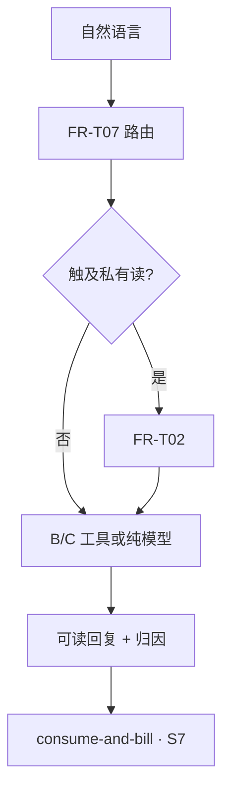

# 流程：经 Agent 的行情只读、深度分析与外网检索（B/C 类）

**定位**：用户于 **Telegram** 索要 **实时行情 / 盘口与 K 线类数据 / 结合模型的走势与指标解读**，或 **X·社媒情绪 / 新闻 / 通用联网搜索 / 知识问答 / 翻译** — **默认不触发** **交易所私有写 API**（与 [`../domains/agent/exchange-agent/trade-assistance.md`](../domains/agent/exchange-agent/trade-assistance.md) **§8.1** **分 B/C 类**对齐）。**本文不含**币币 **「市价 / 即时成交、无委托价」** **写**：该类意图须在 [`trade-via-agent.md`](trade-via-agent.md) 走 **`trade.spot.flash_convert`** **族（闪兑）**，**禁止**在本流程 **静默**走独立「现货市价写」。若对话 **升级为下单（含市价闪兑）、借还、条件单写** → **切换到** **`trade-via-agent.md`** **专节** 或其它 **写路径** **`scenarioId`**，**禁止**在无 **类型 A** 时 **静默写**。

**专节**：**现货闪兑（含用户侧市价）** **与** **现货限价** **均不归**本文；**市价→闪兑、限价挂单→现货限价** 详见 **[`trade-via-agent.md`](trade-via-agent.md)** **开篇四轨** **与** **专节 · 现货限价**。

**对上 Coobit 子账户私有读**（[`FR-T02`](../domains/agent/exchange-agent/overview.md)、[`trade-assistance.md`](../domains/agent/exchange-agent/trade-assistance.md) **§8 · B 类**）：HTTP 出站默认经 **`openapi-ai`**（**须 pin**）；PATH 仍以 **`design/api` 矩阵** 与 [`agent-coobit-api-allowlist`](../integrations/exchange/agent-coobit-api-allowlist.md) **为界** — [`integrations/exchange/overview.md`](../integrations/exchange/overview.md)。
**关单余量（MR 首节）**：[`closure-remaining` §0](../closure-remaining.md#closure-remaining-quicklinks) · [§6 / §6.4](../closure-remaining.md#cc-exec-solve-path)（[**§6.4 问题→动作**](../closure-remaining.md#cc-problem-to-action)）；**主契约** [`contract-closure`](../contract-closure.md)。

## 文首摘要

**书写规范**：[`../standards/business-process-standard.md`](../standards/business-process-standard.md) §2；对齐计划：[**`../standards/STANDARDS-ADOPTION.md`](../standards/STANDARDS-ADOPTION.md)**。

| 项 | 内容 |
|----|------|
| **流程名** | 行情只读、深度分析、外网检索（B/C） |
| **主渠道** | Telegram（**默认无**类型 A，除非转入写路径） |
| **涉及 `domains`** | **trade-assistance §8、exchange-agent FR-T02/T07、agent-context、observability** |
| **`design/`** | 外网/C 类工具合规见 **contract-closure CC-P1-02** |
| **端到端鸟瞰 · 架构语言** | [`flow/e2e-closed-loop.md`](../../../flow/e2e-closed-loop.md) **文首「架构语言」** → [`architecture` §「与通用 Agent 栈之对照」](../../design/architecture.md) |

---

## 参与文档

- [`../domains/agent/exchange-agent/trade-assistance.md`](../domains/agent/exchange-agent/trade-assistance.md) **§8.3～8.4**（**`toolId`** **登记**）；[`routing-engine.md`](../domains/agent/agent-orchestration/routing-engine.md) **§1**、[`execution-lifecycle.md`](../domains/agent/agent-orchestration/execution-lifecycle.md)（**`scenarioId`** 与 **`agent.tool.call`** 归因下限）；**`FR-TS07`/`read_skill`** **仅在** **写路径** **链出** **`trade-via-agent`**
- [`../domains/agent/exchange-agent/overview.md`](../domains/agent/exchange-agent/overview.md) **FR-T02、FR-T07**（**仅当**步骤触及 **须子账户私有读** API 时的门禁）；**不涉及写** → **不适用** **`read_skill_operation_spec`**（**不写** **`FR-T11` A 链**）；**验收** **SC-T11**（**分析类 `scenario` 内** **无** **隐式写**）
- [`../integrations/exchange/overview.md`](../integrations/exchange/overview.md) **对上私有读 HTTP · `openapi-ai`（pin）与 allowlist 同窗**
- [`../domains/agent/agent-context/overview.md`](../domains/agent/agent-context/overview.md) **Token 预算、工具结果占位** — **尤其** **`tool.web.*`** **长上下文**
- [`../observability/overview.md`](../observability/overview.md) **§2.1（`agent.tool.call`、B/C 下限、`scenarioId`/`toolDomain`）**
- [`../domains/agent/telegram/overview.md`](../domains/agent/telegram/overview.md) **默认** **无须** §2.5 · **类型 A（写确认）**，**除非**用户 **明确要求**跳转 **与之绑定的下一步写**
- **[`consume-and-bill.md`](consume-and-bill.md)**：**可计费** **路径** **`accepted`** **时仍** **`executionId` + 终局扣费**，**不因**本条 **免于计费域规则**
- [`../domains/agent/exchange-agent/market-runtime-payload.md`](../domains/agent/exchange-agent/market-runtime-payload.md)：**`userVisibleMarketData` / `marketInsightData`**、编排别名与用户 **Telegram MUST NOT**
- [`../domains/agent/exchange-agent/market-intelligence.md`](../domains/agent/exchange-agent/market-intelligence.md) **§4**（**Market Narrative · `FR-MI04`～`08`**）
- [`../domains/agent/agent-orchestration/read-clarify-session.md`](../domains/agent/agent-orchestration/read-clarify-session.md)（**S2 只读澄清 · `rc:*`**）
- [`../../openapi/components/market-runtime-schemas.yaml`](../../openapi/components/market-runtime-schemas.yaml)、[`../../design/market-narrative-runtime.md`](../../design/market-narrative-runtime.md)（**Runtime Context OpenAPI + phase 管线 v0**）
- [`../evals/market-narrative.md`](../evals/market-narrative.md)（**`eval.market.*` GWT**）
- [`../contract-closure.md`](../contract-closure.md) **§1**（**`toolId`/`skillId`、只读 Pull 须有矩阵/PATH**）、**CC-P1-02**（**`tool.web.*` ADR**）

---

## 主路径（Happy path）

### S1 · 用户发起自然语言

- **执行者**：用户  
- **动作**：在 **Telegram** 发送 **自然语言**（询价、比价、画图解释、要闻、舆情、翻译、常识 **等**）。  
- **前置**：无  
- **产出**：待路由的 **会话轮次**  
- **关联**：[`telegram/overview.md`](../domains/agent/telegram/overview.md)（默认 **无** §2.5 **写确认 · 类型 A**）

### S2 · 意图路由（FR-T07）

- **执行者**：Agent / 编排  
- **动作**：归入 **现货/合约只读行情** · **账户/持仓只读（若用户明确要本人数据）** · **外网检索/问答/翻译**，**或** **混合编排**。**冲突写意图** → **单列** **`trade-*` / `margin-*`** **`scenario`** **或** **澄清轮**（**不得**在本流程 **静默写**）。**只读槽位不全** → **[`read-clarify-session.md`](../domains/agent/agent-orchestration/read-clarify-session.md)** **（** **`rc:*` · 轻量 snapshot** **）** — **与** **写澄清** **分流**。  
- **前置**：S1  
- **产出**：**`scenarioId`** / 工具链分支决策（与 [`routing-engine.md`](../domains/agent/agent-orchestration/routing-engine.md) **§1** 对签）  
- **关联**：[`overview.md`](../domains/agent/exchange-agent/overview.md) **FR-T07**

### S3 · 门禁（私有读）

- **执行者**：Agent 运行时  
- **动作**：若路径 **仅** **公网/API 外层行情** **或** **无交易所读**，且实现定义 **免私有 Key** → **不须** **FR-T02**；若 **须** **`GET …/account`、私有 ticker 聚合、成交/委托明细** **等** → **视同** **`call_exchange_read`**，**FR-T02** **须**满足（与子账户就绪一致，见 **`overview.md`**）。  
- **前置**：S2  
- **产出**：通过 / 阻断（**FR-T05** 下限见域文档）  
- **关联**：[`overview.md`](../domains/agent/exchange-agent/overview.md) **FR-T02**

### S4 · 工具链（B · 行情/深度）

- **执行者**：Agent + 所内工具  
- **动作**：调用 **`tool.market.ticker`、`tool.analytics.symbol_deep_dive`** **或**寄存器等价 — **可先读后综合**。**禁止** **编造**交易所 **未返回** **的 OHLC / 盘口数字**。  
- **前置**：S3（若本路径 **无** B 类工具可 **与 S5 择一或并行** — 以路由为准）  
- **产出**：**工具结果**（可入上下文，见 **agent-context**）  
- **关联**：[`trade-assistance.md`](../domains/agent/exchange-agent/trade-assistance.md) **§8.3**

### S4.1 · Market phase 派生（可选 · 草案）

- **执行者**：Agent 运行时（**PhaseRules · 确定性**）  
- **动作**：**在** **Facts 闭环且未 stale** **时**，**从 **`userVisibleMarketData`/`marketInsightData`** **派生 **`primaryMarketPhase`**（**§3.2.1**）；**可选** **组装 **`marketNarrativeHints`**（**§3.4**）。**Ticker-only** **默认** **不产出** **深度/Funding/突破 phase** — **[`market-intelligence` §4.1](../domains/agent/exchange-agent/market-intelligence.md)**。  
- **前置**：S4 **成功** **且** **`asOf` 未超 stale 阈**  
- **产出**：**`marketInsightData.marketPhase`** / **`marketNarrativeHints`**（**可省略**）；**观测** **`agent.market.phase_computed`**（**[`observability` §2.1](../observability/overview.md)**）  
- **关联**：[`design/market-narrative-runtime.md`](../../design/market-narrative-runtime.md)、[`evals/market-narrative.md`](../evals/market-narrative.md)

### S5 · 工具链（C · 外网/翻译）或纯模型

- **执行者**：Agent + 所内工具 / 模型  
- **动作**：调用 **`tool.web.social_sentiment`、`tool.web.news_search`、`tool.web.search`、`tool.i18n.translate`** **或** **无工具纯模型**。**外传**会话内容 → **速率、归因、Disclaimer、PII** **按** **`trade-assistance` §8.4** 与 [`agent-context/overview.md`](../domains/agent/agent-context/overview.md) **分工表**（**Runtime** / **observability** **同窗**）。  
- **前置**：S2；**与 S4** 按 **`scenarioId`** **编排**（可仅有 C、仅有 B、或 B→C）  
- **产出**：**工具结果** / 模型输出  
- **关联**：[`contract-closure.md`](../contract-closure.md) **CC-P1-02**

### S6 · 可读回复

- **执行者**：Agent  
- **动作**：输出 **结构化摘要** **+** **来源与时间**说明（尤其对 C 类）。**有 **`marketPhase`/Facts** **时** **宜** **自然交易语言润色**（**§8 锚句或 hints**）；**无 Facts/stale** **时** **不得编造盘感** — **`FR-MI03`/`FR-MI05`**。**不写**「已替你下单」。用户可见正文 **禁止**复述 **REST PATH、HTTP 方法、`scenarioId`/`read.market.*` 字面** — **`market-runtime-payload`§2**，[`telegram/overview`](../domains/agent/telegram/overview.md)。
- **前置**：S4 **或** S5（或二者）**至少一处有产出** **或** **纯对话路径**  
- **产出**：用户可见 **Telegram** 消息  
- **关联**：[`observability/overview.md`](../observability/overview.md) **§2.1**

### S7 · 终局与权益核销

- **执行者**：运行时 + 计费域  
- **动作**：若本次 **可计费** **路径** **进入** **`accepted`** → **`executionId`**、**计量封印**、**S5 `ENTITLEMENT_DEBIT`（轨 B）** 见 [`consume-and-bill.md`](consume-and-bill.md)（**与分析是否调用外网无关**；**不** **S5 扣子账户 Token**）。**读路径** **若** **触及 Capability 额度门禁**，**S2** 规则 **同窗** **S2 节**。  
- **前置**：S6  
- **产出**：会话轮次 **终局状态** / 账单痕迹（域内字段为准）  
- **关联**：[`consume-and-bill.md`](consume-and-bill.md)

---

## Runtime 快照与 Prompt FACT SOURCE

- **轻量询价（Ticker）**：典型 **`scenarioId`** → **`market.read_quote`**（[`routing-engine` §1](../domains/agent/agent-orchestration/routing-engine.md)）；Facts 宿主 → **`RUNTIME_CONTEXT_JSON.userVisibleMarketData`**（字段下限见 [`market-runtime-payload` §3.1](../domains/agent/exchange-agent/market-runtime-payload.md)）；**映射 **`last`→`lastPrice`** → **§3.3**。
- **深度解读（多维 / K 线 + NL）**：**`market.read_deep_analysis`** → **`RUNTIME_CONTEXT_JSON.marketInsightData`**（见 [`market-runtime-payload` §3.2](../domains/agent/exchange-agent/market-runtime-payload.md)）。
- **市场叙事（盘感 · 可选）**：**`primaryMarketPhase`/`marketNarrativeHints`** — **§3.2.1 + §3.4**；**OpenAPI** [`market-runtime-schemas.yaml`](../../openapi/components/market-runtime-schemas.yaml)；**锚句 SSOT** [`common-phrases` §8/§8.7](../prompts/shared/common-phrases.md)；**体系** [`market-intelligence` §4](../domains/agent/exchange-agent/market-intelligence.md)；**流程** **S4.1**。**Ticker-only** **默认** **不注入** **深度/Funding phase**。
- **Eval 抽检** → [`evals/market-narrative.md`](../evals/market-narrative.md)。
- **实现别名** **`read.market.ticker`**：须归一为 **`market.read_quote`**（[`routing-engine` §1.1](../domains/agent/agent-orchestration/routing-engine.md)）；**不向** Telegram 甩 PATH / 场景字面。

---

## `scenarioId` 建议（与编排寄存器对签）

| `scenarioId` | 简述 |
|--------------|------|
| `market.read_quote` | 实时价量涨跌幅为主（可多 symbol） |
| `market.read_deep_analysis` | K 线/深度 **+** 模型解读 |
| `market.read_microstructure` | **盘口 + 公共成交**（[`trade-assistance.md`](../domains/agent/exchange-agent/trade-assistance.md) **§8.3** **`tool.market.orderbook`/`recent_trades`**） |
| `orders.read_activity` | **在途委托 + 近期成交**（须 **FR-T02**；**`tool.orders.*`**） |
| `account.read_risk` | **保证金/风险快照**（**`tool.account.risk_snapshot`**） |
| `futures.read_funding` | **资金费率摘要**（**`tool.futures.funding_summary`**） |
| `research.rss_or_macro`（**可选**） | **RSS / 宏观日历**（**`tool.feed.rss_digest`、`tool.calendar.macro_window`**） |
| `research.sentiment_and_news` | 社媒情绪 **+/** 新闻（**无外网则降级说明**） |
| `research.web_search_answer` | 联网补知识 / 时效问答 |
| `utility.translate_or_explain` | 多语种翻译 **或** 长文理解 |
| **`pure_dialogue`** | **无工具** **通用闲聊** — **仍可计费** **若走** **accepted** |

**合规**：任一 **scenario** **不得** **隐式** **包含未声明的写工具**。

---

---

**文档版本**：0.2.1 · **维护**：产品 + Agent Runtime owner · **本版**：**S2 链 read-clarify-session**。承 0.2.0。
