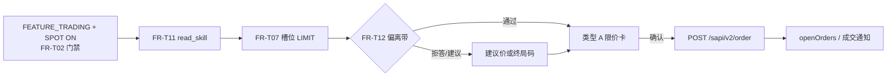
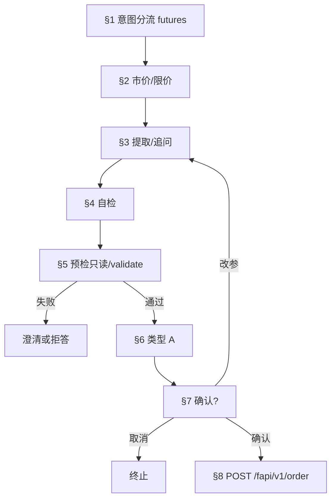
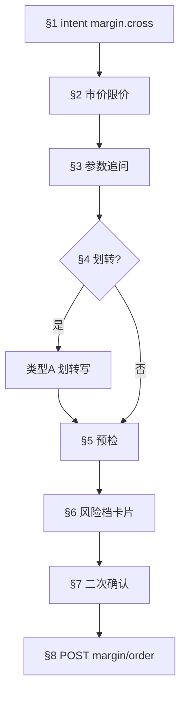
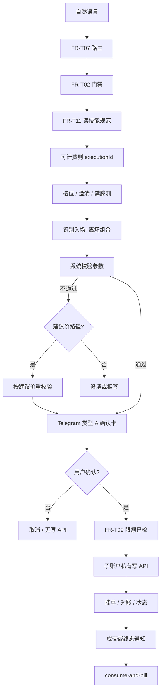

# 流程：经 Agent 的自然语言交易（子账户私有 API）

## 文首摘要

**书写规范**：[`../standards/business-process-standard.md`](../standards/business-process-standard.md) §2；对齐计划：[**`../standards/STANDARDS-ADOPTION.md`](../standards/STANDARDS-ADOPTION.md)**。

| 项 | 内容 |
|----|------|
| **流程名** | 经 Agent 的自然语言交易（子账户私有 API） |
| **主渠道** | Telegram（类型 A 确认见 **[`telegram/overview.md`](../domains/agent/telegram/overview.md) §2.5**） |
| **涉及 `domains`** | **exchange-agent、billing、trade-assistance、agent-orchestration、`config.md`**；只读分叉见 **`read-analyze-and-search-via-agent`** |
| **`design/`** | **`api.md` 矩阵**；**architecture** **504/UNKNOWN** |
| **统一交易语义 · 评审** | **Intent→Canonical→Gateway→Adapter** [`canonical-trading-model.md`](../../design/canonical-trading-model.md)、[`ADR-004`](../../design/adr/004-intent-centric-execution-and-canonical-trading-model.md)、[`trade-assistance` §2.6](../domains/agent/exchange-agent/trade-assistance.md)；契约 [`CC-P1-07`](../contract-closure.md#cc-p1-07)；人类评审 [`requirements-review` §7.5](../../../product/requirements-review.md#cc-adr004-review-checklist)（**Gateway 可执行实现 · DoD B** **在所内工程仓** **验收**） |
| **概念管线 SSOT** | [`Runtime/domain-model.md`](../Runtime/domain-model.md) **§1**（十步 ↔ **S1～S10**）· **§2**（风险闸束）· **§3**（Receipt/Timeline/计费） |
| **关单 / 开放面** | [`closure-remaining` §7](../closure-remaining.md#cc-remaining-open-items) · **[§7.1](../closure-remaining.md#cc-remaining-gap-paste)** · **[§7.5](../closure-remaining.md#cc-remaining-open-close-path)** · **[§7.6](../closure-remaining.md#cc-closure-exec-checklist)**；[`contract-closure`](../contract-closure.md) **§1.2 · §2～§3** |
| **对上 Coobit HTTP** | **`openapi-ai`/Skill** **出站默认（须 pin）**；**PATH/契约** **仍以** **`design/api` + [`agent-coobit-api-allowlist`](../integrations/exchange/agent-coobit-api-allowlist.md)** — [`integrations/exchange/overview.md`](../integrations/exchange/overview.md) |
| **端到端鸟瞰 · 架构语言** | [`flow/e2e-closed-loop.md`](../../../flow/e2e-closed-loop.md) **文首「架构语言」** → [`architecture` §「与通用 Agent 栈之对照」](../../design/architecture.md) |

**定位**：用户于 **Telegram** 表达交易意图 → **门禁** → **技能规范读** → **规划与槽位（含七段式用户路径）** → **每笔写 · 卡片确认（必选）** → **子账户 scope 私有 API** 写/读 → **回复** → **可计费终局**。详见 [`telegram/overview.md`](../domains/agent/telegram/overview.md) **§2.5.x · 类型 A（卡片下限）**、**§2～§2.6（渠道闸 · Bot API）、必选能力 #7**；**七段扩展（`S11`～`S17`）**见 **下文**。

### 交易写 · 四业务线（产品与路由分界）

**产品对外**将「经 Agent 实盘 **写**」**划为四类** **互斥路由**（识别后须落在 **恰一轨**，**禁止静默混用）**：

| 业务线 | 门禁 / 意图示意 | 本文 SSOT |
|--------|----------------|-----------|
| **闪兑** | **`FEATURE_TRADING` + `FEATURE_AGENT_SPOT`**；**`scenarioId`** 为 **`trade.spot.flash_convert`** 族。**含**用户侧 **现货市价** 买卖（**无**合约/全仓/借措辞），须统一走本轨；**禁止**向用户平行承诺「独立现货市价写」。 | **无**独立专节；**`S11`～`S17` 七段扩展**为背景；编排 / 技能：**[`routing-engine.md`](../domains/agent/agent-orchestration/routing-engine.md) §2**、[`trade-assistance.md`](../domains/agent/exchange-agent/trade-assistance.md) **§8.2**。 |
| **现货限价** | **`FEATURE_AGENT_SPOT` 启用**，且意图为 **现货限价挂单**（**不含**闪兑 / 即时市价撮合语义） | **专节 · 现货限价**（下文）。 |
| **全仓杠杆** | **`FEATURE_AGENT_MARGIN`** | **专节 · 全仓杠杆交易**（下文）。 |
| **合约交易** | **`FEATURE_AGENT_FUTURES`** | **专节 · 合约交易**（下文）；**止盈止损 / 条件离场**分流见该专节末与 **`trade-assistance` §8.2**。 |

**无杠杆、无借措辞**的普通买/卖：**不走** **`margin.cross.*`**。**现货侧**：**市价**（无委托价、即时撮合）→ **闪兑轨**；**限价挂单** → **专节 · 现货限价**。**FR-T07** **与** [`telegram/overview.md`](../domains/agent/telegram/overview.md) **§2.5.2 段首路由说明一致**。理财、通用划转、逐仓、`isolated` **等：**依 **[`boundaries.md`](../domains/agent/exchange-agent/boundaries.md)** **产品决策**，不占「主四轨」。**Telegram 闪兑类型 A 卡面下限摘要**：[`telegram/overview.md`](../domains/agent/telegram/overview.md) **§2.5.2 · 闪兑**。

---

## 参与文档

- [`../domains/agent/exchange-agent/overview.md`](../domains/agent/exchange-agent/overview.md)（**五 pillar §1、分卷索引**）；[`overview-legacy-migration.md`](../domains/agent/exchange-agent/overview-legacy-migration.md)（**旧稿 §10.x 映射**）
- [`../domains/admin/billing-management/overview.md`](../domains/admin/billing-management/overview.md) **可计费** 与 **`executionId`**
- [`config.md`](../domains/admin/management-console-v1-prd.md) **`FEATURE_TRADING`、`FEATURE_AGENT_*`**
- [`../domains/agent/telegram/overview.md`](../domains/agent/telegram/overview.md) **§2.5 · 类型 A、§2～§2.6（含 Bot API 约束）、必选能力 #7**
- [`../domains/agent/telegram/admin-bot-config.md`](../domains/agent/telegram/admin-bot-config.md) **运营侧**：**`CHANNEL_TELEGRAM`、`TELEGRAM_*`、`secretRef`、Webhook**（与 [`trading-agent-config/keys.md`](../domains/admin/trading-agent-config/keys.md) **§2～4**、`design/api` **登记表**、**`CC-P1-06`** **同窗**）
- [`../../design/api.md`](../../design/api.md) **子账户 endpoint 矩阵、API 边界**
- [`../../design/canonical-trading-model.md`](../../design/canonical-trading-model.md)、[`../../design/adr/004-intent-centric-execution-and-canonical-trading-model.md`](../../design/adr/004-intent-centric-execution-and-canonical-trading-model.md)（**统一交易语义 · 执行链文档真源**）；[`../contract-closure.md`](../contract-closure.md) **CC-P1-07**；[`requirements-review` §7.5](../../../product/requirements-review.md#cc-adr004-review-checklist)
- [`../../design/architecture.md`](../../design/architecture.md) **504 UNKNOWN、查单对账、写幂等**
- [`../integrations/exchange/overview.md`](../integrations/exchange/overview.md) **对上 HTTP · `openapi-ai` 宿主（pin）与 allowlist / 契约同窗**
- [`../domains/agent/agent-orchestration/routing-engine.md`](../domains/agent/agent-orchestration/routing-engine.md) **场景寄存器**，[`../domains/agent/agent-orchestration/confirmation-flow.md`](../domains/agent/agent-orchestration/confirmation-flow.md) **写路径步骤序**
- [`../domains/agent/exchange-agent/trade-assistance.md`](../domains/agent/exchange-agent/trade-assistance.md) **写前读操作规范** · **能力与 `toolId` 目录 §8**
- [`../Runtime/execution.md`](../Runtime/execution.md) **附录 A**（**单笔 `executionId` 主态 ↔ 工程态**）
- **[`read-analyze-and-search-via-agent.md`](read-analyze-and-search-via-agent.md)**：**只读行情 / 外网检索 / 问答翻译** — **本篇写路径** **须切换场景**后方 **可走**
- [`../contract-closure.md`](../contract-closure.md) **单行能力收口**、**`design/api` 矩阵解冻 MR**
- [`../domains/agent/agent-orchestration/runtime-freeze.md`](../domains/agent/agent-orchestration/runtime-freeze.md) **§2～§3**（**并行**；**§3.1～§3.11** **含** **OCO/bracket**、**理财/监控** **（** **各** **§3.x** **）**）

## 主路径（概要 · `S1`～`S10`）

### S1 · 用户发起

- **执行者**：用户  
- **动作**：在 **Telegram** 发送 **自然语言**（可能含交易意图）。  
- **前置**：无  
- **产出**：待路由的 **会话轮次**  
- **关联**：[`telegram/overview.md`](../domains/agent/telegram/overview.md) **§2.5 · 类型 A**（总则 **§2～§2.6** · 会话进站 · 渠道下限）

### S2 · 意图路由（FR-T07）

- **执行者**：Agent / 编排  
- **动作**：**`FR-T07`**（**同窗** **`intents`、`agent-orchestration` FR-AO02**，旧 §10.3 映射 **[`exchange-agent/overview` §5](../domains/agent/exchange-agent/overview.md)**）：拆分为 **行情/账户/写/纯对话**；**写** **须** **`FEATURE_TRADING=ON`** 且对应 **`FEATURE_AGENT_*`（产品线）** ON。  
- **前置**：S1  
- **产出**：**写/读/对话** 分支  
- **关联**：[`routing-engine.md`](../domains/agent/agent-orchestration/routing-engine.md)

### S3 · 门禁（FR-T02 + 商业额度）

- **执行者**：Agent 运行时  
- **动作**（**与** [`consume-and-bill.md` S2](consume-and-bill.md#s2-dual-gates) **同窗 · 双门禁**）：  
  1. **FR-T02**：全局关 → 运营暂停 → **子账户 + 交易 API**（凡 **须私有 API**）→ **VIP（母账号 `vipTier`）**  
  2. **交易侧 USDT**（**写路径**）：子账户 **币币 USDT 可用** 满足 **下单/理财写** 消耗（**§7.4.1** · **≠** Agent 消耗在 S5 扣 Token）  
  3. **商业额度（轨 B · S2）**：**当前 `scenarioId` 所涉 Capability** **须在订阅/加购包内有可用额度**；**用尽** → **阻断** + **`FR-T05`** **升级/买包**（**`FR-B19`/`SC-B21`**）  
- **S5 清算**：**仅** **`ENTITLEMENT_DEBIT`** — 见 [`consume-and-bill.md` S5](consume-and-bill.md)、[`commerce-model.md`](../domains/admin/billing-management/commerce-model.md)。  
- **前置**：S2 判定为 **写** 或 **须私有读**  
- **产出**：通过 / 阻断（**`FR-T05`** 见域文档）  
- **关联**：[`consume-and-bill.md`](consume-and-bill.md) **S2**（**FR-T02 序 SSOT**）、[`overview.md`](../domains/agent/exchange-agent/overview.md)

### S4 · 技能规范读（FR-T11）

- **执行者**：Agent  
- **动作**：**交易写** **前** **须** **`read_skill_operation_spec`**（[`trade-assistance.md`](../domains/agent/exchange-agent/trade-assistance.md)、**FR-T11**）。  
- **前置**：S3 通过 **且** 路径为 **写**  
- **产出**：**已读技能** 状态（可观测）  
- **关联**：[`trade-assistance.md`](../domains/agent/exchange-agent/trade-assistance.md)

### S5 · 可计费与 executionId（FR-T01）

- **执行者**：运行时  
- **动作**：**可计费** 路径 **accepted** → 分配 **`executionId`**。  
- **前置**：S3、S4（写路径）  
- **产出**：**`executionId`**  
- **关联**：[`billing.md`](../domains/admin/billing-management/overview.md)、[`consume-and-bill.md`](consume-and-bill.md)

### S5.1 · `executionId` 主态与部成/在途（本 flow 冻结）

**对签**：[`../Runtime/execution.md`](../Runtime/execution.md) **附录 A**；**主态迁移契约** [`../Runtime/runtime-state-machine.md`](../Runtime/runtime-state-machine.md)、[`../Runtime/execution-transition-matrix.md`](../Runtime/execution-transition-matrix.md)。**本流程** **作为交易写主路径**，**冻结** **下列产品口径**（**与** **`taskId` 长驻任务** **、** **`agentState`** **摘要** **不同维**）：

| **结论** | **条文** |
|----------|----------|
| **不升格主行** | **「部分成交」「在途挂单」「尚未获得交易所/对账终局」** **等** **不** **单独占** **附录 A** **表头主行**。 |
| **子状态/观测** | 上列 **一律** **落在** **`executing` 或 `settling` 之下** **的** **子状态或观测维度**（**如** **订单维度的部成量、未结 `orderId`**），**须** **可与** **同一 `executionId`** **join**（**同窗** **`execution-lifecycle` / `trading.exchange_private`**）。 |
| **话术边界** | **用户可见** **须** **区分** **「订单仍在途/部成」** **与** **「本笔执行已达产品终局」**；**UNKNOWN/504** **口径** **不得** **冒充成交终局**（[`../../design/architecture.md`](../../design/architecture.md)、[`../Runtime/unknown-state.md`](../Runtime/unknown-state.md)）。 |
| **改单/撤单** | **逻辑改单**、**部成后改撤** **等** **仍属** **`executing`/`settling` 子态**；**卡面须可读剩余可撤量** **等** **见** **专节 · 逻辑改单** **与** **下文** **部成/竞态** **表** — **与本条** **一致**。 |

**若未来产品** **要求** **将「部成」等** **升格为** **对外主态词** **须** **独立 MR** **同步改** **附录 A** **表** **与** **本条**。

#### S5.1.1 · 用户可见话术下限（在途 · 部成 · UNKNOWN · 终局）

**用途**：降低 **「成没成」** **客诉**；与 **[`execution.md`](../Runtime/execution.md) **附录 A**、[`unknown-state.md`](../Runtime/unknown-state.md)、[`telegram/overview.md`](../domains/agent/telegram/overview.md) **§3.1** **同窗**。**非** **逐字稿** **冻结** — **须** **达下列 Then**；**具体中文** **所内 copy deck** **可对齐** **`FR-T05`/`stableReason`** **分桶**。

| **情境** | **须（MUST）** |
|----------|----------------|
| **订单在途 / 部成** | **用户消息** **须** **显式** **区分** **「交易所侧仍在撮合/挂单」** **与** **「本笔 `executionId` 已达成功/失败终局」**；**宜** **带回** **`orderId`（或可读摘要）** **与** **已成交/剩余可撤** **等** **可核对事实**（**无** **Secret**）。 |
| **504 / UNKNOWN** | **禁止** **SUCCESS/已成交** **措辞**；**须** **说明** **结果未决** **与** **平台将对账/查单**（**或** **指引** **等待/稍后重试**），**同窗** [`unknown-state.md`](../Runtime/unknown-state.md) **与** [`../risk/unknown-stall-policy.md`](../risk/unknown-stall-policy.md)。 |
| **终局成功** | **仅** **在** **交易所/对账** **可采信终局** **闭合后**；**与** **计费叙事** **无结构性矛盾**（[`consume-and-bill.md`](consume-and-bill.md)、[`billing-management/overview.md`](../domains/admin/billing-management/overview.md)）。 |
| **卡点 / 拒答** | **须** **`FR-T05` 族** **可读** **（** **含** **FEATURE 闸、限额、槽位不全** **）**，**并** **宜** **提示** **当前大致阶段**（**如** **待确认 / 已提交交易所**）**—** **运维协查** **须有** **`executionId`**。 |

### S6 · 槽位与校验（FR-T07）

- **执行者**：Agent / 交易所只读  
- **动作**：交易对、数量、价格类型等；**黑白名单**（**`config.md` `SYMBOL_POLICY_*`**）。  
- **前置**：S5  
- **产出**：**可提交/须澄清** 参数包  
- **关联**：[`intents.md`](../domains/agent/exchange-agent/intents.md)

### S7 · 安全壳与类型 A（FR-T09）

- **执行者**：Agent + **Telegram**  
- **动作**：**单笔/单日限额**（超限 **拒答**）；**每笔**所内 **写** **须**先发 **`telegram/overview.md` §2.5 · 类型 A** 并得到 **明示确认** **后再**调写 API。**禁止静默写**。  
- **前置**：S6  
- **产出**：**用户已确认** 的写意图  
- **关联**：[`trade-assistance.md` §2 · `FR-T09`](../domains/agent/exchange-agent/trade-assistance.md)

### S8 · 交易所调用（FR-T01）

- **执行者**：运行时网关  
- **动作**：**仅** **子账户绑定 Key** 调私有 API；**禁止**主账户默认。  
- **前置**：S7（写路径）  
- **产出**：交易所 **业务 ID** / 终态或 **504/UNKNOWN**（见 **architecture**）  
- **关联**：[`design/api.md`](../../design/api.md)

### S9 · 用户可见结果（FR-T05）

- **执行者**：Agent  
- **动作**：结果摘要；错误时 **FR-T05** 稳定码；理财/划转 **主站** 时 **`WEALTH_ACTION_REQUIRES_WEB` / `TRANSFER_REQUIRES_WEB`** + Deeplink（[`boundaries.md`](../domains/agent/exchange-agent/boundaries.md) **§8.3～8.4**）。  
- **前置**：S8 **或** 只读成功路径  
- **产出**：**Telegram** 可见消息  
- **关联**：[`overview.md`](../domains/agent/exchange-agent/overview.md) **FR-T05**

### S10 · 终局与扣费

- **执行者**：计费域 + 运行时  
- **动作**：**扣费与会话终局** 见 [`consume-and-bill.md`](consume-and-bill.md)。  
- **前置**：S9  
- **产出**：按 **billing** 域  
- **关联**：[`consume-and-bill.md`](consume-and-bill.md)

---

## 对用户侧「自然语言成交」的七段扩展（`S11`～`S17` · 产品意向 · 与实现对签）

以下描述 **用户体感上**的 **标准路径**（以 **挂单类限价**为主轴，可覆盖 **市价**、**止盈止损/条件离场**等在 [`design/api.md`](../../design/api.md) **矩阵已冻结** 的能力）。**编号 `S11`～`S17`** **展开**上文 **S6～S9** **所涉「槽位—确认—写—可见」**之 **产品细序**，**非**与 **S1～S10** **逐条一一重编号**。**任一能力无 API / 矩阵 TBD** 时，**首版不向用户承诺可走完全程**，须 **`exchange-agent` FR-T05** **透明拒答** 或 **主站 Deeplink**。编排层 **`scenarioId`、步骤序列** **须**能与 [`routing-engine.md`](../domains/agent/agent-orchestration/routing-engine.md)、[`confirmation-flow.md`](../domains/agent/agent-orchestration/confirmation-flow.md) **对签**，**不改变** ADR：**确认卡先于每一笔 Coobit 写**。

### S11 · 厘清用户意图（槽位 · 禁止臆测）

**目标**：在用户表达交易需求后，将自然语言 **`结构化`** 为可校验参数；**关键点不全则主动追问**，**禁止**在未获用户明示值的情况下 **编造**挂单参数。

**须确认的要素（最少集）**：

| 维度 | 说明 |
|------|------|
| **买卖方向** | 买 / 卖（合约侧再结合 **开平、仅减仓** 等 **`telegram/overview.md` §2.5.4** **口径**）。 |
| **标的** | 交易 **币种 / 交易对**（如 BTC、ETH、SOL 及所内 **symbol**；**须**与 **`SYMBOL_POLICY_*`** 一致）。 |
| **价格** | **限价**的 **具体价**；**或**相对市价的 **百分比/偏移**（如「现价比跌 10% 再卖」）— **须** **换算为**所内 **可接受的限价**（或 **拆澄清**）后再进入校验，**禁止** **模糊价** **直接**调 **写 API**。 |
| **数量 / 名义** | **币数**、**USDT 花费/成交额**、**或** **「余额的百分之几」** **等**— **须**解析为 **交易所精度下**的 **数量或名义**，**不够明确**则 **追问**。 |

**对签**：**`FR-T07`** **（槽位与校验）— [`intents.md`](../domains/agent/exchange-agent/intents.md)、[`agent-orchestration` FR-AO02](../domains/agent/agent-orchestration/overview.md)；**回溯** [`exchange-agent/overview` §5](../domains/agent/exchange-agent/overview.md)（旧稿 **§10.3**，见该节映射表）。**信息不全** → **澄清轮次**；**不得** **猜测下单**。**执行体分工** → [`clarify-user-visible` §0](../prompts/shared/clarify-user-visible.md#clarify-execution-split)。**跨轮澄清 session** → [`clarify-session.md`](../domains/agent/agent-orchestration/clarify-session.md)。

### S11.1 · 语义买满 / 卖清（INV-010 · `ALL_IN`）

**适用话束（示意）**：**「全部买入 BNB」**、**「用全部 U 买」**、**「买满」**、**「卖掉全部 / 清仓」** **等** — **须** 打 **`semanticIntent`**（如 **`ALL_IN` / `BUY_ALL` / `SELL_ALL`**，**所内枚举** **与** [`orchestration-runtime-schemas`](../../openapi/components/orchestration-runtime-schemas.yaml) **同窗**）。

**目标**：**经济敏感数量**（**`quoteQty` / `quantity`**）**不得** 由 **LLM 单独推断** — **须** **经** **INV-009** **合法来源** **落盘**（**通常** **`runtime_read_balance`** **或** **`runtime_read_position` + 类型 A**）。

| 用户语义 | 路由（已选市价/闪兑时） | **编排 MUST（缺 `quantity_or_quoteQty` 时）** | 对用户（Prompt 下限） | **执行体** |
|----------|-------------------------|-----------------------------------------------|------------------------|------------|
| **全部买入 / 用全部 U 买** | **`trade.spot.flash_convert`** | **`slot_fill` → 子账户只读 quote 可用（如 USDT）→ 填 `quoteQty`**，`provenance=runtime_read_balance` | **说明将查余额再确认**；**禁止** 问「买多少 U」；**禁止** 内部术语 — [`clarify-user-visible` §2](../prompts/shared/clarify-user-visible.md) | **L→R→B→L** — [`§0.3`](../prompts/shared/clarify-user-visible.md#clarify-execution-split) |
| **全部卖出 / 清仓** | **`trade.spot.flash_convert`**（卖） | **`slot_fill` → 只读持仓/可卖量 → 填 `quantity`**，`provenance=runtime_read_position` | 同上 | **L→R→B→L** |
| **已说「闪兑」** | **不得** 再问市价/限价 | **承接** 上文标的（如 BNB→BNBUSDT） | 见 [`clarify-user-visible` §2](../prompts/shared/clarify-user-visible.md) | **R 禁止再问** + **L 承接** |

**硬闸**：**[`runtime-invariants` INV-010](../Runtime/runtime-invariants.md)** · **Gateway** **`semanticFullBookIntent`** — [`executionGatewayWriteBarrier`](../../../src/admin/src/productionRuntime/executionGatewayWriteBarrier.ts)（Demo）。**编排 DAG 插入点** → [`runtime-freeze` §3.1](../domains/agent/agent-orchestration/runtime-freeze.md) **「只读补槽 · INV-010」**。

**Eval**：**`eval.gateway.buy_all_requires_balance_read`**（正例）· 负例同窗 **`eval.gateway.sell_all_without_balance_read_fail`** — [`evals/scenarios.md`](../evals/scenarios.md)。

**Skill / Prompt**：[`skill.spot.flash_convert` §4](../skill-specs/spot/skill.spot.flash_convert.md) · [`prompts/trading/buy.md` §1.1](../prompts/trading/buy.md)。

### S12 · 识别是否需「入场 + 离场」组合（止盈 / 止损 / 条件）

**目标**：若用户 **同时**表达 **入场**（在某价/某种价格关系下买或卖）**与** **离场**（涨到 X 卖、跌破 Y 卖等），Agent **须**识别为 **组合意图**：在 **所内 API 支持** 的前提下，**一次性**准备 **入场单 + 止盈/止损/条件单**（**或** **所内认可的 bracket / OCO 语义**），**而非** **只下入场单却忽略离场**。

**本产品阶段**：[`product.md`](../../product.md) **§非目标** — 现货 **`trade.spot.oco` / `trade.spot.bracket`**（OCO / bracket）**不交付** Agent 写闭环，**不须实现**。**本条「组合意图」** 仅能经 **已登记单腿**、**合约 `fapi` 条件委托**，或 **分步入场·离场** 配合 **`FR-T05` / 主站** 满足。**禁止** 以组合名义对 **`trade.spot.oco`/`.bracket`** 发起 **`call_exchange_write`**。

**对签**：[`design/api.md`](../../design/api.md) **矩阵**（合约 **`conditionOrder`** 等与 **现货条件单 TBD** **区分**）；[`telegram/overview.md`](../domains/agent/telegram/overview.md) **§2.5.2～§2.5.4** **类型 A** **对** **多腿/条件** **的展示下限**。**若** **组合能力** **未冻结** → **须** **降级**为 **分步说明**（先入场、离场须另确认）**或** **拒答**，**禁止** **虚构**「已同时挂好」。**与 **§非目标** **同窗**：**OCO/bracket** 未解除前 **不适用** 「一次性双挂 / bracket Agent 闭环」。

### S13 · 系统校验参数

在 **生成确认卡之前**（**仍属** **用户未点「确认」** 阶段），**须**将 **拟提交** 参数走 **系统侧校验**（交易所规则 + 本产品策略），**包括但不限于**：

| 校验项 | 说明 |
|--------|------|
| **币种 / 交易对** | 是否存在、是否 **黑白名单** 允许（**`config.md` + 所内**）。 |
| **价格合理性** | 相对 **市价** **偏离过大**、**触发价无效**、**精度不符** 等 — **须** **拦截**（见 **S15** **可与建议价联动**）。 |
| **最小名义 / 数量 / 步进** | **低于**所内 **最小下单** **或** **精度错误** → **拒答** + 可读原因。 |
| **余额** | **买入/保证金** **是否足够**（**子账户 scope** **只读** **拉取**）；不足 **须** **说明** **缺哪一侧**。 |
| **止盈止损价** | **相对入场/市价的逻辑** **是否自洽**（如 **多仓止损** **须** **低于** **参考价** **等** — **产品规则表** **所内冻结**）。 |

**对签**：**FR-T07**、**FR-T01** **只读** **查询** **须** **先于** **写**；**`trade-assistance`** **操作规范** **须** **已读**（**FR-T11**）。**校验失败** → **不** **进入** **类型 A 确认写**（**或** **仅** **展示** **类型 B** **阻断/澄清**）。

### S14 · 生成确认卡片（类型 A）

**校验通过（或** **S15** **用户接受建议价后再次通过）** 后，**须**生成 **[`telegram/overview.md` §2.5 · 类型 A](../domains/agent/telegram/overview.md)** **写确认卡**：展示 **完整** **单笔或本步绑定的多腿摘要** — **交易对、方向、价格、数量/金额**；**若**含 **止盈/止损/条件离场** **须** **一并** **在卡上** **可见**（**§2.5.x** **字段下限**，**合约条件** **§2.5.4**）。

**硬约束**：**Agent** **不得** **代用户点击确认**；**仅**在用户 **明示确认** 后 **方可** **发起** **该笔/该组** **私有写** API（**[`trade-assistance.md` §2 · `FR-T09`](../domains/agent/exchange-agent/trade-assistance.md)**、**ADR-001**）。

### S15 · 价格超出可接受区间时的「建议价」路径

**若** **S13** **因价格偏离等** **拦截**，**产品意向** 为：**系统给出建议价**（或 **可接受区间内的最近价** — **所内算法**），Agent **用建议价重新跑校验**；**再次** **展示** **类型 A** 卡片，**正文须** **说明** **「价格已按系统建议调整」**（**或** **等价清晰表述**），用户 **仍可选** **取消** **或** **改回手动价**（**新澄清轮**）。

**对签**：**独立写意图**（**单笔下单、单笔撤单、单笔划转、单笔条件单创建** **等**）**须** **各** **自** **一次类型 A**；**逻辑改单**（**无原生 amend**、**一次类型 A 授权后顺序** **`cancel`→`order`**）**见** **下文专节 · 逻辑改单**。**若** **建议价** **导致** **与** **用户原话** **显著差异** **须** **二次确认**。**运营开关与偏离阈值**：**[`config.md`](../domains/admin/management-console-v1-prd.md) FR-C08**（**`AGENT_PRICE_*`**）；**偏离带/拒答**：**`FR-T12`** **同窗** **本文专节 · 现货限价 · 偏离带** **[`exchange-agent/overview` §5](../domains/agent/exchange-agent/overview.md)（旧 §10.8）**；**稳定拒答** **`FR-T05`** **— [`trade-assistance.md` §2](../domains/agent/exchange-agent/trade-assistance.md)**；**验收**：**SC-T10**。**若 `AGENT_PRICE_BAND_GUARD_ENABLED=OFF`**：**本产品偏离带不适用**——**本条**仅以 **S13**交易所/业务校验 **与** **`AGENT_PRICE_SUGGEST_ON_BAND_REJECT_ENABLED`** **配置** **为准**。**若 Guard ON 且 Suggest OFF**：**仅以** **`PRICE_REJECTED_AGENT_BAND`** **/澄清** **终局**。**若** **所内暂不提供** **建议价能力** → **同上**。**禁止** **静默** **用** **未展示** **之价** **下单**。

### S16 · 挂单与等待成交（用户侧管理）

**限价单** **提交成功** 后 **进入** **订单簿**；**成交** **依赖** **市价** **触及** **用户价位**。**在成交前**：

- 用户 **可**在 **Coobit 主站**（或所内 **交易页**）**当前委托** **中** **撤单**。**经 Agent 修改在途限价（改价/改量）**：**矩阵无原生 amend 时** → **专节 · 逻辑改单**（**一次类型 A** **+** **顺序撤单与下单**）；**矩阵** **已冻结 amend** **且** **产品开放原生改单** **时** → **单笔写** **仍** **须** **类型 A**。**否则** **须** **引导主站**（[`boundaries.md`](../domains/agent/exchange-agent/boundaries.md) **§8.4**）。
- Agent **可** **应用户请求** **拉取** **委托状态**（**只读**）**并** **解释** **未成交原因**（**不** **伪造** **成交**）。

**对签**：**504 / UNKNOWN** **与** **对账** [`design/architecture.md`](../../design/architecture.md)；**Push / 自动化** — [`monitoring-tasks.md`](../domains/agent/exchange-agent/monitoring-tasks.md)、[`automation-alerts.md`](automation-alerts.md)（[`exchange-agent/overview` §5 **旧 §10.6 映射**](../domains/agent/exchange-agent/overview.md)）。

### S17 · 成交/终态告知

当 **交易所侧** **该委托** **达到** **可对外** **断言**的 **成功成交**（**或** **部成** **+** **剩余** **状态**）**终态** 时，**须** **主动** **通过** **Telegram** **告知** **用户**（**可采用** **[`telegram-and-cards`](../../../product/telegram-and-cards.md) · **类型 D（通知）** **或** **紧随其后的** **可读消息** — **与 **`monitoring-tasks`/`automation-alerts`**、Telegram **必选能力 #8** **对签**），**内容** **至少** **宜** **包含**：

- **买/卖方向**与 **成交数量**；  
- **成交均价** **或** **分层摘要**（**以所内返回为准**）；  
- **订单号**（`orderId` **或** **可读摘要**，**非 Secret**），便于 **主站** **核对**。

**禁止**：在 **对账** **未闭合** **前** **断言** **「已成交」**（**`design/architecture`** **504 语义**）。

---

## 专节 · 现货限价（`FEATURE_AGENT_SPOT` + `LIMIT`）

本专节 **在**上文 **`S11`～`S17` 七段扩展`** **内** **钉死** **币币限价单** 的 **前置条件、编排键、API 行、确认卡下限、与「现货条件单 TBD」的交界**；**不与** **合约** **`conditionOrder`** **混写**（见 [`../../design/api.md`](../../design/api.md) **矩阵**）。

### 前置与门禁（缺一 → 拒答或类型 B，不静默写）

| 项 | 要求 |
|----|------|
| **产品线** | **`FEATURE_TRADING=ON`** **且** **`FEATURE_AGENT_SPOT=ON`**（[`config.md`](../domains/admin/management-console-v1-prd.md) **§5.1**）；**关**现货写闸 → **[`trade-assistance` §2 · `FR-T09`](../domains/agent/exchange-agent/trade-assistance.md)** **可读拒答**。 |
| **子账户与 Key** | **Agent 专用子账户就绪** + **子账户交易 API 有效绑定**（**FR-T02**）；**写** **仅** 子账户 scope **私有 Key**（**FR-T01**）。 |
| **路由与槽位** | 意图 **`写`** **且** **标的为现货限价** → **FR-T07** **槽位** **须** 收敛 **symbol、side、LIMIT 价、quantity 或 quoteQty、timeInForce（若必选/用户已选）**；**不全** → **澄清**，**禁止臆测**。 |
| **技能规范** | **`read_skill_operation_spec`** **先于** **首张类型 A / 写 API**（**FR-T11**、[ **`overview.md` FR-AO04](../domains/agent/agent-orchestration/overview.md)）。 |
| **可计费** | 进入 **accepted** 可计费路径 → **`executionId`**（**FR-T01**）；**扣费与会话稳定码分列**见 [`billing.md`](../domains/admin/billing-management/overview.md) **§7.3、§7.3.1**（**`PRICE_REJECTED_AGENT_BAND` 等不得写入扣费 `billCode`**）。 |

### 编排建议 · `scenarioId`

| 建议 `scenarioId` | 说明 |
|-------------------|------|
| **`trade.spot.limit_order`** | **现货限价写入** **主路径**；**须**在 [`routing-engine.md`](../domains/agent/agent-orchestration/routing-engine.md) **登记** **且** [`confirmation-flow.md`](../domains/agent/agent-orchestration/confirmation-flow.md) **步骤序**（**读技能 → 校验/偏离带 → 类型 A → 写 → 摘要**）与 **`FR-AO01`** **对签**。 |
| **`trade.spot.oco`** | **本产品阶段不实现**：[`product.md`](../../product.md) §非目标。**须** **`FR-T05`/`主站`/分步**。登记键 **与未来 **CC-P1-01·MR-D **解冻** **同窗**。 |
| **`trade.spot.bracket`** | **同上**。**分居键**：**`routing-engine` §2**；**产品与 **`product.md` §非目标** **同窗** OCO。 |

### 交易所侧契约（设计层 SSOT）

- **下单写**：**现货网关** **`POST /sapi/v2/order`**（及所内等价 **test/batch** 行若使用），见 [`../../design/api.md`](../../design/api.md) **子账户矩阵 · 币币 · 下单**。  
- **委托只读**：**`GET /sapi/v2/openOrders`**、**`GET /sapi/v2/order`** **等** — **S16** **解释「未成交」、对账 UNKNOWN** **须** **以查单为准**（[`design/architecture.md`](../../design/architecture.md)）。  
- **撤单写**：**`POST /sapi/v2/cancel`**。**仅撤单**（**用户明确撤销、不挂新单**）→ **独立** **类型 A**。**改价/改量**（**无 amend API**）→ **专节 · 逻辑改单**：**一张类型 A** **授权后** **逻辑层顺序** **`cancel`→`order`**。**矩阵** **原生 amend** **冻结前** **不承诺单笔 amend HTTP**。  
- **幂等**：**建议** **每笔委托** **`newClientOrderId` / `clientOrderId`** **与** **`executionId`** **分拆组合** — **Agent 执行级** **与** **交易所委托级** **各自幂等**，见 **`design/api.md`** **通用契约**。

### Telegram **类型 A** 下限（现货限价）

与 [`../domains/agent/telegram/overview.md`](../domains/agent/telegram/overview.md) **§2.5.2 · 限价（摘要表）** **同窗**；**更长条文以本节列表为准**。**首张/建议价后的第二张** **确认卡** **须** **至少** **可见**：

- **业务线**：**币币**（与杠杆/合约 **版式区分**）。  
- **symbol**、**买/卖 side**、**订单类型**：**限价**。  
- **委托价**（**报价币种** **单价**）。  
- **数量**：**base 数量** **或** **`quoteQty`/成交额口径** **二选一** **且** **单位写清**。  
- **`timeInForce`**：**若** API 必选 **或** 用户 **已选择**（GTC / IOC / FOK 等）→ **卡上须有**。  
- **实现侧**：**`newClientOrderId`** **摘要或可追溯占位** **（非 Secret）** **宜**出现在 **observability / 内部对账**，**卡面** **以** **人类可读单号摘要** **为可选**。

### 与 S12「入场 + 离场」及现货条件单的交界

- **仅现货限价**：**S12** **可** **跳过** **多腿组合** **或** **仅** **单腿限价**。  
- **用户同时**要 **限价入场** **+** **现货侧止盈/止损/计划委托**：**须** **先**核对 [`../../design/api.md`](../../design/api.md) **现货条件/计划 PATH** — **矩阵 TBD** **时** **须** **降级**（**先挂限价入场**；**离场** **另轮次** **或** **主站 Deeplink** **或** **FR-T05 透明拒答**），**禁止** **类型 A 已确认** **却无写 API**。**合约** **条件单** **走** **`fapi`** **另表**，**不得** **套用在** **本专节**。**OCO/bracket** **意图** → **`trade.spot.oco` / `trade.spot.bracket`**（[`routing-engine.md`](../domains/agent/agent-orchestration/routing-engine.md) **§2**）；**与** **矩阵** **书面延期** **同窗** — **PATH 未冻结** **前** **按** **本条** **降级/拒答**，**不得** **默认真成交**。**另**：**[`product.md`](../../product.md) §非目标** **`trade.spot.*` OCO/bracket** **本阶段 Agent **不交付写闭环** — **即** **便** **矩阵载行** **亦** **须在** **回改 **`product.md`** **前 **走 **`FR-T05`** **/ **分步**/****主站**。  

### 偏离带（FR-T12）与计费码

- **Guard ON**：**限价** **相对参考价** **超带** → **`PRICE_REJECTED_AGENT_BAND`** **或** **建议价分支**（**FR-T12**、本文 **S15** **建议价路径**）；**该码** **为会话稳定码** — **不写** **`billing.md` §7.3 `billCode`**（**§7.3.1**）。  
- **Suggest ON** **且** **用户确认建议价类型 A**：**可** **映射** **`PRICE_ADJUST_PROPOSED`** **（中间态）** **—** **同 §7.3.1** **不写扣费 `billCode`**。

### 委托可见性 · `openOrders` 与用户撤单（与 S16 同窗）

- Agent **应** **能** **只读** **拉取** **该 symbol** **或** **全量** **`openOrders`** **并** **解释** **队列/未成交**。  
- **用户** **经 Agent 仅撤单**（**不重建**）：**下一笔写** **`POST …/cancel`** **须** **单独** **类型 A**（**FR-T09**）。**改单** → **逻辑改单专节**（**单次类型 A** **覆盖** **`cancel`+`order`**）。  
- **`INSUFFICIENT_BALANCE`** **等扣费侧码** **仅** **在** **扣费流水** **域** **使用** — **不与** **`PRICE_REJECTED_AGENT_BAND`** **混填 CSV**。

### FR 交叉索引

| FR | 与本专节关系 |
|----|----------------|
| **FR-T07** | 路由、槽位、**禁止猜价猜量** |
| **FR-T09** | **独立写意图** **须** **类型 A**；**逻辑改单** **单次类型 A** **见** **专节 · 逻辑改单**；**`FEATURE_AGENT_SPOT`**；限额 |
| **FR-T11** | **写前** **`read_skill_operation_spec`** |
| **FR-T12** | **限价偏离带**、**建议价第二张卡**；**`PRICE_REJECTED_AGENT_BAND`** |

### Mermaid（现货限价子路径）

---

## 专节 · 逻辑改单（单次类型 A · 撤单 + 重建）

**适用**：[`../../design/api.md`](../../design/api.md) **矩阵** **未提供** **单笔 amend HTTP**（**CC-P0-02 · 币币改单延期** **等**），**用户** **已** **在途限价委托** **且** **意图** **改价/改量**（**或** **等价「换掉当前挂单」** **语义**）。**同城** **币币限价**、**永续限价** **等** **已登记** **`cancel` + `order`** **之业务线**。**不适用**：**全仓杠杆** **经 Telegram** **首版** **仍** **不承诺** **撤单/改单**（[`../domains/agent/telegram/overview.md`](../domains/agent/telegram/overview.md) **§2.5.3**）；**OCO/bracket**、**条件单全链** **须** **各自** **`scenarioId`** **与** **确认语义**，**不得** **与本专节** **混称** **「改单」**。

### 产品与确认（一次类型 A）

1. **卡面（类型 A）** **须** **同时** **可读**：**原委托标识**（`orderId` **或** **`clientOrderId`/`newClientOrderId` 摘要** — **非 Secret**）、**拟撤销** **之** **symbol/side** **摘要**、**新委托** **全量参数**（**限价** **价**、**数量** **`timeInForce` **等** **与** **新开单** **一致**）。  
2. **须** **明示** **自然语言** **等价于**：**「确认后将先撤销原委托，再提交新委托」**（**或** **主站/i18n 等价**）— **禁止** **暗示** **交易所** **单笔 amend** **若** **实际** **为** **两笔 HTTP**。  
3. **`read_skill_operation_spec`** → **登记技能**：**币币** **`skill.spot.amend_limit_order`**；**永续限价** **`skill.futures.amend_limit_order`**（**姊妹** **`routing-engine.md` §2** **`scenarioId`**）。  
4. **用户** **点击确认** → **消费** **唯一** **`pending_confirm` / `confirmId`**（**ADR-001**）**后**，**运行时** **方可** **发起** **交易所写**。

### 逻辑层执行序（无第二次类型 A）

| 序 | 动作 | PATH（公档锚） |
|----|------|----------------|
| 1 | **撤原单** | **现货** **`POST /sapi/v2/cancel`**；**永续** **`POST /fapi/v1/cancel`**（**参数** **以** **所内 spec** **准**） |
| 2 | **查单/断言撤单终态**（**若撤单响应不明确**） | **`GET …/order`**、**`openOrders`** — **同窗** **[`design/architecture.md`](../../design/architecture.md)** **504/UNKNOWN** |
| 3 | **仅当** **撤单** **成功或** **对账认定原单已不在簿** **后** **`POST …/order`** **挂新单** | **现货** **`POST /sapi/v2/order`**；**永续** **`POST /fapi/v1/order`** |
| 4 | **新单** **须** **新** **`clientOrderId`/`newClientOrderId`**（**禁止** **与** **原单** **复用** **致** **幂等误伤**） | — |

**禁止**：**撤单** **前** **先** **下新单**（**致** **双挂** **风险**）；**禁止** **在未** **消费** **确认** **前** **执行** **序 1**。

### 观测、计费与失败

- **同一** **`executionId`** **（或** **`billing` 同窗之单次可计费锚**）**须** **关联** **序 1～3** **之** **`trading.exchange_private`** **步骤**；**可选** **`amendCorrelationId`** **join**。  
- **序 1 失败** → **不执行** **序 3**；**用户** **可见** **`FR-T05`** **族** **+** **可** **重试/改参** **须** **新** **会话/新** **类型 A**。  
- **序 1 成功、序 3 失败** → **原单已撤**、**新单未立** — **须** **`FR-T05` / UNKNOWN 话术** **与** **查单闭环**（**`architecture`/`reconciliation`**），**禁止** **断言** **「改单成功」**。  
- **部成后改单** → **产品** **须** **定义** **是否** **仅撤** **剩余** **或** **拒答**（**以** **槽位/技能** **冻结** **为准**）；**禁止** **静默** **偏离** **卡面声明**。

### 与合约专节 · 第七步之关系

**本专节** **优先于** **合约专节** **泛化表述**：**「多 HTTP 写须独立类型 A」** **之** **适用范围** **为** **独立** **用户** **意图**（**如** **先** **`edit_lever`** **再** **`order`** **且** **产品** **拆确认**）— **不** **要求** **对** **「逻辑改单」** **二次** **类型 A**。**合约** **限价** **改在途单** → **优先** **`trade.futures.amend_limit_order`** **路径** **与本专节** **同窗**。

### 用户体验（实现与文案 · 与 Telegram §2.5 对签）

| 主题 | 建议 |
|------|------|
| **认知负荷** | **首屏** **用** **「修改挂单 / 调整委托」** **类** **叙事**；**技术步骤** **「撤单→下单」** **放在** **披露句** **而非** **标题**。 |
| **扫描效率** | **变更字段** **原→新** **并列**；**未变字段** **可** **缩略** **但** **symbol/side** **须** **可见**。 |
| **触控与误操作** | **主按钮** **避免** **与** **首单限价** **雷同** **的** **单一「确认」** **且无** **改单** **语境**；**取消** **始终** **可用**。 |
| **等待与焦虑** | **`answerCallbackQuery`** **后立即** **阶段消息**；**长耗时** **给** **「可能需数秒」** **预期**；**忌** **静默** **至** **终态** **才** **首条** **回复**。 |
| **失败尊严** | **撤成单败** **模板** **须** **含** **状态事实** **+** **可操作下一步**（**再试 / 主站**）；**UNKNOWN** **同窗** **`architecture`/`unknown-state`** **不** **伪造** **成功**。 |
| **部成 / 竞态** | **若** **原单** **已部分成交**：**卡面或前置澄清** **须** **让读者** **明白** **将** **针对** **剩余可撤量** **还是** **拒答** — **禁止** **静默** **与** **用户理解** **不一致**。 |

**i18n 模板（简中 + English）**：[`product/telegram-logical-amend-copy.md`](../../../../product/telegram-logical-amend-copy.md)。

---

## 专节 · 合约交易（`FEATURE_AGENT_FUTURES`，市价/限价 **开平仓**）

本专节 **钉死** **永续/合约** **单笔** **`POST /fapi/v1/order`** **类** **自然语言路径**（**合约网关** **独立 host**，见 [`../../design/api.md`](../../design/api.md)）。**止盈止损 / 条件离场**、**强平原因解读** **须** **分流**（**见** **末段** **与** [`trade-assistance.md`](../domains/agent/exchange-agent/trade-assistance.md) **§8.2～8.3**），**禁止** **与** **本条** **混为** **同一** **未声明** **的多腿**。

**子路径编号**：以下 **「第一步」～「第八步」** **仅指本专节（合约）**，**与** **上文全局 `S11`～`S17`** **无** **同号对应**。

### 前置与门禁

| 项 | 要求 |
|----|------|
| **产品线** | **`FEATURE_TRADING=ON`** **且** **`FEATURE_AGENT_FUTURES=ON`**；**关**合约写闸 → **FR-T09** **拒答**。 |
| **子账户与 Key** | **FR-T02**、**FR-T01**（**`fapi`** **子账户 scope**）。 |
| **技能** | **`read_skill_operation_spec`** → **`skill.futures.market_order`** **或** **`skill.futures.limit_order`**（**登记表** **须** **与** **将提交** **之** **`type`** **一致**）。 |
| **编排** | 建议 **`scenarioId`**：**`trade.futures.market_order`** / **`trade.futures.limit_order`**（[`routing-engine.md`](../domains/agent/agent-orchestration/routing-engine.md) **§2**）。 |

### 第一步 · 意图识别与分流（FR-T07）

| 用户信号 | 路由 |
|----------|------|
| **「合约」「永续」「做多/做空」「开仓/平仓」「张数」** **等** | **本专节** **合约开平仓** **`scenario`**。 |
| **「止盈」「止损」「触价卖」** **等** **离场条件**（**且** **非** **同时** **仅** **表达** **单笔** **限价/市价** **入场**） | **切换** **`trade.futures.take_profit_stop`** **或** **`futures.condition.order_create`** **链**（**独立** **`read_skill`** **+** **类型 A**）；**见** **「合约止盈止损 · 分流」** **末段**。 |
| **「爆仓」「强平」「强平价」「为什么被平」** | **`futures.read_liquidation_context`** **只读**（**§8.3** **`tool.futures.liquidation_context`**），**无** **本专节** **写**。 |
| **现货、闪兑、币币** | **`trade.spot.*`** **等** — **不得** **默认** **走** **`fapi`**。 |

**须** **0 或 1** **主** **`scenarioId`**（**FR-AO02**）；**冲突** **须** **澄清** **或** **显式** **分步**。

### 第二步 · 市价 / 限价判定

| 规则 | 说明 |
|------|------|
| **市价（默认）** | 用户 **未**给出 **可与** **`design/api`** **冻结字段** **对齐** **的** **明确限价语义**（**无**具体价、无数值锚点 **`到 X 开仓`** **除外** **`若`** **产品有** **`「到价」`** **等价** **`limit`** **规则表**）：**默认** **`MARKET`/市价**。 |
| **限价** | 用户给出 **可解析** **的** **委托价**（**如** 「95000 开多」「限价 3000」「挂单 xxx」）；**映射** **`skill.futures.limit_order`**。 |
| **产品** **不强制** **无**限价意图时 **主动** **问「是否限价」** — **静默** **按市价** **推进**，**直至** **缺参** **须** **澄清**。 |

### 第三步 · 参数提取与追问

**须** **解析** **并** **与所内枚举** **`side` / `positionSide` / `reduceOnly`/开平语义** **`对签`** **[`telegram/overview.md` §2.5.4](../domains/agent/telegram/overview.md)**（**Telegram 卡面摘要**）**：**

| 参数 | **说明 / 映射要点** |
|------|---------------------|
| **合约标的** | 用户 **「BTC」** **→** **所内 **`symbol`/合约代码** **（如** **`BTC_USDT`** **`等`** **寄存器`**）。 |
| **方向** | **开多 / 平空** **等与** **`long`/`short`、`open`/`close`** **对照表** **所内冻结**；**禁止** **口语反向**。 |
| **开/平仓** | **平仓意图** → **`reduceOnly=true`**（**或** API **等价**，**须** **`skill`** **写明**）；**开仓** → **`false`**。 |
| **数量与单位** | **张** **`CONTRACT`** **vs** **币** **`BASE`** **二选一须** **`卡上可读`** **且不**混用 **`observability` 语义**。 |
| **杠杆** | **如「10倍」** → **`leverage`**；**未指定** → **沿用** **当前账户/持仓配置**，**不主动弹窗问杠杆**；**是否须在卡上展示默认值** **由** **`skill`** **冻结**。**若** **将调用** **`edit_lever` 等写** **且** **与用户当前不一致** → **本专节第六、七步** **卡面/文案** **须** **明示** **将先调杠杆再下单**。 |
| **保证金模式** | **逐仓 `isolated` / 全仓 `cross`**；**未指定** → **沿用** **账户**。**若拟 `edit_*` 与用户配置不一致**：**同上** **`确认时`** **明示**。 |
| **限价价** | **仅** **`limit`** **必填**。 |

**须追问**：缺 **标的、方向语义、数量**；**名义歧义**（**如** **「100U 开多」** **是** **名义仓位** **还是** **保证金/投入」** **`—`** **须** **选一** **`澄清`**）；**「兑 ETH」** **等** **无** **多空** **须** **问**。  

**严禁** **在** **歧义未消** **时** **生成类型 A**。  

### 第四步 · Agent 内部参数自检

在 **本专节第五步预检之前**：

- **必填**：**标的、方向/开平、数量+单位、`order type` ↔ 市价/限价、限价价（若限价）**；**市价** **不得** **带** **用户委托价** **（除** **所内** **滑点保护** **专用** **参数** **外**）。  
- **数值**：**数量** **>0**、**格式** **步进** **合法**。  
- **语义自洽**：**开平** **×** **多空** **×** **`reduceOnly`** **须** **`skill`/规则表** **可证**。  

**不通过** → **追问** **或** **拒答**，**不调** **预检/写**。  

### 第五步 · 调用预检（后端）

**在** **`user_confirm_write`（类型 A）之前**，**须** **完成** **一次** **`所内`** **可用的** **`风险/参数预检`**（**形态** **`二选一须在实现`** **ADR** **冻结**）：

1. **组合**：**`GET /fapi/v1/account`** **+** **`GET`** **持仓/保证金** **`+`** **产品规则引擎** **（黑名单、单笔限额、`SYMBOL_POLICY_*`、本平台价格带 **等）** — **全部为只读**。  
2. **或**：**交易所/所内网关** **`order/test`/validate 类 PATH** **`若`** **矩阵** **`已登记`** **`且`** **绑定** **`fapi`**（**GitBook Futures** **`order`** **章节** **`以`** **冻结 OpenAPI **`为准`**）。  

**预检覆盖** **`须`** **至少** **支持** **产品描述**：**合约是否可交易**、**最小张/步进**、**风险限额**、**可用保证金**、**限价相对标记/最新价** **偏离** **（** **平台保护** **）**、**杠杆/保证金模式** **与** **当前** **是否** **一致** **（** **不一致** **`须`** **在** **本专节第六步卡** **+** **本专节第七步** **声明** **将** **先** **`edit_lever`/`edit_user_margin_model` 等`** **再** **`order`** **—** **多 HTTP 写**：**独立用户意图** **各** **须** **类型 A**；**逻辑改单**（**`cancel`→`order`**）**见** **上文专节 · 逻辑改单**，**单次类型 A** **覆盖** **该序** **）**。  

**失败** → **可读** **原因** **+** **修正** **建议**（**充值、减量、换 symbol** **等**），**无** **类型 A**。  
**成功** → **返回** **供** **卡片** **展示** **之** **摘要**：**约** **张数/币数**、**预估保证金**、**市价** **约** **成交价** **或** **限价** **价** **（** **非** **保证成交** **）**。  

### 第六步 · 生成确认卡片（类型 A）

与 [`../domains/agent/telegram/overview.md`](../domains/agent/telegram/overview.md) **§2.5.4 · 永续市价/限价** **摘要表** **同窗**，**详细子弹以本节列表为准**；**且** **卡上** **仅** **自然语言** **+** **业务数** **—** **禁止** **暴露** **内部** **`field` 名**、**PATH**、**错误** **堆栈**：

- **合约 · 业务线**、**方向**（**开/平·多/空**）、**市价/限价** **与** **价**（**若有**）。  
- **实际** **下单** **数量** **与** **单位**（**张/币** **与** **OpenAPI** **一致**）。  
- **杠杆**、**保证金模式**（**逐/全**）。  
- **预估** **保证金** **占用**；**市价** **须** **单行** **滑点** **风险**；**限价** **须** **说明** **不保证** **成交**。  
- **`reduceOnly`** **若为** **true** **须在** **卡上** **可见**（**与** **§2.5.4**）。  

### 第七步 · 用户确认 / 取消 / 改参

- **确认** → **仅** **此时** **允许** **`POST /fapi/v1/order`**（**及** **前置** **已** **同卡** **声明** **的** **`edit_lever` 等`** **—** **顺序** **`须`** **可观测**）。  
- **取消** → **终止**，**不写**。  
- **改数量/杠杆/模式/价** → **回到** **本专节第三步** **`起`** **重新** **自检→预检→新卡**。  

**ADR-001**：**服务端** **`不得`** **在用户** **`CONFIRMED` 之前`** **递交** **`order`** **`写`**。

### 第八步 · 执行与结果

- **限价**：**挂单** → **在未对账闭合前不得断言已成**，**须** **查单 / 持仓** **对齐** [`design/architecture.md`](../../design/architecture.md)。  
- **504 / UNKNOWN**：**话术** **与** **`S11`～`S17`、** **`design/architecture`** **一致**。  
- **后续平仓、止盈止损**：**止盈止损** **须** **`trade.futures.take_profit_stop`** **等** **独立** **`scenario`**；**条件单全链路** **[`automation-alerts.md`](automation-alerts.md)**。

### 合约止盈止损 · 分流（独立于本专节第二～五步）

**不** **`覆盖`** **本条** **`本专节第二～五步`** **之** **`order`** **单笔**。**须**：**`trade.futures.take_profit_stop`** **`或`** **`futures.condition.order_create`**：**`read_skill`**（**`skill.futures.take_profit_stop`** **`或`** **`condition_order_create`** **登记分型**）→ **类型 A**（**触发条件区块** **`须`** **独立于** **`「即时挂单」` 版式**，**详见 [`telegram/overview.md` §2.5.4 · 止盈止损/条件](../domains/agent/telegram/overview.md)**）→ **`POST /fapi/v1/conditionOrder`**。  

### FR 交叉索引

| FR | 说明 |
|----|------|
| **FR-T07** | **§第一步 分流** **与** **槽位**。 |
| **FR-T09** | **§第六～七步** **类型 A**；**逻辑改单** **同窗** **上文专节 · 逻辑改单**；**`FEATURE_AGENT_FUTURES`**。 |
| **FR-T11** | **`skill.futures.market_order` / `skill.futures.limit_order` / `skill.futures.take_profit_stop`**。 |
| **FR-T12** | **主要针对** **现货限价带** — **合约** **限价偏离** **以** **本专节第五步 预检** **及** **`config.md`/所内规则** **为准**。 |

### Mermaid（合约市价/限价子路径）

---

## 专节 · 全仓杠杆交易（`FEATURE_AGENT_MARGIN`，cross · 借款买卖 / 还款）

本专节 **钉死** **现货网关 · 全仓保证金（cross）** 路径：**`POST /sapi/v2/margin/order`** **及** 依赖 **`GET …/margin/*`** **等** **只读**；**划转** **`universal_transfer` / `asset/transfer`** **以** [`../../design/api.md`](../../design/api.md) **与** [`boundaries.md`](../domains/agent/exchange-agent/boundaries.md) **§8.4** **模板纳入**为准。**逐仓（isolated）** **若矩阵另列** → **须** **单独** **`scenarioId` / skill**，**禁止**与本专节 **cross** **混路由**。

**子路径编号**：以下 **「第一步」～「第八步」** **仅指本专节（全仓杠杆）**，**与** **上文全局 `S11`～`S17`** **无** **同号对应**。

### 本条首版 · 不向用户经 Agent 承诺（主站 Deeplink / FR-T05）

| 诉求 | 行为 |
|------|------|
| **撤单 / 改单** | **`POST …/margin/cancel`** **及** **改价改量** **首版不通过 Agent** **交付给用户** → **可读拒答 + 引导主站 / H5 交易页**。 |
| **杠杆委托上的止盈止损 / 计划条件单** | **不支持** Agent 闭环 → **FR-T05** + **交易页 Deeplink**（与产品「止盈止损→交易页」一致）。 |
| **自定义名义杠杆倍数**（如「5 倍杠杆买 BTC」指向 **调档位**，**非** **本入口允许** **的** **固定语义**） | **说明** Telegram **入口** **仅支持** **系统/账户** **允许的** **默认或既有配置** → **自定义** **`须`** **主站**；**禁止**谎称已为客户改档位。 |
| **margin 侧条件单**（若与上条等价） | **同上** → **主站**。 |

---

### 前置与门禁

| 项 | 要求 |
|----|------|
| **产品线** | **`FEATURE_TRADING=ON`** **且** **`FEATURE_AGENT_MARGIN=ON`**；关 → **FR-T09** |
| **子账户 scope** | **FR-T02**、**FR-T01** |
| **技能** | **`read_skill_operation_spec`** → **`skill.margin.cross_market_order`** **或** **`skill.margin.cross_limit_order`**（**须与将提交之 `type` / OpenAPI 一致**，**寄存器冻结**）；**划出/划入** → **独立 `skillId`**（**示意** **`skill.margin.transfer_spot_to_cross`**）；**每笔写** **单独** **类型 A** |
| **`scenarioId`** | **`margin.cross.market_order`**、**`margin.cross.limit_order`**、划转 **`margin.cross.transfer_in`**（[`routing-engine.md`](../domains/agent/agent-orchestration/routing-engine.md) **§2**） |

---

### 第一步 · 意图识别与分流（FR-T07）

**仅当用户明确表达** 全仓杠杆、借钱买、借款买入、卖出还款、保证金率、可借额度、用杠杆做多 **等** → **`margin.cross.*`**。「买点 BTC」「用 100U 买 ETH」等 **且未**提杠杆或借：**若为市价/即时撮合** → **`trade.spot.flash_convert`** 族；**若为限价挂单** → **`trade.spot.limit_order`** 路径（见 **专节 · 现货限价**）。**合约永续**、做空 → **`trade.futures.*`**。**杠杆挂单的止盈止损** → **上文「首版不向用户经 Agent 承诺」**。**仅查可借额度/保证金** → **可走只读** **`GET`**，**可** **无** **`margin/order`** **写**；**须** **`scenarioId`** **；私有读** **须** **FR-T02**。

### 第二步 · 市价 / 限价

**未指定价格语义** → **默认市价**。出现限价语义（挂单、限价、到价等）→ **限价**。**不主动追问**是否要限价。

### 第三步 · 参数提取与追问

对齐 [`../domains/agent/telegram/overview.md`](../domains/agent/telegram/overview.md) **§2.5.3**（**Telegram 卡面摘要**）与 [`../domains/agent/exchange-agent/trade-assistance.md`](../domains/agent/exchange-agent/trade-assistance.md) **技能条文**：

| 参数 | 说明 |
|------|------|
| **买卖方向** | 「借钱买入」等产品语义 ↔ **`buy`**；「卖出还款」↔ **`sell`**；对用户口语 ↔ **`side`** **之映射须在寄存器冻结** |
| **标的 / 计价** | **`symbol`** 示例 **`BTC_USDT`**；计价未说出 → **默认 USDT**（寄存器） |
| **下单类型** | **市价** / **限价**；限价须 **`price`** |
| **名义或数量** | **USDT 金额** vs **标的数量**，语义不同时 **须追问** |
| **`autoBorrow`** | **默认 **`true`**；计息（浮动利率、整点结算等）须在卡可读披露 |
| **`autoRepay`** | **`API`** **支持时**：卖出顺带还款须在卡上以自然语言可读、可选勾选 |

缺 **方向、标的、名义或数量**，或限价单缺 **`price`**：**须追问**。

---

### 第四步 · 账户前置校验 · 划转（子账户内 · 现货 → 全仓）

**典型场景**：用户意图为 **全仓杠杆下单**（`margin.cross.*`），**全仓（cross）可用** **不足以承接拟下单**（口径含 **预估借入、维持保证金与产品规则引擎** **判定** **之缺口**），**但** **同一 `FR-T01` 子账户 · 币币（spot）账本** **存在可划拨可用余额** → **须**在本流程内支持 **资金归集**：由系统 **按预检缺口** **与** **精度 / 最小划转单位 / 所内舍入规则** **计算建议划转额**，并在 **[`telegram/overview.md` §2.5.3](../domains/agent/telegram/overview.md)** **类型 A** 中向用户展示 **「从币币划入全仓」** **的币种与数额**。**用户无须** **另行口述「划转」** **或** **离开对话去主站钱包手工操作**（**除非** **落入** **`TRANSFER_REQUIRES_WEB`** **或** **可读拒答**）。

**执行语义**：**用户确认该笔划转类型 A 后**，运行时 **自动串行** 调用矩阵登记之 **`universal_transfer` / `asset/transfer`**（[`design/api.md`](../../design/api.md) **子账户内多账本划转**、[`boundaries.md`](../domains/agent/exchange-agent/boundaries.md) **§8.4**、[`integrations/exchange/agent-coobit-api-allowlist.md`](../integrations/exchange/agent-coobit-api-allowlist.md) **§2.7**），**成功后** **再进入** **第五步** **委托预检** **与** **下单确认链**。**此处「自动」** **指** **编排层代发划转 API** **并** **衔接** **后续下单**，**不是** **免确认** **或** **不向用户展示划转要素** — **同窗** **`boundaries` §8.4**。

**每笔** **`universal_transfer` 类写** → **独立** **`user_confirm_write`**（**划转类型 A** **与** **下单链** **之** **强制二次确认** **各自满足** **ADR-001** **与** **专节 · 第七步**）。**未入模板** **或** **策略拒绝对话内划转** → **`TRANSFER_REQUIRES_WEB`** + **主站**；**现货亦无可调拨** → **可读拒答** **或** **引导充值/调拨**，**不得** **伪造** **已划转**。

---

### 第五步 · 预校验（后端）

与 **上文合约专节 · 第五步** **同构**：在 **`user_confirm_write`（类型 A）之前** **须完成**一次所内可用的 **风险/参数预检**（**形态 `ADR`** **二选一**）：

1. **`margin`** **账本/可借** **`GET`** **等只读** **+** **产品规则引擎**（精度步进、`SYMBOL_POLICY_*`、单笔限额 **等）。**或**
2. **矩阵已登记** **`order` / `validate` / `test`** **类 PATH**，与 OpenAPI **对签**。

**覆盖**至少须支持产品与实现之约：**资产是否够用**；**`symbol` 是否支持全仓 `cross` 杠杆**；**价格/数量精度与步进**；**可用 + 可借是否覆盖拟单**；**预估借入**；**下单后维持保证金率/风控阈**；**限价相对市价之偏离**。

**失败** → **可读原因 + 修正建议**，**无双卡**。**成功** → **供卡片用之摘要**。

---

### 第六步 · 风险评估档位与卡片内容

依预检后 **维持保证金率**（或所内等价指标）分为 **低 / 中 / 高** **三档**。**卡**可读展示：**方向、币对、数量/名义、市价或限价价、预估借入与币种、计息提示**（浮动、以所内为准）、中/高风险档必备 **风险提示**。**禁止贴内部字段名**。**订单状态**可先标 **待确认**。 

---

### 第七步 · 等待确认（强制二次）

首张卡后产品 **强制二次确认**（**Telegram**：等价第二张摘要或弹层，**无「不再提示」勾选**）。**用户未 `CONFIRMED` 之前**禁止 **`POST …/margin/order`** / **`POST /sapi/v2/margin/order`**（以矩阵冻结 **`PATH`** 为准）。密钥不经模型——由审计过的运行时网关提交（ADR-001）。**改参数**→ **从本专节第三步起重跑**。

---

### 第八步 · 执行与状态反馈

**市价**优先撮合；**限价**挂单等触。**状态枚举**可读对齐对账：**待确认**、**待成交**、**确认中 / 进行中**、**已完成**、**已失效**，与 **`GET` 订单**一致；504 话术见 [`design/architecture.md`](../../design/architecture.md)。**卖出** **与自动还款（若开启）以 OpenAPI 与对应 `skill` 条文为准**。 

---

### FR 交叉索引

| FR | 说明 |
|----|------|
| **FR-T07** | **§1 分流**：须有 **杠杆借还**措辞才映射 **`margin.cross.*`** |
| **FR-T09** | **每笔写** + **`FEATURE_AGENT_MARGIN`** + **类型 A** |
| **FR-T11** | **`skill.margin.cross_market_order` / `skill.margin.cross_limit_order`**、划转关联 **`skill`** |
| **FR-T12** | **主要针对**现货限价偏离带；全仓限价以 **§5 预检** 及 **`config.md`/所内规则** 为准。 |

### Mermaid（全仓杠杆子路径）

---

### 全流程 Mermaid（`S11`～`S17` 汇总）

