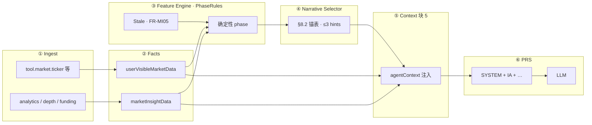

# Market Narrative Runtime Architecture（MNRA · 总入口）

**路径**：`specs/requirements/market-narrative-runtime/README.md`。

**用途**：把 **行情分析** 从「`prompts/analysis` 几篇条文」收成 **一条运行时架构**：**工具 Facts → 确定性 `marketPhase` → 叙事 hints → PRS 块 5 → LLM 润色 → Telegram**。

**产品名**：**MNRA**（对外可与 **Market Narrative System** 互称；**规格索引以本篇为准**）。

**不替代**：[`market-intelligence`](../domains/agent/exchange-agent/market-intelligence.md) **FR/SC 宿主**；[`market-runtime-payload`](../domains/agent/exchange-agent/market-runtime-payload.md) **Facts 字段 SSOT**；[`design/market-narrative-runtime`](../../design/market-narrative-runtime.md) **PhaseRules 数值设计面**。

---

## 1. 定义

**MNRA** = 在 **读侧 / 分析类 `scenarioId`** 上，于 **模型调用前** 确定性产出并注入：

| 产物 | 键（示意） | SSOT |
|------|-----------|------|
| **Market Facts** | `userVisibleMarketData`、`marketInsightData` | [`market-runtime-payload` §3](../domains/agent/exchange-agent/market-runtime-payload.md) |
| **Market Phase** | `primaryMarketPhase`（+ secondary） | 同上 §3.2.1 · **FR-MI06** |
| **Narrative Hints** | `marketNarrativeHints.recommendedNarratives`（≤3） | 同上 §3.4 · **FR-MI08** |
| **Narrator 约束** | Facts 优先、禁止无源 phase、Funding 须带数值 | **FR-MI04～08** · [`market-analysis`](../prompts/analysis/market-analysis.md) |

**MNRA 不负责**：下单、类型 A、写工具、执行状态机 — 见 **Agent Runtime** + **PRS 写路径** + **skill 操作契约**。

**与 PRS 分工**：**MNRA 产出 Runtime Context（块 5）**；**PRS 消费 Context 并拼装 SYSTEM** — PRS 总入口 [`prompt-runtime/README`](../prompt-runtime/README.md)；**改什么去哪（含 MNRA 行）** → **[PRS §4](../prompt-runtime/README.md#prs-where-to-edit)**。

---

## 2. 管线（逻辑架构）

**原则（需求冻结）**：

1. **PhaseRules 纯确定性**（**FR-MI06**）— **禁止** 主模型输出未登记 `marketPhase`。  
2. **AnchorPicker** 仅从 [`common-phrases` §8.2](../prompts/shared/common-phrases.md) **择 1～3 句** — **禁止** 运行时扩库。  
3. **Ticker-only**（**`market.read_quote`**）**默认不跑** 深度/Funding/突破 phase（**§4.1**）。

**设计默认值与占位阈值** → [`design/market-narrative-runtime`](../../design/market-narrative-runtime.md)。

---

## 3. 分层 SSOT（禁止分裂）

| MNRA 层 | SSOT | 职责 |
|---------|------|------|
| **能力 / FR** | [`market-intelligence` §4](../domains/agent/exchange-agent/market-intelligence.md) | FR-MI04～08、SC-MI04～08、§4.1 派生原则 |
| **Facts / 枚举** | [`market-runtime-payload`](../domains/agent/exchange-agent/market-runtime-payload.md) | 键名、`scenarioId` 归一、对用户 MUST NOT |
| **锚句字典** | [`common-phrases` §8](../prompts/shared/common-phrases.md) | 原则级锚句；**非** Trader Phrase Library |
| **Narrator 规则（PRS L6）** | [`prompts/analysis/*`](../prompts/analysis/README.md)、[`fragment-intent-analysis`](../prompts/library/packs/fragment-intent-analysis.zh-CN.md) | 短规则；**勿** 塞千句替代 Engine |
| **Few-shot** | [`prompt-management` FR-PM05](../domains/admin/prompt-management/overview.md) | **须 Publish**；Git 镜像 [`fewshot-narrative-analysis`](../prompts/library/packs/fewshot-narrative-analysis.zh-CN.md) |
| **PRS 配方** | [`registry` §1.2](../prompts/library/scenarios/registry.md)、[`scenario-matrix`](./scenario-matrix.md) | per-`scenarioId` 的 Context 键与 Eval |
| **OpenAPI 形状** | [`market-runtime-schemas.yaml`](../../openapi/components/market-runtime-schemas.yaml) | JSON Schema |
| **验收构造** | [`evals/market-narrative`](../evals/market-narrative.md) | GWT · Mock 基线 |

**权重（产品导向 · 非执法条）**：Market State ~40% · Anchors ~30% · Few-shot ~20% · Prompt Rules ~10% — [`common-phrases` §8.1](../prompts/shared/common-phrases.md)。

---

## 4. 与 `scenarioId` 分档

| 档位 | 典型 `scenarioId` | MNRA 要点 |
|------|-------------------|-----------|
| **Ticker-only** | `market.read_quote` | **仅** `userVisibleMarketData`；**默认无** 深度/Funding phase |
| **微观** | `market.read_microstructure` | 盘口 Facts；`wide_spread` / `thin_book` 等 |
| **深度** | `market.read_deep_analysis` | `marketInsightData` + 结构/动能/波动 phase |
| **Funding** | `futures.read_funding` | **`funding_*` phase 须同窗 `fundingRate` 数值**（FR-MI07） |
| **舆情** | `research.*` | C 类工具 Facts；情绪锚须与来源同窗 |
| **私读** | `portfolio.read_pnl_exposure` 等 | **非** MNRA 行情引擎主路径；**FR-T02** |

**全表** → [`scenario-matrix.md`](./scenario-matrix.md)。

---

## 5. 阅读顺序（建议）

1. **本篇**（MNRA 定义 + 管线）  
2. [`market-intelligence` §4](../domains/agent/exchange-agent/market-intelligence.md)（FR/SC）  
3. [`market-runtime-payload` §1～3](../domains/agent/exchange-agent/market-runtime-payload.md)（Facts + phase 枚举）  
4. [`design/market-narrative-runtime`](../../design/market-narrative-runtime.md)（PhaseRules v0 · 阈值 TBD）  
5. [`registry` §1.2](../prompts/library/scenarios/registry.md) + [`scenario-matrix`](./scenario-matrix.md)  
6. [`prompts/analysis/README`](../prompts/analysis/README.md)（**仅** Narrator 条文）  
7. [`evals/market-narrative`](../evals/market-narrative.md)  
8. **拼装消费** → [`prompt-runtime/README`](../prompt-runtime/README.md)

---

## 6. 开放项（规模化前）

| 项 | 状态 | 关单路径 |
|----|------|----------|
| **PhaseRules 数值冻结** | design **TBD** | analytics MR + 回测 → `ai-settings` / `design/api` |
| **Feature Engine 实现** | 所内 Runtime | 与 OpenAPI 字段级对签 |
| **`agent.market.phase_computed` 事件** | design §4 已写 | observability MR |
| **`marketNarrativeTimeline`（LTM）** | **P2** · `FEATURE_SEMANTIC_NARRATIVE` | [`memory-runtime`](../Runtime/memory-runtime.md) — **不** 塞进 SYSTEM |

**关单索引** → [`closure-remaining` §7](../closure-remaining.md#cc-remaining-open-items) **Market Narrative 行** · [`contract-closure`](../contract-closure.md)。

---

## 7. 禁止项（架构级）

- **`TRADER_PHRASE` / 独立 Phrase Library 卷** — [`market-intelligence` §4.2](../domains/agent/exchange-agent/market-intelligence.md)  
- **用 `prompts/analysis` 长文替代 Facts/phase 计算**  
- **无工具闭环用 §8 锚句编盘感** — **FR-MI05**  
- **在用户气泡展示 `read.market.*` 等实现别名** — [`market-runtime-payload` §2](../domains/agent/exchange-agent/market-runtime-payload.md)

---

**文档版本**：1.0.1 · **维护**：产品 + Agent Runtime owner · **本版**：**链 PRS §4 派工表**。**承** 1.0.0。
