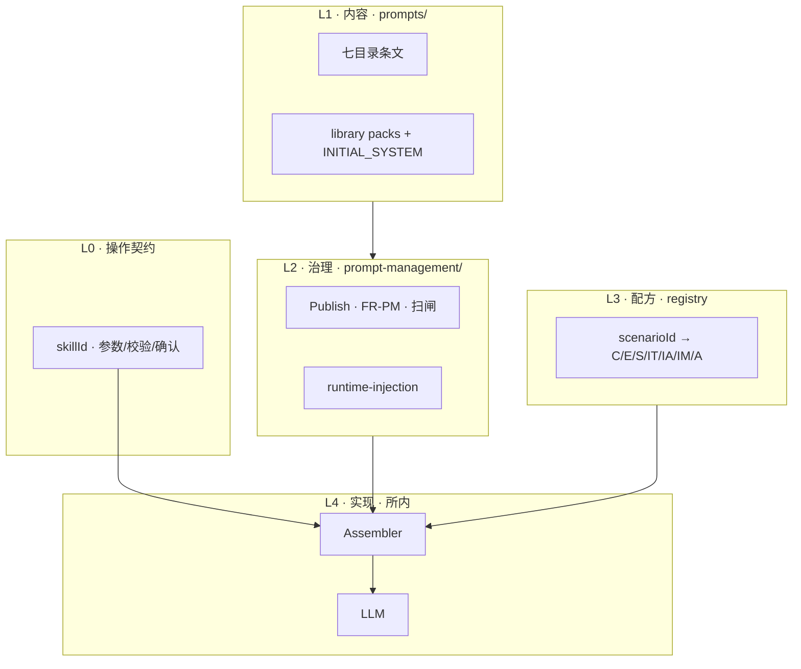

# Prompt Runtime System（PRS · 总入口）

**路径**：`specs/requirements/prompt-runtime/README.md`。

**用途**：把 **`prompts/`**、**`prompt-management/`**、**`library/`**、**`runtime-injection`**、**`market-narrative-runtime/`（MNRA）**、**`skill-specs/`（L0）** 收成 **一个产品子系统（PRS）** — **避免** 将 Prompt、Library、Management、Runtime、MNRA 读成多套并行体系。

**日常只记一个名**：**PRS**。物理路径仍是分卷（内容 / 读侧引擎 / 写路径契约），**改什么去哪** → **[§4](#prs-where-to-edit)**。

**不替代**：各目录正文 SSOT；**不**承载新 FR/SC（默认仍落在 **`domains/`** 或 **`prompt-management/functions`**）。

**≠ Agent Runtime**：执行、状态机、UNKNOWN、对账 → [`Runtime/overview`](../Runtime/overview.md)。

---

## 1. 定义

**PRS** = 在 **每次发往模型的调用前**，将下列内容组装为 **可审计的 messages**（或等价结构）：

1. **已发布** Prompt 包（SYSTEM / SAFETY / 场景族 / Few-shot）
2. **变量闸 + denylist + Safety §7.1 扫闸**
3. **按 `scenarioId` 的拼装配方**（Git [`registry`](../prompts/library/scenarios/registry.md) ↔ [`runtime-injection` §1](../domains/admin/prompt-management/runtime-injection.md)）
4. **Runtime Context**（行情、记忆、编排已定稿的 `user_visible_message` 等）
5. **Tool JSON Schema**（§4 单一 SSOT）
6. **用户本轮输入**

**邻域 · 非 PRS**：

| 名称 | 路径 | 管什么 |
|------|------|--------|
| **Agent Runtime** | [`Runtime/overview`](../Runtime/overview.md) | 执行、状态机、UNKNOWN、对账、计费 |
| **MNRA**（读侧行情） | [`market-narrative-runtime/README`](../market-narrative-runtime/README.md) | Facts → phase → hints → **块 5**（PRS 的输入） |
| **Skill 操作契约（L0）** | [`skill-specs/README`](../skill-specs/README.md) · **需求层闭环** [`requirements-closure`](../skill-specs/requirements-closure.md) · **S-01～S-09 + amend** · 抽检 [`evals/skill-contract`](../evals/skill-contract.md) | 写路径槽位 / 确认 / UNKNOWN |

---

## 2. 分层（L0～L4）



| 层 | 路径 | 一句职责 |
|----|------|----------|
| **L0** | [`skill-specs/`](../skill-specs/README.md) + `trade-assistance` §4/§8 | 写路径 **能不能** 进类型 A |
| **L1a** | `prompts/{system,intents,trading,analysis,confirmation,safety,shared}` | 评审 **下限条文** |
| **L1b** | `prompts/library/` | Git **可粘贴镜像** + MR diff |
| **L1c** | `prompts/library/scenarios/registry.md` | **`scenarioId` → 拼装字母** |
| **L2** | `domains/admin/prompt-management/*` | **发布、版本、变量闸、Safety** |
| **L3** | `routing-engine` §1～§4 | **`scenarioId` 键 SSOT** |
| **L4** | 所内 Runtime + [`observability` §2.3](../observability/overview.md) | 真拼装器、`resolvedPromptBinding` |

---

## 3. Git 字母 ↔ `runtime-injection` §1

| Git（[`ASSEMBLY`](../prompts/library/ASSEMBLY.md)） | `runtime-injection` 块 | 典型 pack / 条文 |
|---------------------------------------------------|------------------------|------------------|
| **L1 · C** | **SYSTEM**（片段） | `core-runtime-root.*` ≈ 身份/工具铁闸；**发布**仍以 **SYSTEM pack** 为准 |
| **L2 · E** | （并入 SYSTEM 或独立段） | `fragment-errors-user-visible.*` |
| **L3 · S** | **SAFETY** | `fragment-safety.*` + Publish SAFETY |
| **L4 · IT/IA/IM** | **场景策略正文**（意图桥 + 场景包） | `fragment-intent-*` + **TRADING/ANALYSIS** 发布包 |
| **L5 · A** | （写路径 · 确认叙事） | `fragment-confirmation-type-a.*`；**卡片**在 Telegram，**非** SYSTEM |
| **L6** | **场景策略加深** / Few-shot | `prompts/trading/*`、`analysis/*`；Few-shot **FR-PM05** |
| **块 5** | **Runtime Context** | **MNRA** 产出 · [`runtime-injection` §2.4](../domains/admin/prompt-management/runtime-injection.md) |
| **块 6** | **Tool Spec** | `design/api` + tool registry |
| **块 7** | **User Input** | 本轮用户消息 |

**读侧行情**：块 5 由 **[MNRA](../market-narrative-runtime/README.md)** 填充；**勿** 用 L6 条文替代 Facts/phase。

---

<a id="prs-where-to-edit"></a>

## 4. 改什么去哪（派工表）

**用法**：先定 **`scenarioId`**（[`routing-engine` §1～§4](../domains/agent/agent-orchestration/routing-engine.md)）与 **读 / 写**；再按下表打开 **唯一 SSOT**，避免在 `prompts/analysis` 与 MNRA 之间重复改。

| 我要改… | 去这里 | 层级 / 说明 |
|---------|--------|-------------|
| **全局身份、工具铁闸、禁止编造** | [`prompts/system/system.md`](../prompts/system/system.md) · [`library/packs/core-runtime-root.*`](../prompts/library/README.md) | L1；**发布**仍以 SYSTEM pack 为准 |
| **意图分流叙事** | [`prompts/intents/`](../prompts/intents/README.md) | L1 |
| **下单 / 卖 / 合约等写路径叙事** | [`prompts/trading/`](../prompts/trading/README.md) | L1；**须** 同窗 [`skill-specs/`](../skill-specs/README.md)（L0） |
| **分析「怎么说」（短规则，非算 phase）** | [`prompts/analysis/`](../prompts/analysis/README.md) · [`fragment-intent-analysis.*`](../prompts/library/packs/fragment-intent-analysis.zh-CN.md) | L6；**勿** 替代 MNRA 计算 |
| **类型 A 确认话术** | [`prompts/confirmation/`](../prompts/confirmation/README.md) · `fragment-confirmation-type-a.*` | L5；**卡片**在 Telegram |
| **Safety / 越狱 / 越权** | [`prompts/safety/`](../prompts/safety/README.md) · Publish SAFETY | L3 + L2 |
| **术语、格式、§8 行情锚句** | [`prompts/shared/`](../prompts/shared/README.md)（[`common-phrases` §8](../prompts/shared/common-phrases.md)） | L1；MNRA **AnchorPicker** 字典 |
| **Git 可粘贴片段 / 冷启动整段** | [`prompts/library/`](../prompts/library/README.md) · [`INITIAL_SYSTEM.*`](../prompts/library/INITIAL_SYSTEM.zh-CN.md) | L1b |
| **`scenarioId` → 拼装字母（C/E/S/…）** | [`library/scenarios/registry.md`](../prompts/library/scenarios/registry.md) | L1c / L3；CI [`check_registry_vs_routing_engine.py`](../prompts/library/scripts/check_registry_vs_routing_engine.py) |
| **发布、版本、变量闸、Few-shot FR-PM05** | [`prompt-management/`](../domains/admin/prompt-management/overview.md) · [`functions`](../domains/admin/prompt-management/functions.md) | L2 |
| **拼装块顺序、块 5 键名、Safety §7.1** | [`runtime-injection`](../domains/admin/prompt-management/runtime-injection.md) **§1～§7** | **拼装契约 SSOT** |
| **Facts 字段、`marketPhase` 枚举** | [`market-runtime-payload`](../domains/agent/exchange-agent/market-runtime-payload.md) | MNRA · 契约 |
| **FR-MI04～08、读侧能力原则** | [`market-intelligence` §4](../domains/agent/exchange-agent/market-intelligence.md) | MNRA · 域 FR 宿主 |
| **PhaseRules 数值 / 阈值（设计面）** | [`design/market-narrative-runtime`](../../design/market-narrative-runtime.md) | MNRA · design |
| **per-`scenarioId` 读侧矩阵、Context 键** | [`market-narrative-runtime/scenario-matrix`](../market-narrative-runtime/scenario-matrix.md) | MNRA |
| **MNRA 管线总览** | [`market-narrative-runtime/README`](../market-narrative-runtime/README.md) | 读侧 **块 5** 子系统 |
| **写路径参数 / 校验 / 确认卡 / 拒答** | [`skill-specs/`](../skill-specs/README.md)（金样 [`skill.spot.limit_order`](../skill-specs/spot/skill.spot.limit_order.md)） | L0 |
| **记忆注入 STM/LTM** | [`Runtime/memory-runtime`](../Runtime/memory-runtime.md) · [`evals/memory-runtime`](../evals/memory-runtime.md) | 块 5 之一；**非** SYSTEM 塞 LTM |
| **行情评测 GWT / Mock** | [`evals/market-narrative`](../evals/market-narrative.md) | 验收素材 |
| **降级策略 vs 降级话术分界** | [`Runtime/fallback-policy`](../Runtime/fallback-policy.md) | **策略** Runtime；**话术** `prompts/` |
| **执行、UNKNOWN、对账、计费** | [`Runtime/overview`](../Runtime/overview.md) | **非 PRS** |
| **产品治理清单（人类，非 SSOT）** | [`product/prompt-governance-checklist.md`](../../../product/prompt-governance-checklist.md) | **16 包** · 六段正文 |
| **条文 ↔ 运营包映射（规格索引）** | [`prompts/governance-map.md`](../prompts/governance-map.md) | `scenarioId` · `promptPackId` |

**路径树（记法）**：

```text
PRS
├── prompt-runtime/README.md     ← 本篇（地图）
├── prompts/                     ← L1 内容 + library/
├── market-narrative-runtime/    ← 读侧块 5（MNRA）
├── skill-specs/                 ← L0 写路径
├── domains/.../prompt-management/ + runtime-injection
└── evals/market-narrative.md · memory-runtime.md
```

---

## 5. 阅读顺序（建议）

1. **本篇** §1～§4（定义 + 分层 + **派工表**）  
2. [`runtime-injection`](../domains/admin/prompt-management/runtime-injection.md) **§1～§7**（拼装契约 SSOT）  
3. [`prompts/library/ASSEMBLY`](../prompts/library/ASSEMBLY.md) → [`registry`](../prompts/library/scenarios/registry.md)  
4. [`prompts/README`](../prompts/README.md)（七目录 + 派工表链）  
5. **读侧行情** → [`market-narrative-runtime/README`](../market-narrative-runtime/README.md)  
6. **关单 / AC-09** → [`closure-remaining` §7.2～§7.4](../closure-remaining.md#cc-ac09-closure-matrix) · [§7.3 闭环互引](../closure-remaining.md#cc-prompt-runtime-closure-loop)

---

## 6. 相关链

| 主题 | 文档 |
|------|------|
| **Publish / SC-PM** | [`prompt-management/functions`](../domains/admin/prompt-management/functions.md) |
| **降级话术分界** | [`Runtime/fallback-policy`](../Runtime/fallback-policy.md) |
| **Registry CI** | [`check_registry_vs_routing_engine.py`](../prompts/library/scripts/check_registry_vs_routing_engine.py) |
| **Skill Publish CI** | [`check_skill_contract_complete.py`](../skill-specs/scripts/check_skill_contract_complete.py) · [`skill-specs/PUBLISH.md`](../skill-specs/PUBLISH.md) |
| **产品治理清单（非 SSOT）** | [`product/prompt-governance-checklist.md`](../../../product/prompt-governance-checklist.md) |
| **条文 ↔ 运营包映射** | [`prompts/governance-map.md`](../prompts/governance-map.md) |

---

**文档版本**：1.1.0 · **维护**：产品 + Prompt owner · **本版**：**§4 改什么去哪派工表 · PRS 单一体系导航**。**承** 1.0.1。
