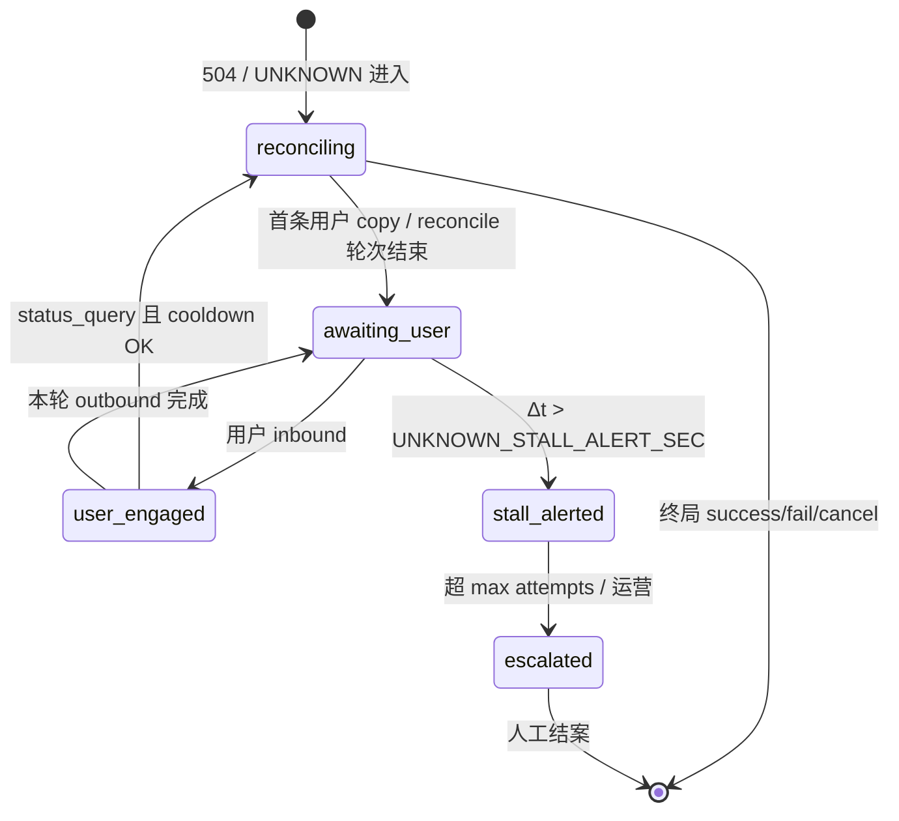

# Risk · UNKNOWN / `unknown_pending` 无进展与用户追问状态机

**路径**：`specs/requirements/risk/unknown-stall-policy.md`。

**职责**：

1. **无进展阈值** — 为 [`Runtime/unknown-state.md`](../Runtime/unknown-state.md) **「收口与无进展」**、[`Runtime/recovery.md`](../Runtime/recovery.md) **UNKNOWN 收口** **提供 `risk` 域宿主**：**须登记** **的阈值类配置**、**告警与处置路径** **之** **产品下限**（**§1**）。
2. **用户追问状态机** — **当** **写 **`executionId`** **处于 **`unknown_pending`** **时** **用户** **再发 inbound** **之** **意图分类、Runtime 动作、并发叠层与用户可见下限** **之** **统一 SSOT**（**§2～§5**）。

**不**重复 **`504`/对账算法** — [`Runtime/reconciliation.md`](../Runtime/reconciliation.md)、**`design/api`「REST ↔ WebSocket 对账」** **仍为终裁**。

**同窗**：[`../domains/agent/exchange-agent/overview.md`](../domains/agent/exchange-agent/overview.md) **§4·UNKNOWN 无进展**；[`../Runtime/fallback-policy.md`](../Runtime/fallback-policy.md) **§2.2 FB-C3/C6**；[`../domains/agent/agent-orchestration/session-concurrency-policy.md`](../domains/agent/agent-orchestration/session-concurrency-policy.md) **§4 · §5.3 · P5**；[`../prompts/shared/common-phrases.md`](../prompts/shared/common-phrases.md) **§2**；[`../evals/scenarios.md`](../evals/scenarios.md)；[`../observability/overview.md`](../observability/overview.md) **§2**；[`acceptance.md`](./acceptance.md) **`SC-RISK-06`～`07`**。

---

## 1. 须冻结项（配置 / 观测 / 处置 · 无进展）

**下列项** **须** **在所内专项 MR** **落地为** **`design` / `ai-settings` / `trading-agent-config/keys.md`** **之** **可运维键名与默认值**（**具体键名** **以 OpenAPI / [`keys` §2.4](../domains/admin/trading-agent-config/keys.md) 收束** **为准**；**本文** **锁** **语义** **不** **锁** **字面值**）。

| **类** | **语义（须可测）** | **宿主** |
|--------|---------------------|----------|
| **无进展** **可观测** | 同一 **`executionId`** 在 **`unknown_pending`** 下，自上次可查进度起超过 **`UNKNOWN_STALL_ALERT_SEC`**（Δt）仍无对账闭合或终局迁移的，**须**可告警（指标或规则与 **observability** §2 同窗）。 | **`metrics`/告警 MR**；[`observability/overview.md`](../observability/overview.md) **§2** |
| **查单 · 退避 · 轮次** | 自动查单/对账 **须**有界（**`UNKNOWN_RECONCILE_MAX_ATTEMPTS`**、退避上界、熔断后路径）；**禁止**无上限热循环冒充「仍在推进」。 | **实现** **同窗** **`exchange-agent`/`Runtime/recovery`**；**[`keys` §2.4](../domains/admin/trading-agent-config/keys.md)** |
| **超时终局 / 人工** | 超过策略上界仍不可判时 **须**走显式路径：终局失败、维持 UNKNOWN 但带运营入口、或登记例外 ADR — 与 [`unknown-state.md`](../Runtime/unknown-state.md) **闭环路径 (b)(c)** 一致。 | **工单/管理台** **`design` MR** |
| **用户触达** | 全程与 **`FR-T05` 族**一致：**不**假终局成交、**不**无限无解释「请重试」。 | [`boundaries.md`](../domains/agent/exchange-agent/boundaries.md) |

---

## 2. `unknown_pending` · 用户追问统一状态机（MUST · P1）

### 2.1 前置条件

| **须（MUST）** | **说明** |
|----------------|----------|
| **锚定 **`executionId`** | **追问处理** **须** **绑定** **唯一** **在途写 **`executionId=E*`** **（** **P5** **）** — **禁止** **silent 切换到** **新写 **`executionId`** |
| **主态** | **Runtime 主态 **`unknown_pending`** **（** **或等价** **`EXECUTION_UNKNOWN`** **）** |
| **并发** | **Inbound 队列** **仍** **服从** [`session-concurrency-policy` §2](../domains/agent/agent-orchestration/session-concurrency-policy.md)；**P5** **优先于** **P7 新写** |
| **D-1** | **`SESSION_BLOCK_NEW_WRITE_ON_UNKNOWN=true`**（**默认**）**时** **新写起票** **须** **挡** — **§2.4 `NEW_WRITE`** |

### 2.2 Runtime 子态（`unknown_pending` 内 · 逻辑名）

**性质**：**编排/BFF 缓存** **或** **观测派生**；**B 阶段** **OpenAPI** **专项 MR** **冻结字段名**。

| **子态** | **进入** | **Then（摘要）** |
|----------|----------|------------------|
| **`reconciling`** | **504 后** **或** **后台对账 tick** | **自动查单/WS 对账** **在退避窗口内** |
| **`awaiting_user`** | **首条 UNKNOWN 用户 copy 已发** **且** **无 in-flight reconcile** | **等待** **用户追问或** **后台 tick** |
| **`user_engaged`** | **用户追问 inbound 已分类** **且** **本轮 outbound 未完成** | **处理** **§2.3 意图** **（** **单 session 串行** **）** |
| **`stall_alerted`** | **Δt > `UNKNOWN_STALL_ALERT_SEC`** **且无终局** | **告警已触发** **+** **用户触达升级 copy** — **§1** |
| **`escalated`** | **超 **`UNKNOWN_RECONCILE_MAX_ATTEMPTS`** **或** **运营动作** | **人工/工单路径** **+** **审计** |

**禁止**：**子态** **不得** **单独** **驱动** **主态离 **`unknown_pending`** **为** **`success`** **而无** **对账证据**。

### 2.3 用户追问 · 意图分类（MUST）

**每条** **`unknown_pending`** **下** **之** **用户 inbound**（**非** **幂等重投** **）** **须** **L→R 重意图** **后** **归入** **下表** **之一**（**观测 **`unknownFollowupIntent`** **）**：

| **`unknownFollowupIntent`** | **触发示例（zh-Hans）** | **优先级** |
|-----------------------------|-------------------------|:----------:|
| **`status_query`** | 「成交了吗」「好了没」「单子怎么样了」 | **1** |
| **`read_order_position`** | 「查一下订单」「我的 BNB 持仓」「挂单还在吗」 | **2** |
| **`cancel_request`** | 「取消上一笔」「撤单」「不要了」 | **3** |
| **`repeat_submit`** | 「再下一单」「再试一次」「重新买」**（** **同参或新写** **）** | **4** |
| **`new_write`** | 「另外买 ETH」「再帮我买 0.1 BTC」**（** **明确新写** **）** | **5** |
| **`impatient_nudge`** | 「快点」「怎么这么慢」**（** **无新槽位** **）** | **6** |
| **`greeting_unrelated`** | 「你好」「今天天气」 | **7** |

**歧义**：**「再买一点 BNB」** **且** **与** **UNKNOWN 单** **同 symbol** → **默认 **`repeat_submit`** **（** **非** **silent 新写** **）** **除非** **用户** **明确** **「新的另一笔」**。

### 2.4 意图 → Runtime 动作表（MUST）

**与** [`session-concurrency-policy` §5.3](../domains/agent/agent-orchestration/session-concurrency-policy.md) **对读** **；** **冲突** **以** **本篇** **追问细表** **为准**。

| **意图** | **Then（Runtime）** | **写** | **Reconcile** | **用户可见（宜）** |
|----------|---------------------|:------:|:-------------:|---------------------|
| **`status_query`** | **(1)** **若** **距上次 reconcile ≥ `UNKNOWN_USER_RECONCILE_COOLDOWN_SEC`** **且** **未达 **`UNKNOWN_MAX_USER_FOLLOWUP_RECONCILE_PER_EXECUTION`** → **触发** **一次** **查单/对账**；**(2)** **Fresh 只读** **订单/成交** **（** **若矩阵允许** **）**；**(3)** **UNKNOWN 叙事** **+** **已知事实摘要** | **0** | **有界 +1** | 「还在核对，暂未看到终局成交…」**禁止 SUCCESS** |
| **`read_order_position`** | **独立只读 **`executionId`** **或** **E* 只读步** **→** **工具链** **→** **答** **不** **断言** **UNKNOWN 单终局** | **0** | **可选** **（** **cooldown 内** **跳过** **）** | **只读结果** **+** **一行 UNKNOWN 提醒** |
| **`cancel_request`** | **若** **交易所** **可撤** **且** **矩阵允许** **→** **撤单 skill + 类型 A** **（** **新 **`toolCallSeq`** **）**；**否则** **Explain + 查单** **0** **假撤成功** | **须类型 A** | **撤前/后可 reconcile** | **可撤** **→** **确认卡**；**不可撤** **→** **UNKNOWN + 查单指引** |
| **`repeat_submit`** | **0** **自动同参 **`create_order`** **重放**；**0** **新类型 A** **冒充已受理**；**可读** **「勿重复提交，我在核对上一笔」** | **0** | **不** **因 repeat  alone 触发** | **同窗** [`common-phrases` §2](../prompts/shared/common-phrases.md) |
| **`new_write`** | **D-1 ON** **→** **挡** **`FR-T05` 族** **+** **保留 E* 上下文**；**0** **第二张无关类型 A** | **0** | **0** **为新写** | 「上一笔结果仍待确认…」 |
| **`impatient_nudge`** | **不** **额外 reconcile** **若** **cooldown 内** **；** **短句安抚** **+** **可选** **上次进度摘要** | **0** | **0** **（** **除非** **距上次 > cooldown** **）** | 「仍在核对，有结果马上告诉你。」 |
| **`greeting_unrelated`** | **寒暄短答** **+** **一行** **E* UNKNOWN 状态** **（** **不** **复读长模板** **若** **`UNKNOWN_FOLLOWUP_COPY_THROTTLE_SEC` 内已发** **）** | **0** | **0** | **简短** |

**硬闸（叠于全表）**：

| **闸** | **MUST** |
|--------|----------|
| **U1 禁止假终局** | **任何追问答复** **不得** **使用** **已成交/已买入完成** **终局语气** — [`unknown-state.md`](../Runtime/unknown-state.md) |
| **U2 禁止盲重放** | **`repeat_submit` / `new_write`** **不得** **触发** **无 **`idempotencyKey`** **之** **写 Retry** — [`fallback-policy` FB-C3](../Runtime/fallback-policy.md) |
| **U3 对账有界** | **用户触发的 reconcile** **≤ **`UNKNOWN_MAX_USER_FOLLOWUP_RECONCILE_PER_EXECUTION`** **且** **遵守 cooldown** |
| **U4 卡面一致** | **答复** **不得** **与** **用户已确认类型 A** **方向/数量** **矛盾** **（** **除非** **对账证明** **）** |
| **U5 节流** | **同一 E*** **在 **`UNKNOWN_FOLLOWUP_COPY_THROTTLE_SEC`** **内** **勿** **逐字复读** **同一 UNKNOWN 长模板** |

### 2.5 状态迁移（示意）

### 2.6 与 session 优先级叠层

| **叠层** | **MUST** |
|----------|----------|
| **P5 vs P7** | **`unknown_pending`** **存活** **时** **`new_write`/`repeat_submit`** **走** **§2.4** **挡** **—** **不** **起** **P7 新写 **`executionId`** |
| **P5 vs P8** | **`read_order_position` / `status_query` 内只读** **可走** **P8** **或** **挂 E* 只读步** |
| **类型 A 撤单** | **`cancel_request` + 可撤** **→** **P2/P3 级** **确认链** **服务** **E* 或** **新撤单 **`executionId`** **（** **`design` 冻结一种** **）** **须** **可观测 **`executionId`** |
| **队列** | **追问** **与** **`cl:*`** **串行** — **同窗** **`eval.session.callback_serial_with_message`** **精神** |

### 2.7 观测字段（逻辑名 · B 阶段 OpenAPI）

| 字段 | **说明** |
|------|----------|
| **`unknownFollowupIntent`** | **§2.3 枚举** |
| **`unknownSubstate`** | **§2.2 子态** |
| **`unknownUserReconcileCount`** | **本 E* 用户触发 reconcile 次数** |
| **`lastUnknownUserCopyAt`** | **节流** **用** |
| **`lastReconcileAttemptAt`** | **cooldown** **用** |

---

## 3. 配置键语义（`UNKNOWN_*` · 索引）

**SSOT 登记**：[`trading-agent-config/keys` §2.4](../domains/admin/trading-agent-config/keys.md)。

| **语义** | **默认方向（v0）** |
|----------|-------------------|
| **`UNKNOWN_STALL_ALERT_SEC`** | **Δt 无进展告警**（**如 300s** — **所内 MR 冻字面值**） |
| **`UNKNOWN_USER_RECONCILE_COOLDOWN_SEC`** | **用户追问触发 reconcile 最小间隔**（**如 30s**） |
| **`UNKNOWN_MAX_USER_FOLLOWUP_RECONCILE_PER_EXECUTION`** | **有界**（**如 5**） |
| **`UNKNOWN_FOLLOWUP_COPY_THROTTLE_SEC`** | **同模板复读节流**（**如 60s**） |
| **`UNKNOWN_RECONCILE_MAX_ATTEMPTS`** | **含自动+用户触发** **总轮次上界** — **与** **§1** **同窗** |

---

## 4. 验收（`SC-RISK-06`～`07`）

| ID | Then |
|----|------|
| **`SC-RISK-06`** | **Δt 超阈** **→** **可观测告警** **+** **`FR-T05` 族** **+** **查单有界** — **§1** |
| **`SC-RISK-07`** | **`unknown_pending` + `status_query`** **→** **有界 reconcile/只读** **+** **0 SUCCESS 假终局** |
| **`SC-RISK-07a`** | **`unknown_pending` + `new_write`** **→** **0 新写** **（** **D-1 默认** **）** **+** **`FR-T05` 族** |
| **`SC-RISK-07b`** | **`unknown_pending` + `repeat_submit`** **→** **0 同参自动重放** |
| **`SC-RISK-07c`** | **`unknown_pending` + `cancel_request`（可撤）** **→** **类型 A 撤单** **0** **假撤成功** |
| **`SC-RISK-07d`** | **用户 reconcile** **≤ cooldown / max** **可观测** |
| **`SC-RISK-07e`** | **`UNKNOWN_FOLLOWUP_COPY_THROTTLE_SEC` 内** **0** **长模板逐字复读** |

**Eval**：[`evals/unknown-followup-telegram.md`](../evals/unknown-followup-telegram.md) · **回归** **`eval.session.new_write_blocked_on_unknown`** · **`eval.fallback.write_504_unknown_no_auto_replay`**。

---

## 5. 明确不包含

- **单一交易所** **查单 PATH** **与** **WS 矩阵** — **`design/api`**、**`Runtime/reconciliation`**。  
- **子账户** **限额数值** — **`exposure-limit`** **等** **他卷**。  
- **504 进入 UNKNOWN** **之初次 outbound 模板** — [`unknown-state.md`](../Runtime/unknown-state.md) **+** [`trade-via-agent` S5](../flows/trade-via-agent.md)。

---

**文档版本**：0.2.0 · **维护**：产品 + 风控 owner · **本版**：**P1 — §2 用户追问状态机 · `SC-RISK-07*` · keys §2.4 · eval 束**。**承** 0.1.0。
