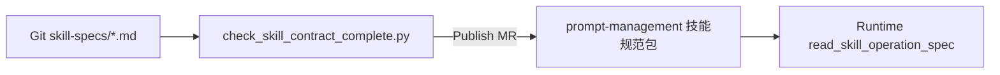

# Skill Specs · Publish（Git → prompt-management）

**路径**：`specs/requirements/skill-specs/PUBLISH.md`。

**职责**：定义 **`read_skill_operation_spec`** 正文的 **版本化发布** 与 Git **对账**规则。**正文 SSOT** 仍为各 `**/<skillId>.md`；**登记行** 为 [`trade-assistance` §4](../domains/agent/exchange-agent/trade-assistance.md)；**拼装** 不内嵌 skill 全文 — [`prompt-management/rules`](../domains/admin/prompt-management/rules.md)。

**范围说明**：本篇 + [`requirements-closure.md`](./requirements-closure.md) **宣告完成的是规格与 Admin 原型对齐**；**所内** BFF/DB/编排真实现见 [`MR-B-BFF-IMPLEMENTATION.md`](./MR-B-BFF-IMPLEMENTATION.md)（**不在本规格仓交付**）。

---

## 1. 数据流



| 阶段 | 真源 | 禁止 |
|------|------|------|
| **编辑** | Git `specs/requirements/skill-specs/` | 仅在控制台改正文不同步 Git |
| **Publish** | `skillSpecVersion` 单调 + **全文快照** | 只发布「增量段」或摘要 |
| **运行** | 已发布包 + `agent.skill.spec_read` 观测 | 未发布版本 **`PROMPT_SKILL_REF_INVALID`** |

---

## 2. 清单 · `manifest.yaml`

[`manifest.yaml`](./manifest.yaml) 列出全部 `skillId`：

- **`publishRequired: true`** — **须** `contract-complete` 正文（**11** 篇，含 amend）  
- **`publishRequired: false`** — OCO/bracket/划转等 **仅** `FR-T05`，**无** Git 正文  

**MR 前自检**（仓库根目录）：

```bash
python3 specs/requirements/skill-specs/scripts/check_skill_contract_complete.py
python3 specs/requirements/prompts/library/scripts/check_registry_vs_routing_engine.py
```

---

## 3. `skillSpecVersion` 规则

| 规则 | 说明 |
|------|------|
| **格式** | `MAJOR.MINOR.PATCH-contract` 或所内 SemVer（**全站冻结一种**） |
| **Git 元数据** | 各 skill 文件 **元数据表** `skillSpecVersion` = **拟发布版本** |
| **§4 登记** | [`trade-assistance` §4](../domains/agent/exchange-agent/trade-assistance.md) **操作规范列** 与 Publish **同窗更新** |
| **单调** | 同一 `skillId` **禁止** 回退版本号；**Rollback** 走 prompt-management **指针回指** |
| **摘要** | 可选 `specDigest`（hash）— [`observability` §2.1](../observability/overview.md) `agent.skill.spec_read` |

**场景包绑定**：Trading 场景 **`skillSpecRef`** 指向 **`skillId` + `skillSpecVersion`** — [`prompt-management/config`](../domains/admin/prompt-management/config.md)。

---

## 4. Publish 前 DoD（运营 + 工程）

1. 正文 **§1～§6** 自包含（**无**「同 xxx §2」作主文）— [`TEMPLATE`](./TEMPLATE.md)。  
2. `check_skill_contract_complete.py` **通过**。  
3. 对应 **`scenarioId`** 在 [`registry`](../prompts/library/scenarios/registry.md) **`skill_spec` 列** 直链本文件。  
4. **symbol 数值**（tick/step）若未冻结 — 条文 **须** 写「以元数据/预检为准」，**不得** 填假数。  
5. Publish 后抽检：[`evals/skill-contract.md`](../evals/skill-contract.md) **P0 束**（至少 **缺槽禁 confirm** + **改单序**）。

---

## 5. 错误码（运行时）

| 码 | 触发 |
|----|------|
| **`PROMPT_SKILL_REF_INVALID`** | `skillSpecVersion` 未发布或未知 — [`prompt-management/functions` §5](../domains/admin/prompt-management/functions.md) |
| **`FR-T05`** | 矩阵 PATH TBD（如 `conditionOrder`）— skill §5 已声明 |

---

## 6. OpenAPI（草案 · 所内实现）

| 资源 | 路径 |
|------|------|
| **Schemas** | [`specs/openapi/components/skill-operation-spec-schemas.yaml`](../../openapi/components/skill-operation-spec-schemas.yaml) |
| **Paths** | [`specs/openapi/admin/prompt-management.yaml`](../../openapi/admin/prompt-management.yaml) — `admin/skill-specs/*`、`GET /api/v1/internal/skills/effective` |
| **登记** | [`design/api.md`](../../design/api.md) **运营侧 Prompt / Skill 子表** |

**运行时读**：`EffectiveSkillSpecResponse.bodyMarkdown` = **单文件 §1～§6 全文**。

## 7. 原型与规格对齐状态（本仓）

### 7.1 Admin 原型 · 交付边界（`src/admin`）

| 维度 | 原型 **交付** | 原型 **不交付**（所内 MR-B / 规格 SC-TM-17～18 UI） |
|------|----------------|------------------------------------------------------|
| **运营可用性** | 列表 **启用/停用** + 抽屉 **已启用/未启用**（**SC-TM-16**；固定登记册、无新建技能） | — |
| **规范阅读** | §1～§6 解析、**说明已齐全**、**需正式上线** 分类 Tag | — |
| **Prompt 绑定** | `skillSpecRef` / `scenarioId`；Publish 前校验 **登记册 + Git 版本**（**SC-PM-21** 演示口径） | Runtime **PUBLISHED** 真库（接 BFF 后改 `getEffective…`） |
| **Runtime 发布 UI** | **不展示**（避免与启用开关重复、且无创建技能流程） | **SC-TM-17～18** 发布按钮/已发布 Tag/页顶统计 → **MR-B 接线后** 再启用 |

契约小样：`skillPublish/*` + Vitest **保留**供 MR-B 对签，**不要求** 运营 Demo 走 localStorage 发布。

| 项 | 对齐层级 | 入口 |
|----|----------|------|
| **Git 快照 bundle** | **规格** | [`published/runtime-bundle.json`](./published/runtime-bundle.json) · [`scripts/build_runtime_publish_bundle.mjs`](./scripts/build_runtime_publish_bundle.mjs) |
| **Publish 规则 + FR/SC** | **规格** | 本篇 · [`requirements-closure` §3.6](./requirements-closure.md#36-runtime-publish--原型与规格对齐非生产实现) |
| **控制台「发布到 Runtime」** | **所内**（**Demo 无 UI**） | **SC-TM-17～18** → MR-B；`/ai/tool-registry` **仅** Enable + 规范抽屉（[`tool-registry-reconciliation`](../domains/admin/tool-management/admin-console-tool-registry-reconciliation.md) §0） |
| **Prompt `skillSpecRef` 门禁** | **原型** | **SC-PM-21** · `promptPublishGate` |
| **Production Runtime 协查** | **原型** | 执行详情 **`agent.skill.spec_read`** + 总览技能规范卡 · [`production-runtime.md`](./production-runtime.md) · **SC-OM-05** |
| **CI 门卫** | **规格** | `check_skill_contract_complete.py` + bundle `--check` + 契约 Vitest（**非** E2E 生产） |
| **本地 OpenAPI Mock** | **可选原型辅助** | `src/admin/dev/skillSpecBff*` — **仅** dev，**不**计入关单 |
| **生产 BFF / DB / 编排** | **所内** | [`MR-B-BFF-IMPLEMENTATION.md`](./MR-B-BFF-IMPLEMENTATION.md) |

**规格 MR 前**（仓库根目录）：

```bash
python3 specs/requirements/skill-specs/scripts/check_skill_contract_complete.py
node specs/requirements/skill-specs/scripts/build_runtime_publish_bundle.mjs --check
```

---

## 8. 上级

[`README.md`](./README.md) · [`prompt-runtime/README`](../prompt-runtime/README.md) · [`evals/skill-contract.md`](../evals/skill-contract.md)

---

**文档版本**：0.3.0 · **维护**：产品 + Agent Runtime owner · **本版**：**统一为「原型+规格对齐」；所内实现单列**。**承** 0.2.0。
