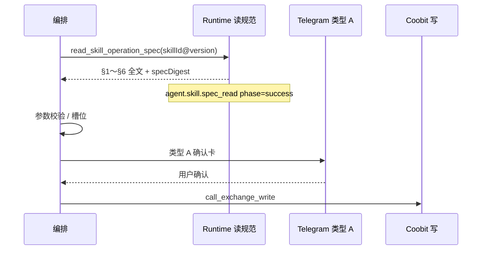

# Production Runtime · 写路径读技能规范（`read_skill_operation_spec`）

**路径**：`specs/requirements/skill-specs/production-runtime.md`。

**职责**：冻结 **所内 Agent 执行态** 在 **A 类写** 场景下 **如何消费已发布 L0** 的 **产品序、观测下限、失败语义与 Admin 协查原型**。**不**替代 [`PUBLISH.md`](./PUBLISH.md)（运营发布链）或 [`Runtime/execution.md`](../Runtime/execution.md)（九步管线全文）。

**与 Publish 之分**：

| 面 | SSOT | 完成口径（本仓） |
|----|------|------------------|
| **Runtime Publish** | [`PUBLISH.md`](./PUBLISH.md)、[`requirements-closure` §3.6](./requirements-closure.md#36-runtime-publish--原型与规格对齐非生产实现) | 规格 + **所内** 发布落库（**Demo 无** `/ai/tool-registry` 发布按钮 · [`tool-registry-reconciliation` §0](../domains/admin/tool-management/admin-console-tool-registry-reconciliation.md)） |
| **Production Runtime（本篇）** | 本篇 + **FR-T11** / **FR-AO04** / [`confirmation-flow` §1](../domains/agent/agent-orchestration/confirmation-flow.md) | 规格 + **执行详情时间线** 原型；**所内真编排** → [`MR-B-BFF-IMPLEMENTATION` §2 MR-B4](./MR-B-BFF-IMPLEMENTATION.md) |

---

## 1. 标准序（写路径 · 与确认流同窗）

以 [`confirmation-flow.md` §1](../domains/agent/agent-orchestration/confirmation-flow.md) 为准，**观测上** **须** 能在 **同一 `executionId`** 重放：

**写参闸门（同窗）**：在 **推送** **载有** **`call_exchange_write`** **将使用** **之** **参数的** **类型 A** **之前**，**与** **在调用** **`call_exchange_write`/`Gateway`** **之前** — **须** **各** **满足一次** **[`runtime-invariants` §0 · INV-008、INV-009](../Runtime/runtime-invariants.md)**（**语义满仓/清仓** **另** **INV-010**）。

**只读分析**（`read-analyze-and-search-via-agent`）：**不适用** 全链 **FR-T11**；**不得** 伪造 **`agent.skill.spec_read`** 冒充写路径。

---

## 2. 读规范契约（所内须实现 · 规格已闭合）

| 项 | 规则 | 失败 / 拒答 |
|----|------|-------------|
| **版本键** | **`skillId` + `skillSpecVersion`**（与 Prompt **`skillSpecRef`**、Publish 快照 **同窗**） | 未发布 / 未知版本 → **`PROMPT_SKILL_REF_INVALID`**（[`PUBLISH` §5](./PUBLISH.md)） |
| **正文** | **contract-complete** 单文件 **§1～§6**；**禁止** 运行时仅加载「增量片段」 | **`FR-T05`** 可解释；**不得** 类型 A |
| **时机** | **先于** **首张类型 A** **与** **`call_exchange_write`**（**SC-AO-04**） | 跳过读规范 → **契约不达标** |
| **重试** | **重试不得跳过** 读规范 / 确认门（**SC-AO-06**） | 与 [`retry-policy`](../domains/agent/agent-orchestration/retry-policy.md) 同窗 |
| **摘要** | 可落 **`specDigest`**（hash）；**禁止** 默认日志 **全文** | [`observability` §2.1](../observability/overview.md) |

**API 形状（草案）**：[`MR-B-BFF-IMPLEMENTATION`](./MR-B-BFF-IMPLEMENTATION.md) · OpenAPI **`read_skill_operation_spec` / effective** 路径。

---

## 3. 观测（`agent.skill.spec_read`）

**事件 SSOT**：[`observability/overview.md` §2.1](../observability/overview.md) **`agent.skill.spec_read`**。

**时间线映射（§2.4）**：

| Trigger（推荐字面） | `eventName` | `summary` 下限键 |
|---------------------|-------------|------------------|
| **`skill.spec_loaded`** | **`agent.skill.spec_read`** | **`skillId`**、**`skillSpecVersion`**、**`phase`**=`success`\|`fail`；**可选** **`specDigest`**（**非**全文） |

**须** 落在 **`confirmation.required` 之前**（写路径演示 **`exec-aa11`** 等同序）。

**验收**：

| ID | 主题 | 宿主 |
|----|------|------|
| **SC-OBS11** | 写路径 **`executionId`** **可 join** **`agent.skill.spec_read`** **且** **时序早于** **类型 A / 写** | [`observability` §4](../observability/overview.md) |
| **SC-OM-05** | **`FR-MC801` 时间线** **可读** **`agent.skill.spec_read`** **行**（**`eventName` + 摘要键**） | [`observability-management/functions` §3](../domains/admin/observability-management/functions.md) |
| **SC-AO-04** | 读技能 **先于** 类型 A / 交易所写 | [`agent-orchestration/overview` §3](../domains/agent/agent-orchestration/overview.md) |

**Eval 构造**：[`evals/skill-contract.md`](../evals/skill-contract.md) **§2.1 Given**（**须** contract-complete 包）。

---

## 4. Admin 原型（规格对齐 · 非生产）

| 页面 | 行为 | 验收 |
|------|------|------|
| **`runtime.execution-detail`** | **Timeline** 表含 **`agent.skill.spec_read`** 行；**总览** **「技能规范（Production Runtime）」** 卡解析 **skillId / version / digest / phase** | **SC-OM-05** |
| **`/ai/tool-registry`** | **登记 + §1～§6 抽屉**；**Vitest** `readSkillOperationSpec` 供 **SC-TM-17** 契约对签（**非** 运营 Publish 按钮） | **SC-TM-13～14**、[`tool-registry-reconciliation` §0](../domains/admin/tool-management/admin-console-tool-registry-reconciliation.md) |

**映射**：[`admin-console/runtime-to-ui-mapping.md`](../admin-console/runtime-to-ui-mapping.md) · [`page-specs.md`](../admin-console/page-specs.md) **`runtime.execution-detail`**。

**所内不做（本仓）**：Telegram 真机、编排 DAG 真节点、生产 BFF 时间线落库。

---

## 5. B 阶段（所内 · 不阻塞 A）

| ID | 主题 | 入口 |
|----|------|------|
| **SK-B02** | 编排 **`read_skill_operation_spec`** 真链路 | [`MR-B-BFF-IMPLEMENTATION` §2](./MR-B-BFF-IMPLEMENTATION.md) |
| **SK-B03** | **`eval.skill.*` 真跑** | [`evals/skill-contract.md`](../evals/skill-contract.md) |

**生产化总表**：[`Runtime/runtime-truth-source-map.md`](../Runtime/runtime-truth-source-map.md) **§2**「写路径读规范」行。

---

## 6. 索引

| 文档 | 关系 |
|------|------|
| [`requirements-closure.md` §3.7](./requirements-closure.md#37-production-runtime-读规范-read_skill_operation_spec--规格对齐) | A 阶段 DoD 勾选 |
| [`closure-remaining.md`](../closure-remaining.md) **OP-SKILL** | 所内行 **SK-B02** |
| [`trade-assistance` §2](../domains/agent/exchange-agent/trade-assistance.md) | **FR-T11** |
| [`execution.md` §1](../Runtime/execution.md) | 九步管线 **步 5～6** 对读 |

---

**文档版本**：1.0.1 · **维护**：产品 + Agent Runtime owner · **本版**：**同窗** **`runtime-invariants`** **写参闸**。承 1.0.0。
