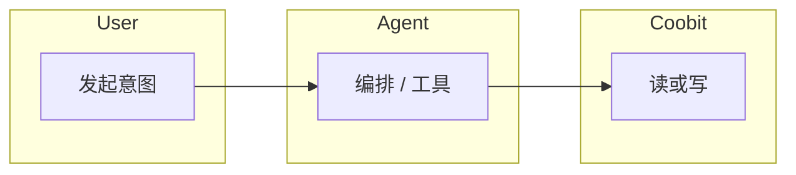

# 业务流程书写规范

**适用**：[`flows/`](../flows/) 下 **业务步骤级** 主流程 —— **谁先谁后**、规则分支、与 **计费 / 门禁 / 渠道 / 设计契约** 的交界。  
**区别于**：[`interaction-flow-standard.md`](interaction-flow-standard.md) 侧重 **消息与卡片字段**；本文侧重 **端到端编排** 与 **跨域引用**。

---
**关单余量（MR 首节）**：[`closure-remaining` §0](../closure-remaining.md#closure-remaining-quicklinks) · [§6 / §6.4](../closure-remaining.md#cc-exec-solve-path)（[**§6.4 问题→动作**](../closure-remaining.md#cc-problem-to-action)）；**主契约** [`contract-closure`](../contract-closure.md)。

## 1. 何时新建或修改 `flows/` 文档

| 情形 | 建议动作 |
|------|-----------|
| 新增 **跨多系统或多域** 的用户主路径 | 新建 **`flows/<name>.md`** 并在 [`flows/README.md`](../flows/README.md) **登记一行** |
| 仅为 **单域内**规则增补、无步骤链变化 | 优先扩写 **`domains/*.md`** |
| 仅为 **Telegram 展示 / 字段** 变化 | 优先 **`domains/agent/telegram/overview.md`** |
| 能力依赖 **endpoint 矩阵未冻结** | 正文标明 **受限 / TBD**，并链 [`contract-closure.md`](../contract-closure.md) |
| 现有流程 **过长（例：> ~120 步同级编号）** | 拆 **子流程** 文件或拆 **阶段章节**（见 §5） |

---

## 2. 单篇流程文档建议结构

| 章节 | 内容 |
|------|------|
| **文首摘要表** | 流程名、主渠道、涉及 **`domains/`**、相关 **`design/`** 锚点（504 / 对账 / 幂等等 **仅引用**） |
| **参与角色与系统** | 用户、Agent 运行时、交易所、运营台、Billing H5、外部推送渠道等 |
| **前置条件** | 账户 / VIP / 子账户 / API / 余额 / 配置开关 — **引用 FR 或 `config.md` 中登记的 `configKey`** |
| **主路径（Happy path）** | **S1、S2…**；每步：**执行者 + 动作 + 产出物**（如 `executionId`、`billingTraceId`、订单业务 ID） |
| **分支与异常** | 条件驱动；**504 / UNKNOWN** 与用户可见语义 **对齐** [`design/architecture.md`](../../design/architecture.md)，**不在 flows 发明排障协议细节** |
| **计费与门禁交界** | **何时进入可计费执行**；须引用 **计费域**、**计费顺序类流程**、**交易 Agent 域** 中与门禁/计费相关的 **§ 或 FR**（具体文件名以仓库为准） |
| **渠道与交互** | **指向** `domains/agent/telegram/overview.md` **§** 与用户确认步骤；**不重复**整张卡片字段表 |
| **附录（可选）** | Mermaid 泳道图、与 **`spec.md`** 索引对齐的一句「版本范围」说明 |

---

## 3. 流程条目模板（可复制）

以下为 **单步** 推荐字段；可按流程密度合并为表格或列表。

```
### S{n} · <短标题>
- **执行者**：用户 / Agent / Coobit / 运营台 / …
- **动作**：……
- **前置**：……（或显式「无」）
- **产出**：业务 ID / 状态 / 写审计要点（不写 HTTP 细节）
- **关联**：FR-xx；flows/xxx §y；domains/zzz §w（可选）
```

**并行**：若两步可并行，标注 **「与 Sn 并行」**，避免歧义顺序。**异步**：标明 **「触发后即返回 / 结果由推送续」**，并与 **`telegram`** / **`observability`** 对签。

---

## 4. 命名与索引

- **文件名**：**英文 kebab-case**，语义清晰（例：`trade-via-agent.md`、`consume-and-bill.md`）。  
- **`flows/README.md`**：**每文件一行** 索引（简述 + 关键互引）。  
- **`spec.md` / `product.md`**：若为主版本路径，须在聚合 **范围或索引** 中加链接。  
- **文内锚点**：标题尽量 **稳定**；改名时全局搜链入。

---

## 5. 长流程拆分

| 策略 | 何时用 |
|------|--------|
| **分阶段章节** | 同一用户旅程 **强顺序**，但阶段边界清晰（例：开通 → 首笔交易 → 扣费查验） |
| **子文档** | 子旅程可被 **多处引用**（例：扣费消费 [`consume-and-bill.md`](../flows/consume-and-bill.md) 被多条交易流引用） |
| **指向 domains** | 单一门禁规则全文 — **只维护一处**，flows **仅引用 FR / §** |

拆分后须在 **原流程文首「关联流程」** 表中列出子文档，避免孤岛。

---

## 6. 业务流程自检

- [ ] 每步可映射到 **FR** 或 **运营配置规则**（明确写出引用）  
- [ ] **写路径** 对齐 **ADR-001** 与 **`telegram`** **类型 A**  
- [ ] **计费相关步骤**（若涉及）与 **计费域文档**及 **`consume-and-bill` 类计费顺序流程** **无双重计费 / 无漏引用终局**  
- [ ] **未支持** 能力未写成已上线；与 **`design/api.md` TBD** 一致  
- [ ] **`flows/README.md`** 已更新  
- [ ] 矩阵解冻或 PATH 变更时，可依 [`contract-closure.md`](../contract-closure.md) **§4** 做 MR 核对  
- [ ] 大块改动 MR **按需**填写 [`review-and-change-standard.md`](review-and-change-standard.md) **§3 变更摘要**

---

## 7. 反模式（避免）

| 反模式 | 建议 |
|--------|------|
| `flows/` **重写一遍 domains FR 全文** | flows **指 § / FR**；细节留在域文档 |
| **卡片字段表** 在 flows 与 **`telegram.md`** **两套并存** | **单一契约**：`telegram.md` |
| **步骤里嵌 API PATH** | PATH **只在 `design/api.md`** |
| **仅改 flows 不改 `domains/agent/telegram`**（用户可见形态已变） | **同一变更窗口** 联动评审 |

---

## 8. 与 PRD、交互的分工

| 层次 | 内容 | 落地 |
|------|------|------|
| PRD | 要什么、验收、边界 | `domains/*.md`、`product.md` |
| **业务流程** | **步骤链、角色、规则、跨界点** | `flows/*.md` |
| 交互 | 消息形态、按钮、卡片字段 | `domains/agent/telegram/`、`product/` 体验篇 |

**联动**：合并请求（MR）评审时，若 **步骤顺序或确认闸门** 变更，默认检查 **`domains/agent/telegram/overview.md`**、相关 **`domains/` FR**、**ADR-001** 是否需同一 MR 或关联 MR。

---

## 9. 补偿、回滚与「业务终局」（叙述级）

- **业务补偿**：若某步失败后须 **冲正用户可见状态**（如卡片作废、订单语义改为失败），在 **分支段落** 写清 **用户可见结果**，不要求写分布式事务协议 —— **机制** 见 **`design/`**。  
- **幂等与重复提交**：用户多次点击确认类按钮时的 **业务语义**（忽略二次 / 报错 / 拉已有结果）须在 **`domains/` FR** 或 **`flows/`** 指 **`design/architecture`** 一致口径，**不在 flows 展开 HTTP**。  
- **终局**：若流程涉及计费，**业务终局**叙述须与 **计费域文档**及 **`consume-and-bill` 类流程** **可对签**（仓库内具体文件名以聚合索引为准）。

---

## 10. Mermaid 泳道图（可选）

适用于 **多角色并行** 时的评审对齐（仍以正文步骤为准）：



泳道 **不做契约 SSOT**；字段与门禁仍以 **`domains/`、`domains/agent/telegram/`、`design/api`** 为准。

---

## 11. 与评审规范及 `Log.md`

- MR **勾选与变更摘要**：[`review-and-change-standard.md`](review-and-change-standard.md)。  
- 修改 **`specs/requirements/standards/`**（含本篇）：须在 **[`Log.md`](Log.md)** **顶部追加一条**（见 **`review-and-change-standard.md` §4**）。
