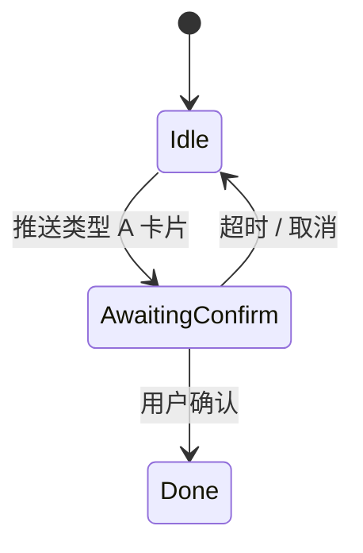

# 交互流程书写规范

**适用**：**终端侧** 用户如何完成任务 —— 会话 **文案与结构**、**Telegram 消息 / InlineKeyboard / 卡片**、**Deeplink → H5/Billing**、**确认与阻断恢复**。  
**边界**：不写服务端 **字段级契约**（→ **`specs/design/api.md`**）；不写 **跨系统步骤链**（→ **`flows/`** + [`business-process-standard.md`](business-process-standard.md)）。

---
**关单余量（MR 首节）**：[`closure-remaining` §0](../closure-remaining.md#closure-remaining-quicklinks) · [§6 / §6.4](../closure-remaining.md#cc-exec-solve-path)（[**§6.4 问题→动作**](../closure-remaining.md#cc-problem-to-action)）；**主契约** [`contract-closure`](../contract-closure.md)。

## 1. 文档存放与权威来源

| 内容 | 存放位置 |
|------|-----------|
| **渠道必选能力、§2.4 会话语言、卡片字段下限、Bot API 约束** | [`domains/agent/telegram/overview.md`](../domains/agent/telegram/overview.md)（**跨会话记忆 UX** → **§2.7**；**清空本会话 STM** → **§2.8**） |
| **开通 / Billing Deeplink / 渠道下限** | [`telegram/overview.md`](../domains/agent/telegram/overview.md) **§2.2～§2.5**（卡片 · Deeplink · **§2.5.x** 字段下限）；[`onboarding/telegram-binding.md`](../domains/agent/onboarding/telegram-binding.md)；[`integrations/telegram/deeplink.md`](../integrations/telegram/deeplink.md) |
| **类型 A 确认先于 Coobit 写** | [`../../design/adr/001-telegram-confirm-before-coobit-write.md`](../../design/adr/001-telegram-confirm-before-coobit-write.md) |
| **人类可读体验** | [`../../../product/telegram-and-cards.md`](../../../product/telegram-and-cards.md)、[`../../../product/flows.md`](../../../product/flows.md) |

本版 **主会话渠道为 Telegram**（若项目变更渠道名，以 **`domains/agent/telegram/overview.md`** 为准）；**用户侧 Billing 通常在主站/H5**。凡涉及 **一键打开链接 / `url` 按钮 / Deeplink**：须与 **`telegram/overview.md`、`telegram-binding`、`integrations/telegram/deeplink`** 以及 **`domains/` FR**（会话入口与阻断恢复类）**可对签**。**目录索引**（非条文）：[`domains/agent/telegram/README.md`](../domains/agent/telegram/README.md)。对外承诺能力仍须符合 [`prd-standard.md`](prd-standard.md) **§8**。

---

## 2. 与业务流程、PRD 的分工

| 写什么 | 落在 | 不落在 |
|--------|------|--------|
| **步骤顺序、角色、计费/门禁交界** | [`flows/`](../flows/) | 不写死每条消息的按钮文案全文时可省略重复 |
| **卡片类型、必选字段、回调语义** | [`domains/agent/telegram/overview.md`](../domains/agent/telegram/overview.md) | 不重述 FR 公式与结算策略全文 |
| **必须 / 禁止 / 验收** | [`domains/`](../domains/) FR/SC | 交互文档不写「替代 FR」 |

**规则**：若 **`telegram/overview.md`** 已定义某卡片 **§**，交互增量 **改 § 或增脚注**，避免在 `flows/` 再写一套冲突字段表。

---

## 3. 单条交互流程建议结构

以「用户一次任务」为粒度（宜映射到某 **`flows/`** 片段）：

1. **名称与范围**：任务名；前置用户状态（登录 / Agent 开通 / 子账户/API / 余额 / `BILLING_BLOCKED` 等）。  
2. **入口**：指令、按钮、系统推送；是否 **必须** 提供 **可点击打开 Billing/H5**（对照 [`telegram/overview.md`](../domains/agent/telegram/overview.md) **§2.2～§2.5**、[`telegram-binding`](../domains/agent/onboarding/telegram-binding.md)、[`deeplink`](../integrations/telegram/deeplink.md)）。  
3. **步骤表（推荐）**

| 步骤 | 用户动作 | 系统响应形态 | 契约锚点 | 分支 |
|------|-----------|----------------|-----------|------|
| … | … | 纯文本 / InlineKeyboard / **卡片类型 X** | `telegram/overview.md` §… | 成功 / 失败 / **待类型 A 确认** |

4. **关键 trace（若面向用户展示）**：与 **计费 / 交易 Agent** 等权威域文档中的 FR 对齐 — 业务 traceId、执行 ID 等 **是否展示、是否可复制、客服话术占位**（字段名以对应域定义为准）。  
5. **异常与恢复**：网络失败、权限、账户/API 未就绪、余额不足等 — **须有可点击恢复路径**（Deeplink / 按钮 / 明确下一步），**禁止**唯一路径为「复制一长串 URL」（错误码与阻断语义以 **`domains/` + `domains/agent/telegram/`** 为准）。  
6. **写路径**：标明 **类型 A**；卡片字段与 **`telegram/overview.md`** 一致；禁止 **静默提交交易所写**。  
7. **映射**：文末列出 **`flows/*.md`** 章节 / **`domains/` FR**，避免双 SSOT。

---

## 4. 文案与呈现原则

- **确定性**：不对 **`design/api` TBD** 能力承诺「必有结果」；可用「若能力可用则…否则拒答/引导主站」。  
- **一致性**：同一业务错误码或阻断原因在会话与 H5 **同一语义层级**；详细口径在对应 **`domains/`** 计费或交易条文。  
- **可归因**：提示用户复制 **`billingTraceId` / `executionId`** 时，样式须符合对应 FR（不外泄密钥类字段）。  
- **可读**：避免超长单行；列表键值对与 **`telegram/overview.md`** 字段顺序对齐便于研发实现。

---

## 5. 国际化与文案占位

- **Telegram**：**运行时 **`effective_locale`**** **、**本条 **`inbound`**** **优先推断 **与 **`§2.1.1`**** **基线桶**，**同窗** **[`telegram/overview.md` §2.4](../domains/agent/telegram/overview.md)**；**卡片与 **`inline_keyboard`**** **同语**。  
- **默认**：与非 Telegram 触点或本产品历史文档策略一致；若 **仅中文版**，须 **显式**写明 **「首版仅中文文案」**，避免 specs **中英混杂**且无归属。  
- **占位符**：动态字段（币种、数量、`traceId`）在范例中用 **尖括号或示例值**，并在 **`telegram/overview.md` 或本文** 说明 **格式与用户可复制性**。  

---

## 6. 推送节奏与会话连续性

- **勿刷屏**：同一意图 **多条卡片 / 编辑消息 vs 新发消息** 的取舍须在 **`telegram/overview.md`** 或与研发对齐的脚注中 **写明默认策略**（防止 MR 实现分叉）。  
- **会话超时 / 用户离开时**：类型 A **待确认**态须有 **超时或重来路径**（与上文 **§3**「异常与恢复」一致）。

---

## 7. 图表与原型

- **Mermaid**：用于 **消息次序 / 状态机**（可选）。示例形态：

- **Figma / 原型**：仅作辅助；**Specs 正文仍须**写清 **分支与必选字段**（图变更不得单独 SSOT）。  
- **图表不替代** **`telegram/overview.md`** 中的 **契约字段表**。

---

## 8. 交互文档自检

- [ ] 每条路径在 **`telegram/overview.md`** 有 **卡片类型或消息形态** 依据，或已发起同步评审修改 **`telegram/overview.md`**  
- [ ] **写操作**路径体现 **类型 A** 与 ADR-001  
- [ ] **Billing/H5** 与会话 **成对描述**（进入方式 + 回流预期）  
- [ ] 异常态 **有可点击或可跳转下一步**，非纯报错堆栈  
- [ ] 未承诺 **矩阵未冻结** 能力；与 **`contract-closure`** 缺口一致  
- [ ] 变更已考虑 **暗色模式 / 折叠客户端** 等 **Telegram 约束**（若 `telegram/overview.md` 有述则从之）
- [ ] **语言策略 / 占位符** 与 §5 一致（若牵涉中英或多语言）
- [ ] **推送节奏 / 类型 A 超时** 与 §6、`telegram/overview.md` 脚注一致或已立项补齐

### 补充反模式

| 避免 | 改为 |
|------|------|
| 同一按钮 / 卡片在 **`telegram/overview.md`、`flows/`、域 FR** 三套措辞 **互不引用** | 选定 **单一契约 §**，其余 **「见 `telegram/overview` §…」** |
| **TBD** 能力仍配「最终成功」示意图或截图 | 示意图标注 **「能力冻结后生效」** 或拆分为占位 |
| 仅为文案微调却 **无 FR/SC 变更** 但实际改变了用户义务 | 回溯是否隐含 **范围变更**，必要时补 FR |

---

## 9. 与其他角色

- **产品经理**：范围、FR、验收是否覆盖该交互。  
- **UI**：视觉令牌与组件；交互规范 **至少**给出 **信息架构与状态**。  
- **架构**：504、UNKNOWN、幂等等 **现象级描述**可写在交互或 `flows`；**机制**在 **`design/architecture`、`design/api`**。

---

## 10. 与评审规范及 `Log.md`

- MR **勾选**、**变更摘要**：[`review-and-change-standard.md`](review-and-change-standard.md)。  
- 若本轮修改落在 **`specs/requirements/standards/`**（含本交互规范）：须在 **[`Log.md`](Log.md)** **顶部追加一条**（见 **`review-and-change-standard.md` §4**）。
